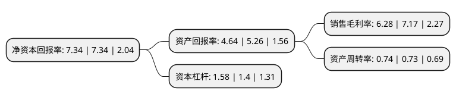

> 本页面由自动化程序生成于 2022年5月20日 01:32
> 内容可能存在错误，如有bug请提交issue至：https://github.com/Eroleice/doc-pi/issues
{.is-warning}

# 上市公司基本情况

## 基本资料

江苏赛福天钢索股份有限公司（以下简称“赛福天”）成立于2005年06月23日，无锡市。于2016年03月31日在上交所主板上市。

赛福天注册资本28,704万元，公司主营业务为特种钢丝绳与索具的研发，生产和销售;主要产品为电梯用钢丝绳，起重用钢丝绳，钢丝绳索具和合成纤维吊装带索具。以下是详细信息：

- 公司名称: 江苏赛福天钢索股份有限公司
- 股票代码: 603028.SH
- 所在地: 江苏 - 无锡市
- 成立日期: 2005年06月23日
- 注册资本: 28,704万元
- 法定代表人: 沈生泉
- 主营业务: 公司主营业务为特种钢丝绳与索具的研发，生产和销售;主要产品为电梯用钢丝绳，起重用钢丝绳，钢丝绳索具和合成纤维吊装带索具
- 公司官网: www.jsrope.com
- 公司介绍: 公司主营业务为特种钢丝绳与索具的研发、生产和销售；主要产品为电梯用钢丝绳、起重用钢丝绳、钢丝绳索具和合成纤维吊装带索具。公司是经江苏省科技厅、江苏省财政厅、江苏省国税局和江苏省地税局联合认定的高新技术企业、国家级火炬计划项目实施单位，公司的技术中心被江苏省经济与信息化委员会等部门认定为江苏省企业技术中心，并被江苏省科技厅认定为江苏省特种钢绳工程技术研究中心；子公司建峰索具是经广东省科技厅、广东省财政厅、广东省国税局和广东省地税局联合认定的高新技术企业，是全国钢标准化技术委员会索具工作组承担单位，并被评为广东省知识产权优势企业、广东省民营科技企业，建峰索具的检验中心具有经中国合格评定国家认可委员会认证的CNAS国家实验室资质。公司拥有的“大力”、“建峰”品牌具有较强的市场影响力和品牌美誉度。公司是国内主要特种钢丝绳生产企业，是电梯用钢丝绳领域的领先企业，是经三菱、奥的斯、富士达、迅达、通力等全球知名电梯厂商，以及江南嘉捷、沈阳博林特、康力电梯、广日股份等国内上市电梯制造公司认可的电梯用钢丝绳配套供应商。

## 股东及高管情况

上市公司第一大股东为苏州吴中融泰控股有限公司，持股82,980,738股，占比28.91%，**疑似为**上市公司实际控制人。

截至2022年04月19日，上市公司的前十大股东中，共有5名自然人股东，5名机构股东，其中5%以上大股东共有3名。上市公司前十大股东明细如下：

> 未能通过持股比例判定出上市公司实际控制人（持股30%以上）
> 可能存在通过间接持股、联合持股、协议控制等方式拥有实际控制权的主体，具体请参考上市公司定期公告！
{.is-warning}

> 截至2022年04月19日，上市公司前十大股东信息如下：

| 股东名称 | 持股数量（股） | 持股比例 |
| --- | --- | --- |
| 苏州吴中融泰控股有限公司 | 82,980,738 | 28.91% |
| 杰昌有限公司 | 35,316,798 | 12.3% |
| 深圳市分享投资合伙企业(有限合伙) | 21,521,500 | 7.5% |
| 徐立芳 | 4,313,400 | 1.5% |
| 孙木钗 | 3,659,500 | 1.27% |
| 江西省省属国有企业资产经营(控股)有限公司 | 3,576,720 | 1.25% |
| 俞文 | 2,780,770 | 0.97% |
| 秦爱萍 | 2,439,900 | 0.85% |
| 陆丰市东业管理咨询有限公司 | 2,152,800 | 0.75% |
| 叶向民 | 2,152,800 | 0.75% |

## 利润表分析

上市公司2021年总收入为9.15亿元，净利润为0.57亿元，实现盈利。

## 杜邦分析

> 数据列示周期：2021年 | 2020年 | 2019年
{.is-info}

上市公司的净资产收益率在近一年有所下降，下降幅度为0%，其变化情况分解如下：
- 上市公司的销售毛利率在近一年下降了-12.41%，可能是生产效率的下降、商品原材料价格上涨或商品价格的下跌所致。
- 上市公司的资产周转率在近一年上升了1.37%，可能是源自于更快的销售回款或库存管理效果提升。
- 上市公司的财务杠杆比率在近一年上升了12.86%，可能是增加负债扩大生产规模。

