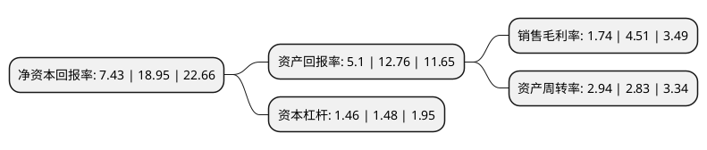

> 本页面由自动化程序生成于 2022年5月20日 01:36
> 内容可能存在错误，如有bug请提交issue至：https://github.com/Eroleice/doc-pi/issues
{.is-warning}

# 上市公司基本情况

## 基本资料

浙江华达新型材料股份有限公司（以下简称“华达新材”）成立于2003年07月25日，杭州市。于2020年08月05日在上交所主板上市。

华达新材注册资本51,142万元，主要从事多功能彩色涂层板，热镀锌铝板及其基板的研发，生产和销售。以下是详细信息：

- 公司名称: 浙江华达新型材料股份有限公司
- 股票代码: 605158.SH
- 所在地: 浙江 - 杭州市
- 成立日期: 2003年07月25日
- 注册资本: 51,142万元
- 法定代表人: 邵明祥
- 主营业务: 主要从事多功能彩色涂层板，热镀锌铝板及其基板的研发，生产和销售
- 公司官网: www.hdnew.cn
- 公司介绍: 公司是国内较早进入热镀锌铝板和彩色涂层板行业的民营企业之一，经过十多年的持续投入与创新，现已发展成为产业链布局完整、产品质量良好的热镀锌铝板和彩色涂层板生产企业。公司在建筑应用领域拥有一定品牌影响力，通过规模化生产实现对成本的良好控制，通过合理生产组织实现对不同规格产品订单的快速响应，生产工艺和产品质量控制良好，具有稳定的国内外客户基础。主营：制造，销售：镀锌钢带、冷轧钢板。一般经营项目：销售：工业用氯化亚铁；货物进出口(法律、行政法规禁止经营的项目除外，法律、行政法规限制经营的项目取得许可证后方可经营)。2012年“隆和”牌钢板及钢带被评为“浙江名牌产品”，2014年“隆和”注册商标被认定“杭州市著名商标”。公司产品目前已出口至20多个国家和地区，2015年为杭州富阳区十强外贸出口企业，2016年度彩色涂层板出口量位居全国前列。

## 股东及高管情况

上市公司第一大股东为浙江华达集团有限公司，持股294,814,000股，占比57.65%，为上市公司实际控制人。

截至2022年03月31日，上市公司的前十大股东中，共有6名自然人股东，4名机构股东，其中5%以上大股东共有2名。上市公司前十大股东明细如下：

> 截至2022年03月31日，上市公司前十大股东信息如下：

| 股东名称 | 持股数量（股） | 持股比例 |
| --- | --- | --- |
| 浙江华达集团有限公司 | 294,814,000 | 57.65% |
| 杭州富阳仁祥投资合伙企业(有限合伙) | 43,524,000 | 8.51% |
| 邵明祥 | 20,137,000 | 3.94% |
| 邵升龙 | 8,632,000 | 1.69% |
| 杭州富阳恒进投资合伙企业(有限合伙) | 8,268,000 | 1.62% |
| 杭州富阳聚丰投资合伙企业(有限合伙) | 8,125,000 | 1.59% |
| 禤世基 | 776,500 | 0.15% |
| 张冠琼 | 610,340 | 0.12% |
| 彭雨晗 | 449,310 | 0.09% |
| 蒋明忱 | 445,300 | 0.09% |

## 利润表分析

上市公司2021年总收入为85.06亿元，净利润为1.47亿元，实现盈利。

## 杜邦分析

> 数据列示周期：2021年 | 2020年 | 2019年
{.is-info}

上市公司的净资产收益率在近一年有所下降，下降幅度为-60.79%，其变化情况分解如下：
- 上市公司的销售毛利率在近一年下降了-61.42%，可能是生产效率的下降、商品原材料价格上涨或商品价格的下跌所致。
- 上市公司的资产周转率在近一年上升了3.89%，可能是源自于更快的销售回款或库存管理效果提升。
- 上市公司的财务杠杆比率在近一年下降了-1.35%，可能是减少负债降低财务费用。

