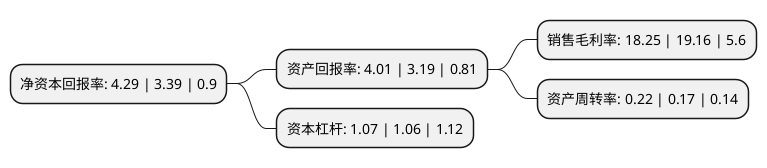

> 本页面由自动化程序生成于 2022年5月20日 01:02
> 内容可能存在错误，如有bug请提交issue至：https://github.com/Eroleice/doc-pi/issues
{.is-warning}

# 上市公司基本情况

## 基本资料

宁夏西部创业实业股份有限公司（以下简称“西部创业”）成立于1994年02月18日，银川市。于1994年06月17日在深交所主板上市。

西部创业注册资本145,837.474万元，主要业务:铁路运输，仓储物流，葡萄酒，酒店餐饮。以下是详细信息：

- 公司名称: 宁夏西部创业实业股份有限公司
- 股票代码: 000557.SZ
- 所在地: 宁夏 - 银川市
- 成立日期: 1994年02月18日
- 注册资本: 145,837.474万元
- 法定代表人: 何旭东
- 主营业务: 铁路运输，仓储物流，葡萄酒，酒店餐饮
- 公司官网: www.xbcy.nx.cn
- 公司介绍: 公司目前从事的主要业务包括铁路运输、仓储物流、葡萄酒、酒店餐饮等板块。公司目前为公司主营业务，该板块以宁夏宁东铁路有限公司为主体，西与包兰铁路大坝站接轨、东与太中银铁路银川联络线梅花井站接轨、北与内蒙古三新铁路上海庙站接轨，形成了以古窑子站和鸳鸯湖站为中心运输枢纽，具备3个外运出口的地方铁路网络。担负着宁东能源化工基地铁路建设、运营管理及煤炭、油品、化工等物资的运输任务。

## 股东及高管情况

上市公司第一大股东为宁夏国有资本运营集团有限责任公司，持股429,820,178股，占比29.47%，**疑似为**上市公司实际控制人。

截至2022年03月31日，上市公司的前十大股东中，共有5名自然人股东，5名机构股东，其中5%以上大股东共有2名。上市公司前十大股东明细如下：

> 未能通过持股比例判定出上市公司实际控制人（持股30%以上）
> 可能存在通过间接持股、联合持股、协议控制等方式拥有实际控制权的主体，具体请参考上市公司定期公告！
{.is-warning}

> 截至2022年03月31日，上市公司前十大股东信息如下：

| 股东名称 | 持股数量（股） | 持股比例 |
| --- | --- | --- |
| 宁夏国有资本运营集团有限责任公司 | 429,820,178 | 29.47% |
| 中国信达资产管理股份有限公司 | 209,810,073 | 14.39% |
| 国家能源集团宁夏煤业有限责任公司 | 71,526,908 | 4.9% |
| 华电国际电力股份有限公司 | 71,084,524 | 4.87% |
| 国家电投集团宁夏能源铝业有限公司 | 71,084,524 | 4.87% |
| 郑慧霞 | 5,660,000 | 0.39% |
| 郑毅仁 | 5,645,000 | 0.39% |
| 杜瑞萍 | 5,527,300 | 0.38% |
| 胡建来 | 4,626,200 | 0.32% |
| 王莉 | 4,410,000 | 0.3% |

## 利润表分析

上市公司2021年总收入为12.36亿元，净利润为2.25亿元，实现盈利。

## 杜邦分析

> 数据列示周期：2021年 | 2020年 | 2019年
{.is-info}

上市公司的净资产收益率在近一年有所上升，上升幅度为26.55%，其变化情况分解如下：
- 上市公司的销售毛利率在近一年下降了-4.75%，可能是生产效率的下降、商品原材料价格上涨或商品价格的下跌所致。
- 上市公司的资产周转率在近一年上升了29.41%，可能是源自于更快的销售回款或库存管理效果提升。
- 上市公司的财务杠杆比率在近一年上升了0.94%，可能是增加负债扩大生产规模。

