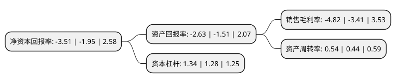

> 本页面由自动化程序生成于 2022年5月20日 01:31
> 内容可能存在错误，如有bug请提交issue至：https://github.com/Eroleice/doc-pi/issues
{.is-warning}

# 上市公司基本情况

## 基本资料

广深铁路股份有限公司（以下简称“广深铁路”）成立于1996年03月06日，深圳市。于2006年12月22日在上交所主板上市。

广深铁路注册资本708,353.7万元，主营业务:坪石至深圳间各铁路车站的客，货运输业务，并与中国香港九广铁路公司合作经营广九直通车(广州—中国香港九龙)旅客运输业务。(本次发行及资产收购完成后)以下是详细信息：

- 公司名称: 广深铁路股份有限公司
- 股票代码: 601333.SH
- 所在地: 广东 - 深圳市
- 成立日期: 1996年03月06日
- 注册资本: 708,353.7万元
- 法定代表人: 武勇
- 主营业务: 主营业务:坪石至深圳间各铁路车站的客，货运输业务，并与中国香港九广铁路公司合作经营广九直通车(广州—中国香港九龙)旅客运输业务(本次发行及资产收购完成后)
- 公司官网: www.gsrc.com
- 公司介绍: 公司主要经营深圳—广州—坪石段铁路客货运输业务及长途旅客列车运输业务，并与香港铁路有限公司合作经营直通车旅客列车运输业务。同时亦经营铁路设施技术综合服务、商业贸易及兴办各种实业等与公司宗旨相符的其他业务。公司独立经营的深圳—广州—坪石段铁路，纵向贯通广东省全境。其中广坪段为中国铁路南北大动脉——京广线南段；广深段是中国内陆通往中国香港的唯一铁路通道，连接京广、京九、三茂、平南、平盐和中国香港九广铁路，是中国铁路交通网络的重要组成部分。广深段铁路是目前中国现代化程度最高的铁路之一，是国内第一条全程封闭、四线并行的铁路，也是第一条实现客货分线运行的铁路。

## 股东及高管情况

上市公司第一大股东为中国铁路广州局集团有限公司，持股2,629,451,300股，占比37.12%，为上市公司实际控制人。

截至2022年03月31日，上市公司的前十大股东中，共有3名自然人股东，2名机构股东，4个产品账户，1个海外主体，其中5%以上大股东共有2名。上市公司前十大股东明细如下：

> 截至2022年03月31日，上市公司前十大股东信息如下：

| 股东名称 | 持股数量（股） | 持股比例 |
| --- | --- | --- |
| 中国铁路广州局集团有限公司 | 2,629,451,300 | 37.12% |
| 香港中央结算(代理人)有限公司 | 1,493,112,192 | 21.08% |
| 林乃刚 | 124,000,000 | 1.75% |
| 洪泽君 | 100,000,000 | 1.41% |
| 李伟 | 51,979,601 | 0.73% |
| 中国建设银行股份有限公司-华安国企改革主题灵活配置混合型证券投资基金 | 43,294,418 | 0.61% |
| 太原钢铁(集团)有限公司 | 29,729,989 | 0.42% |
| 嘉实基金-农业银行-嘉实中证金融资产管理计划 | 27,163,700 | 0.38% |
| 银华基金-农业银行-银华中证金融资产管理计划 | 26,814,300 | 0.38% |
| 中欧基金-农业银行-中欧中证金融资产管理计划 | 26,436,800 | 0.37% |

## 利润表分析

上市公司2021年总收入为202.06亿元，净利润为-9.74亿元，**未实现盈利**。

## 杜邦分析

> 数据列示周期：2021年 | 2020年 | 2019年
{.is-info}

上市公司的净资产收益率在近一年有所上升，上升幅度为80%，其变化情况分解如下：
- 上市公司的销售毛利率在近一年上升了41.35%，可能是生产效率的提升、商品原材料价格下跌或商品价格的上涨所致。
- 上市公司的资产周转率在近一年上升了22.73%，可能是源自于更快的销售回款或库存管理效果提升。
- 上市公司的财务杠杆比率在近一年上升了4.69%，可能是增加负债扩大生产规模。

