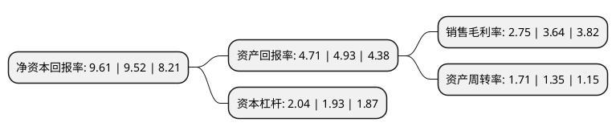

> 本页面由自动化程序生成于 2022年5月20日 01:01
> 内容可能存在错误，如有bug请提交issue至：https://github.com/Eroleice/doc-pi/issues
{.is-warning}

# 上市公司基本情况

## 基本资料

深圳市中金岭南有色金属股份有限公司（以下简称“中金岭南”）成立于1984年09月01日，深圳市。于1997年01月23日在深交所主板上市。

中金岭南注册资本365,003.461万元，主要产品:铅锭，锌锭及锌合金，白银，黄金，镉锭，锗锭，铟锭，工业硫酸，硫磺等产品。主要业务:铅锌矿的开采，选矿以及铅锌金属的冶炼。以下是详细信息：

- 公司名称: 深圳市中金岭南有色金属股份有限公司
- 股票代码: 000060.SZ
- 所在地: 广东 - 深圳市
- 成立日期: 1984年09月01日
- 注册资本: 365,003.461万元
- 法定代表人: 王碧安
- 主营业务: 主要产品:铅锭，锌锭及锌合金，白银，黄金，镉锭，锗锭，铟锭，工业硫酸，硫磺等产品铅锌矿的开采，选矿以及铅锌金属的冶炼
- 公司官网: www.nonfemet.com
- 公司介绍: 公司是一家主要是从事铅锌铜等有色金属的采矿、选矿、冶炼和深加工一体化生产的企业。公司通过一系列收购兼并、资源整合，直接掌控的已探明的铅锌铜等有色金属资源总量近千万吨，逐步成长为具有一定影响力的跨国矿业企业。公司主要产品有铅锭、锌锭及锌合金、白银、黄金、镉锭、锗锭、铟锭、工业硫酸、硫磺等产品。公司主要的生产活动为铅锌矿的开采、选矿以及铅锌金属的冶炼。公司产品质量均达到国际先进水平，公司拥有国家级技术中心，设立了“博士后科研工作站”。多年来，共获得省部级以上科技奖励近100项。公司秉承“做不到，没有理由”的企业核心价值观，以铅、锌、铜为主，坚持多金属、国际化、一体化、集约化的经营理念，努力打造国际矿业旗舰企业。

## 股东及高管情况

上市公司第一大股东为广东省广晟控股集团有限公司，持股1,287,627,186股，占比35.28%，为上市公司实际控制人。

截至2022年04月18日，上市公司的前十大股东中，共有2名自然人股东，4名机构股东，3个产品账户，1个海外主体，其中5%以上大股东共有2名。上市公司前十大股东明细如下：

> 截至2022年04月18日，上市公司前十大股东信息如下：

| 股东名称 | 持股数量（股） | 持股比例 |
| --- | --- | --- |
| 广东省广晟控股集团有限公司 | 1,287,627,186 | 35.28% |
| 广东省广晟控股集团有限公司 | 1,200,154,186 | 32.88% |
| 香港中央结算有限公司(陆股通) | 52,906,771 | 1.45% |
| 云南铜业股份有限公司 | 32,894,736 | 0.9% |
| 广东广晟有色金属集团有限公司 | 30,653,662 | 0.84% |
| 蔡玉栋 | 19,740,747 | 0.54% |
| 嘉实资本-中铜投资有限公司-嘉实资本汇铜1号单一资产管理计划 | 15,909,119 | 0.44% |
| 中国农业银行股份有限公司-中证500交易型开放式指数证券投资基金 | 12,372,417 | 0.34% |
| 中国农业银行股份有限公司-富国中证500指数增强型证券投资基金(LOF) | 11,954,800 | 0.33% |
| 刘炜 | 10,150,000 | 0.28% |

## 利润表分析

上市公司2021年总收入为444.99亿元，净利润为12.21亿元，实现盈利。

## 杜邦分析

> 数据列示周期：2021年 | 2020年 | 2019年
{.is-info}

上市公司的净资产收益率在近一年有所上升，上升幅度为0.95%，其变化情况分解如下：
- 上市公司的销售毛利率在近一年下降了-24.45%，可能是生产效率的下降、商品原材料价格上涨或商品价格的下跌所致。
- 上市公司的资产周转率在近一年上升了26.67%，可能是源自于更快的销售回款或库存管理效果提升。
- 上市公司的财务杠杆比率在近一年上升了5.7%，可能是增加负债扩大生产规模。

