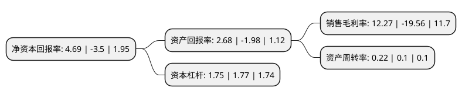

> 本页面由自动化程序生成于 2022年5月20日 01:01
> 内容可能存在错误，如有bug请提交issue至：https://github.com/Eroleice/doc-pi/issues
{.is-warning}

# 上市公司基本情况

## 基本资料

内蒙古兴业矿业股份有限公司（以下简称“兴业矿业”）成立于1996年08月23日，赤峰市。于1996年08月28日在深交所主板上市。

兴业矿业注册资本183,719.222万元，主营业务:本公司以有色金属采选，冶炼，加工，销售为主业以下是详细信息：

- 公司名称: 内蒙古兴业矿业股份有限公司
- 股票代码: 000426.SZ
- 所在地: 内蒙古 - 赤峰市
- 成立日期: 1996年08月23日
- 注册资本: 183,719.222万元
- 法定代表人: 吉兴业
- 主营业务: 主营业务:本公司以有色金属采选，冶炼，加工，销售为主业
- 公司官网: www.nmxyky.com
- 公司介绍: 公司以有色金属采选、冶炼、加工、销售为主业。公司主要产品为铅、锌、铜、铁、铋、钨等有色金属及黑金属。公司依据当地资源富集的区位优势，确立了“立足区域资源，布局产业延伸，发展新兴产业，打造文化强企”的战略目标，历经多年的创新发展，积累了丰富的矿山建设和有色金属采选生产经验，在人才、管理、技术和设备等方面具有较强的市场竞争能力，尤其是成本控制始终保持较好水平，业已构成集地质、采选、冶炼于一体的产业链，不断开创企业发展进步的新格局。

## 股东及高管情况

上市公司第一大股东为内蒙古兴业集团股份有限公司，持股556,075,350股，占比30.27%，为上市公司实际控制人。

截至2022年03月31日，上市公司的前十大股东中，共有3名自然人股东，3名机构股东，3个产品账户，1个海外主体，其中5%以上大股东共有3名。上市公司前十大股东明细如下：

> 截至2022年03月31日，上市公司前十大股东信息如下：

| 股东名称 | 持股数量（股） | 持股比例 |
| --- | --- | --- |
| 内蒙古兴业集团股份有限公司 | 556,075,350 | 30.27% |
| 国民信托有限公司-国民信托·恒盈5号事务管理类集合资金信托计划 | 162,244,603 | 8.83% |
| 赤峰富龙公用(集团)有限责任公司 | 133,648,294 | 7.27% |
| 常刚 | 25,000,000 | 1.36% |
| 香港中央结算有限公司(陆股通) | 23,965,464 | 1.3% |
| 北信瑞丰基金-民生银行-四川信托-辰星2号证券投资集合资金信托计划 | 18,721,082 | 1.02% |
| 杨全玉 | 18,196,900 | 0.99% |
| 宁波梅山保税港区东芷投资合伙企业(有限合伙) | 14,180,507 | 0.77% |
| 南通金玖锐信投资管理有限公司-中汇金玖锐信定增2期私募股权投资基金 | 13,698,630 | 0.75% |
| 李献来 | 13,626,093 | 0.74% |

## 利润表分析

上市公司2021年总收入为20.08亿元，净利润为2.46亿元，实现盈利。

## 杜邦分析

> 数据列示周期：2021年 | 2020年 | 2019年
{.is-info}

上市公司的净资产收益率在近一年有所下降，下降幅度为-234%，其变化情况分解如下：
- 上市公司的销售毛利率在近一年下降了-162.73%，可能是生产效率的下降、商品原材料价格上涨或商品价格的下跌所致。
- 上市公司的资产周转率在近一年上升了120%，可能是源自于更快的销售回款或库存管理效果提升。
- 上市公司的财务杠杆比率在近一年下降了-1.13%，可能是减少负债降低财务费用。

