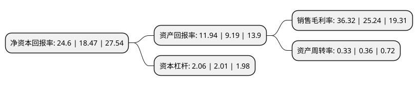

> 本页面由自动化程序生成于 2022年5月20日 01:02
> 内容可能存在错误，如有bug请提交issue至：https://github.com/Eroleice/doc-pi/issues
{.is-warning}

# 上市公司基本情况

## 基本资料

盛达金属资源股份有限公司（以下简称“盛达资源”）成立于1995年06月22日，北京市。于1996年08月23日在深交所主板上市。

盛达资源注册资本68,996.935万元，主营业务:银，铅，锌等有色金属的采选与销售。以下是详细信息：

- 公司名称: 盛达金属资源股份有限公司
- 股票代码: 000603.SZ
- 所在地: 北京 - 北京市
- 成立日期: 1995年06月22日
- 注册资本: 68,996.935万元
- 法定代表人: 朱胜利
- 主营业务: 主营业务:银，铅，锌等有色金属的采选与销售
- 公司官网: www.sdkygf.com
- 公司介绍: 公司主要业务为有色金属矿采选业，目前在产矿山为控股子公司银都矿业拥有的内蒙古克什克腾旗拜仁达坝银多金属矿，公司产品为含银铅精粉(银单独计价)和锌精粉。银都矿业资源为银多金属矿，矿石中含有铅、锌、银三种金属元素。参照国家相关行业标准，银都矿业按单一元素计量，银的金属储量达到大型矿山标准；铅的金属储量达到中型矿山标准，接近大型矿山标准；锌的金属储量达到大型矿山标准。银都矿业是已知国内上市公司中毛利率最高的矿山之一。公司于2016年7月完成重大资产重组，收购光大矿业100%股权以及赤峰金都100%股权，光大矿业拥有2个矿区，3个采矿权，主要产品为含银铅精矿、锌精矿，年设计采选矿石30万吨；赤峰金都拥有2个采矿权以及2个探矿权，年设计采选矿石30万吨。公司在稳步发展主业的同时，战略性投资了一些具有广阔前景的新能源、金融企业，进一步挖掘和完善了公司的价值和布局，增强了发展后劲。

## 股东及高管情况

上市公司第一大股东为甘肃盛达集团有限公司，持股215,939,596股，占比31.3%，为上市公司实际控制人。

截至2022年03月31日，上市公司的前十大股东中，共有2名自然人股东，5名机构股东，2个产品账户，1个海外主体，其中5%以上大股东共有2名。上市公司前十大股东明细如下：

> 截至2022年03月31日，上市公司前十大股东信息如下：

| 股东名称 | 持股数量（股） | 持股比例 |
| --- | --- | --- |
| 甘肃盛达集团有限公司 | 215,939,596 | 31.3% |
| 赵满堂 | 36,189,200 | 5.25% |
| 三河华冠资源技术有限公司 | 28,585,723 | 4.14% |
| 赵庆 | 19,270,650 | 2.79% |
| 赤峰红烨投资有限公司 | 15,926,096 | 2.31% |
| 中国农业银行股份有限公司-银华内需精选混合型证券投资基金(LOF) | 15,500,000 | 2.25% |
| 天津祥龙企业管理有限公司 | 13,700,000 | 1.99% |
| 赣州希桥置业发展有限公司 | 13,526,500 | 1.96% |
| 中国建设银行股份有限公司-银华同力精选混合型证券投资基金 | 9,600,000 | 1.39% |
| 香港中央结算有限公司(陆股通) | 9,573,534 | 1.39% |

## 利润表分析

上市公司2021年总收入为16.38亿元，净利润为5.94亿元，实现盈利。

## 杜邦分析

> 数据列示周期：2021年 | 2020年 | 2019年
{.is-info}

上市公司的净资产收益率在近一年有所上升，上升幅度为33.19%，其变化情况分解如下：
- 上市公司的销售毛利率在近一年上升了43.9%，可能是生产效率的提升、商品原材料价格下跌或商品价格的上涨所致。
- 上市公司的资产周转率在近一年下降了-8.33%，可能是源自于更慢的销售回款或库存管理效果下降。
- 上市公司的财务杠杆比率在近一年上升了2.49%，可能是增加负债扩大生产规模。

