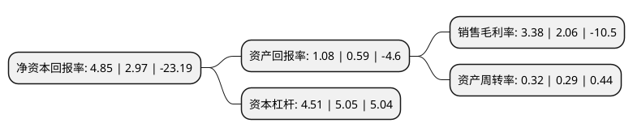

> 本页面由自动化程序生成于 2022年5月20日 01:03
> 内容可能存在错误，如有bug请提交issue至：https://github.com/Eroleice/doc-pi/issues
{.is-warning}

# 上市公司基本情况

## 基本资料

中国有色金属建设股份有限公司（以下简称“中色股份”）成立于1983年09月16日，北京市。于1997年04月16日在深交所主板上市。

中色股份注册资本196,937.842万元，主营业务为有色金属资源开发和国际有色工程的设计咨询和总承包以下是详细信息：

- 公司名称: 中国有色金属建设股份有限公司
- 股票代码: 000758.SZ
- 所在地: 北京 - 北京市
- 成立日期: 1983年09月16日
- 注册资本: 196,937.842万元
- 法定代表人: 刘宇
- 主营业务: 主营业务为有色金属资源开发和国际有色工程的设计咨询和总承包
- 公司官网: www.nfc.com.cn
- 公司介绍: 公司致力于海内外有色金属资源的开发，包括与有色金属相关的矿山开发、国际工程技术承包、国际劳务合作、进出口等业务，涵盖了有色金属的勘探设计、施工、设备采购、人员培训、采选、冶炼、金属加工的全过程。由于率先进入国际市场，公司在国际市场的激烈竞争中已经形成了企业自身的经营特色，并开始显现品牌效应。多年来，中色股份重视培植企业的核心竞争能力，形成了独具特色的社会资源整合能力和大型有色工业项目的管理能力，工程承包业务确立了以伊朗为基地的中东地区，以哈萨克斯坦为中心的中北亚地区，以赞比亚为中心的中南非洲地区以及越南、老挝、蒙古、朝鲜、印尼、菲律宾等周边国家的几大主要市场区域。

## 股东及高管情况

上市公司第一大股东为中国有色矿业集团有限公司，持股664,613,232股，占比33.75%，为上市公司实际控制人。

截至2022年03月31日，上市公司的前十大股东中，共有5名自然人股东，2名机构股东，2个产品账户，1个海外主体，其中5%以上大股东共有1名。上市公司前十大股东明细如下：

> 截至2022年03月31日，上市公司前十大股东信息如下：

| 股东名称 | 持股数量（股） | 持股比例 |
| --- | --- | --- |
| 中国有色矿业集团有限公司 | 664,613,232 | 33.75% |
| 中矿国际投资有限公司 | 39,387,400 | 2% |
| 香港中央结算有限公司(陆股通) | 14,076,750 | 0.71% |
| 周伟青 | 13,383,600 | 0.68% |
| 中国建设银行股份有限公司-嘉实中证稀土产业交易型开放式指数证券投资基金 | 8,247,200 | 0.42% |
| 中国农业银行股份有限公司-中证500交易型开放式指数证券投资基金 | 7,125,568 | 0.36% |
| 黄洪飞 | 6,000,000 | 0.3% |
| 周伟芳 | 5,746,000 | 0.29% |
| 许军军 | 5,007,801 | 0.25% |
| 何书军 | 4,707,400 | 0.24% |

## 利润表分析

上市公司2021年总收入为65.32亿元，净利润为2.2亿元，实现盈利。

## 杜邦分析

> 数据列示周期：2021年 | 2020年 | 2019年
{.is-info}

上市公司的净资产收益率在近一年有所上升，上升幅度为63.3%，其变化情况分解如下：
- 上市公司的销售毛利率在近一年上升了64.08%，可能是生产效率的提升、商品原材料价格下跌或商品价格的上涨所致。
- 上市公司的资产周转率在近一年上升了10.34%，可能是源自于更快的销售回款或库存管理效果提升。
- 上市公司的财务杠杆比率在近一年下降了-10.69%，可能是减少负债降低财务费用。

