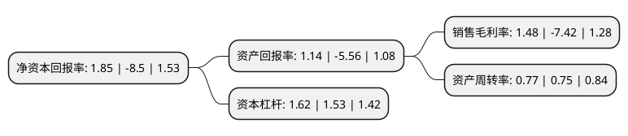

> 本页面由自动化程序生成于 2022年5月20日 01:06
> 内容可能存在错误，如有bug请提交issue至：https://github.com/Eroleice/doc-pi/issues
{.is-warning}

# 上市公司基本情况

## 基本资料

云南罗平锌电股份有限公司（以下简称“罗平锌电”）成立于2000年12月21日，曲靖市。于2007年02月15日在深交所中小板上市。

罗平锌电注册资本32,339.527万元，主营产品:锌锭，电，铅精矿，锗精矿，银精矿，镉锭，超精细锌粉及副产物铅渣，铜渣等。主营业务:铅锌矿石采选，锌冶炼，水力发电，资源综合利用和产品深加工项目等以下是详细信息：

- 公司名称: 云南罗平锌电股份有限公司
- 股票代码: 002114.SZ
- 所在地: 云南 - 曲靖市
- 成立日期: 2000年12月21日
- 注册资本: 32,339.527万元
- 法定代表人: 李尤立
- 主营业务: 主营产品:锌锭，电，铅精矿，锗精矿，银精矿，镉锭，超精细锌粉及副产物铅渣，铜渣等主营业务:铅锌矿石采选，锌冶炼，水力发电，资源综合利用和产品深加工项目等
- 公司官网: www.lpxdgf.cn
- 公司介绍: 公司是基于罗平县丰富的水电、铅锌矿资源优势，在罗平县委、县政府制订的“电矿结合”发展地方工业经济的战略架构下应运而生的。公司主营业务为铅锌矿石采选、锌冶炼、水力发电和资源综合利用项目。公司拥有锌矿开采、水力发电、锌冶炼及锌产品加工相结合的主导产品产业链，具有一定的抗市场风险能力和盈利能力。主要产品为锌锭、电、铅精矿、锗精矿、银精矿、镉锭、超精细锌粉及副产物铅渣、铜渣等。公司具有“矿-电-冶”一体化的产业链。公司始终坚持“矿、电、冶”相结合发展的思路和“诚信、共赢、创新、高效”的理念，内强素质、外拓市场，加强对矿、电资源的投资开发和整合，积极投资参与省内外水电资源和铅锌矿山的开发与建设，不断优化公司资产结构，提高抗风险能力。公司将继续依托已形成的矿、电、冶规模化优势，充分利用上市公司的融资平台，积极拓展对产业链上游——原料矿山的整合，适时引进新材料、新技术，逐步实现产业转型升级，丰富产品服务，推进公司跨越式发展，为地方经济社会建设做出积极贡献。

## 股东及高管情况

上市公司第一大股东为罗平县锌电公司，持股88,597,600股，占比27.4%，**疑似为**上市公司实际控制人。

截至2022年03月31日，上市公司的前十大股东中，共有5名自然人股东，3名机构股东，2个产品账户，其中5%以上大股东共有1名。上市公司前十大股东明细如下：

> 未能通过持股比例判定出上市公司实际控制人（持股30%以上）
> 可能存在通过间接持股、联合持股、协议控制等方式拥有实际控制权的主体，具体请参考上市公司定期公告！
{.is-warning}

> 截至2022年03月31日，上市公司前十大股东信息如下：

| 股东名称 | 持股数量（股） | 持股比例 |
| --- | --- | --- |
| 罗平县锌电公司 | 88,597,600 | 27.4% |
| 华融晋商资产管理股份有限公司 | 5,155,444 | 1.59% |
| 保宁资本有限公司-保宁新兴市场中小企基金(美国) | 3,621,791 | 1.12% |
| 徐开东 | 2,777,800 | 0.86% |
| 中国国际金融香港资产管理有限公司-客户资金2 | 1,787,419 | 0.55% |
| 陈湖平 | 1,495,000 | 0.46% |
| 柯济成 | 1,023,600 | 0.32% |
| 陈光南 | 1,000,000 | 0.31% |
| 温长青 | 1,000,000 | 0.31% |
| 财通基金-工商银行-富春定增承瑾1号资产管理计划 | 970,865 | 0.3% |

## 利润表分析

上市公司2021年总收入为18.24亿元，净利润为0.26亿元，实现盈利。

## 杜邦分析

> 数据列示周期：2021年 | 2020年 | 2019年
{.is-info}

上市公司的净资产收益率在近一年有所下降，下降幅度为-121.76%，其变化情况分解如下：
- 上市公司的销售毛利率在近一年下降了-119.95%，可能是生产效率的下降、商品原材料价格上涨或商品价格的下跌所致。
- 上市公司的资产周转率在近一年上升了2.67%，可能是源自于更快的销售回款或库存管理效果提升。
- 上市公司的财务杠杆比率在近一年上升了5.88%，可能是增加负债扩大生产规模。

