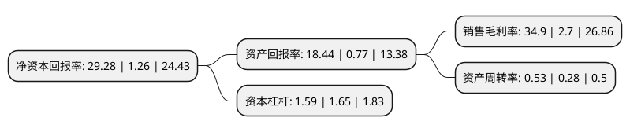

> 本页面由自动化程序生成于 2022年5月20日 01:26
> 内容可能存在错误，如有bug请提交issue至：https://github.com/Eroleice/doc-pi/issues
{.is-warning}

# 上市公司基本情况

## 基本资料

西藏珠峰资源股份有限公司（以下简称“西藏珠峰”）成立于1998年11月30日，拉萨市。于2000年12月27日在上交所主板上市。

西藏珠峰注册资本91,421.017万元，主要产品:摩托车整车，摩托车配件。以下是详细信息：

- 公司名称: 西藏珠峰资源股份有限公司
- 股票代码: 600338.SH
- 所在地: 西藏 - 拉萨市
- 成立日期: 1998年11月30日
- 注册资本: 91,421.017万元
- 法定代表人: 黄建荣
- 主营业务: 主要产品:摩托车整车，摩托车配件
- 公司官网: www.xizangzhufeng.com
- 公司介绍: 公司是一家以矿山综合开发为主的资源类上市企业，主要从事矿产资源勘探、开采、矿石加工、金属冶炼、矿产品贸易、矿产资源及相关产业投资运作等业务。公司下属主要子公司塔中矿业有限公司是目前塔吉克斯坦最大的中资企业，拥有铅锌资源量1亿多吨，600万金属吨，是中国企业在中亚地区目前获得的最具有战略价值的多金属矿山资源。塔中矿业作为上海合作组织经贸合作框架下的样板工程，是目前中塔两国矿业领域最大的合作项目，也是我国在“一带一路”国家战略布局上的标杆企业。

## 股东及高管情况

上市公司第一大股东为新疆塔城国际资源有限公司，持股286,842,552股，占比31.38%，为上市公司实际控制人。

截至2022年03月31日，上市公司的前十大股东中，共有2名自然人股东，4名机构股东，3个产品账户，1个海外主体，其中5%以上大股东共有2名。上市公司前十大股东明细如下：

> 截至2022年03月31日，上市公司前十大股东信息如下：

| 股东名称 | 持股数量（股） | 持股比例 |
| --- | --- | --- |
| 新疆塔城国际资源有限公司 | 286,842,552 | 31.38% |
| 上海歌石祥金投资合伙企业(有限合伙) | 47,471,638 | 5.19% |
| 中国环球新技术进出口有限公司 | 44,864,380 | 4.91% |
| 香港中央结算有限公司(陆股通) | 17,783,850 | 1.95% |
| 刘美宝 | 12,093,408 | 1.32% |
| 上海歌金企业管理有限公司 | 12,062,242 | 1.32% |
| 中国农业银行股份有限公司-上投摩根新兴动力混合型证券投资基金 | 8,113,634 | 0.89% |
| 中国银行股份有限公司-上投摩根远见两年持有期混合型证券投资基金 | 7,739,740 | 0.85% |
| 朱立锋 | 6,006,900 | 0.66% |
| 中国建设银行股份有限公司-创金合信新能源汽车主题股票型发起式证券投资基金 | 4,204,261 | 0.46% |

## 杜邦分析

> 数据列示周期：2021年 | 2020年 | 2019年
{.is-info}

上市公司的净资产收益率在近一年有所上升，上升幅度为2223.81%，其变化情况分解如下：
- 上市公司的销售毛利率在近一年上升了1192.59%，可能是生产效率的提升、商品原材料价格下跌或商品价格的上涨所致。
- 上市公司的资产周转率在近一年上升了89.29%，可能是源自于更快的销售回款或库存管理效果提升。
- 上市公司的财务杠杆比率在近一年下降了-3.64%，可能是减少负债降低财务费用。

