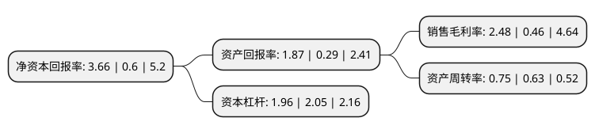

> 本页面由自动化程序生成于 2022年5月20日 01:26
> 内容可能存在错误，如有bug请提交issue至：https://github.com/Eroleice/doc-pi/issues
{.is-warning}

# 上市公司基本情况

## 基本资料

云南驰宏锌锗股份有限公司（以下简称“驰宏锌锗”）成立于2000年07月18日，曲靖市。于2004年04月20日在上交所主板上市。

驰宏锌锗注册资本509,129.157万元，主要产品:锌产品，铅产品，银产品，锗产品。以下是详细信息：

- 公司名称: 云南驰宏锌锗股份有限公司
- 股票代码: 600497.SH
- 所在地: 云南 - 曲靖市
- 成立日期: 2000年07月18日
- 注册资本: 509,129.157万元
- 法定代表人: 王冲
- 主营业务: 主要产品:锌产品，铅产品，银产品，锗产品
- 公司官网: www.chxz.com
- 公司介绍: 公司是中国百家最大的有色金属冶炼企业之一，集探矿、采矿、选矿、冶炼、化工和科研为一体的国家大型企业，是我国最早从氧化铅锌矿中提取锗用于国防尖端工业建设的企业。公司主要产品有铅、锌、锗三大系列20余个品种，拥有矿山厂、麒麟厂两座自备矿山，曲靖和会泽两个生产基地，其中麒麟厂矿山资源储量大、品位高。现公司拥有“高锗沉矾液的处理方法”发明专利权等七项核心技术，铅、锌、锗系列产品覆盖我国十余个省市，“银晶”牌锗锭、“银鑫”牌锌锭、“银磊”牌粗铅、“华达”牌等多种产品多次获奖，其中“银鑫”牌锌锭为伦敦金属交易所(LME)注册商品；公司锗产量和质量则居全国同行业之首。

## 股东及高管情况

上市公司第一大股东为云南冶金集团股份有限公司，持股1,944,142,784股，占比38.19%，为上市公司实际控制人。

截至2022年03月31日，上市公司的前十大股东中，共有2名自然人股东，2名机构股东，6个产品账户，其中5%以上大股东共有1名。上市公司前十大股东明细如下：

> 截至2022年03月31日，上市公司前十大股东信息如下：

| 股东名称 | 持股数量（股） | 持股比例 |
| --- | --- | --- |
| 云南冶金集团股份有限公司 | 1,944,142,784 | 38.19% |
| 苏庭宝 | 250,336,298 | 4.92% |
| 华能贵诚信托有限公司-华能信托·悦晟1号单一资金信托 | 50,927,397 | 1% |
| 中国工商银行股份有限公司-交银施罗德趋势优先混合型证券投资基金 | 42,132,527 | 0.83% |
| 李维明 | 40,630,080 | 0.8% |
| 中国工商银行股份有限公司-海富通改革驱动灵活配置混合型证券投资基金 | 22,539,064 | 0.44% |
| 全国社保基金--一组合 | 21,437,973 | 0.42% |
| 全国社保基金一一一组合 | 21,437,973 | 0.42% |
| 中国建设银行股份有限公司-华安聚优精选混合型证券投资基金 | 19,351,600 | 0.38% |
| 中国农业银行股份有限公司-中证500交易型开放式指数证券投资基金 | 16,921,336 | 0.33% |

## 利润表分析

上市公司2021年总收入为217.16亿元，净利润为5.39亿元，实现盈利。

## 杜邦分析

> 数据列示周期：2021年 | 2020年 | 2019年
{.is-info}

上市公司的净资产收益率在近一年有所上升，上升幅度为510%，其变化情况分解如下：
- 上市公司的销售毛利率在近一年上升了439.13%，可能是生产效率的提升、商品原材料价格下跌或商品价格的上涨所致。
- 上市公司的资产周转率在近一年上升了19.05%，可能是源自于更快的销售回款或库存管理效果提升。
- 上市公司的财务杠杆比率在近一年下降了-4.39%，可能是减少负债降低财务费用。

