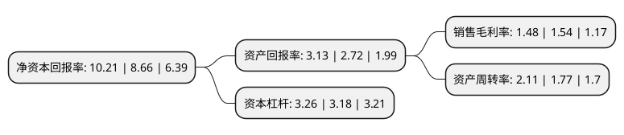

> 本页面由自动化程序生成于 2022年5月20日 01:27
> 内容可能存在错误，如有bug请提交issue至：https://github.com/Eroleice/doc-pi/issues
{.is-warning}

# 上市公司基本情况

## 基本资料

河南豫光金铅股份有限公司（以下简称“豫光金铅”）成立于2000年01月06日，济源市。于2002年07月30日在上交所主板上市。

豫光金铅注册资本109,024.263万元，主营业务:有色金属冶炼及经营，化工原料的销售;贵金属冶炼;废旧铅蓄电池收集，贮存，处置;金银制品销售。主要产品:电解铅及铅合金，白银，黄金，阴极铜，硫酸等。。以下是详细信息：

- 公司名称: 河南豫光金铅股份有限公司
- 股票代码: 600531.SH
- 所在地: 河南 - 济源市
- 成立日期: 2000年01月06日
- 注册资本: 109,024.263万元
- 法定代表人: 杨安国
- 主营业务: 主营业务:有色金属冶炼及经营，化工原料的销售;贵金属冶炼;废旧铅蓄电池收集，贮存，处置;金银制品销售主要产品:电解铅及铅合金，白银，黄金，阴极铜，硫酸等
- 公司官网: www.yggf.com.cn
- 公司介绍: 公司主要从事电解铅、白银、黄金等有色金属及贵金属产品的冶炼及进出口贸易。公司主要产品为电解铅及铅合金、白银、黄金、阴极铜、硫酸等。公司已通过ISO9001(2000版)质量管理体系、ISO14001环境管理体系和OHSAS18001职业健康安全管理体系、计量检测体系认证。公司先后建设了博士后科研工作站，有色金属产学研基地、铅锌行业技术开发中心等科研基地。重点突破了制约公司发展的资源、环境、循环经济等领域关键的前沿技术和关键技术，形成了高铅渣直接还原炼铅、废旧铅酸蓄电池自动分离-底吹熔炼再生铅工艺研究、底吹炉炼金银、铜锍底吹连续吹炼等一批国际领先拥有自主知识产权的核心技术，引领了行业发展。公司技术装备及环保治理水平在国际国内都处于领先地位。

## 股东及高管情况

上市公司第一大股东为河南豫光金铅集团有限责任公司，持股322,799,737股，占比29.61%，**疑似为**上市公司实际控制人。

截至2022年03月31日，上市公司的前十大股东中，共有6名自然人股东，3名机构股东，1个海外主体，其中5%以上大股东共有2名。上市公司前十大股东明细如下：

> 未能通过持股比例判定出上市公司实际控制人（持股30%以上）
> 可能存在通过间接持股、联合持股、协议控制等方式拥有实际控制权的主体，具体请参考上市公司定期公告！
{.is-warning}

> 截至2022年03月31日，上市公司前十大股东信息如下：

| 股东名称 | 持股数量（股） | 持股比例 |
| --- | --- | --- |
| 河南豫光金铅集团有限责任公司 | 322,799,737 | 29.61% |
| 济源投资集团有限公司 | 75,152,132 | 6.89% |
| 中国黄金集团资产管理有限公司 | 38,246,471 | 3.51% |
| 香港中央结算有限公司(陆股通) | 7,738,526 | 0.71% |
| 李荣国 | 4,569,887 | 0.42% |
| 王跃岭 | 2,632,000 | 0.24% |
| 黄钦富 | 2,603,600 | 0.24% |
| 陈劲 | 2,010,000 | 0.18% |
| 王树盛 | 2,000,500 | 0.18% |
| 张东东 | 1,770,000 | 0.16% |

## 利润表分析

上市公司2021年总收入为268.9亿元，净利润为3.98亿元，实现盈利。

## 杜邦分析

> 数据列示周期：2021年 | 2020年 | 2019年
{.is-info}

上市公司的净资产收益率在近一年有所上升，上升幅度为17.9%，其变化情况分解如下：
- 上市公司的销售毛利率在近一年下降了-3.9%，可能是生产效率的下降、商品原材料价格上涨或商品价格的下跌所致。
- 上市公司的资产周转率在近一年上升了19.21%，可能是源自于更快的销售回款或库存管理效果提升。
- 上市公司的财务杠杆比率在近一年上升了2.52%，可能是增加负债扩大生产规模。

