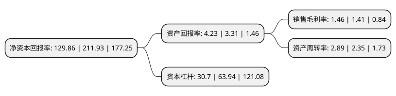

> 本页面由自动化程序生成于 2022年5月20日 01:30
> 内容可能存在错误，如有bug请提交issue至：https://github.com/Eroleice/doc-pi/issues
{.is-warning}

# 上市公司基本情况

## 基本资料

株洲冶炼集团股份有限公司（以下简称“株冶集团”）成立于1993年12月20日，株洲市。于2004年08月30日在上交所主板上市。

株冶集团注册资本52,745.791万元，主要产品:铅，锌及其合金产品。主营业务:国家法律法规允许的产业投资;冶炼，销售有色金属产品，矿产品及副产品;生产，销售工业硫酸，二氧化硫烟气;研究，开发，生产，销售政策允许的金属新材料。以下是详细信息：

- 公司名称: 株洲冶炼集团股份有限公司
- 股票代码: 600961.SH
- 所在地: 湖南 - 株洲市
- 成立日期: 1993年12月20日
- 注册资本: 52,745.791万元
- 法定代表人: 刘朗明
- 主营业务: 主要产品:铅，锌及其合金产品主营业务:国家法律法规允许的产业投资;冶炼，销售有色金属产品，矿产品及副产品;生产，销售工业硫酸，二氧化硫烟气;研究，开发，生产，销售政策允许的金属新材料
- 公司官网: www.torchcn.com
- 公司介绍: 公司主要生产铅、锌及其合金产品，并综合回收铜、金、银、铋、镉、铟、碲等多种稀贵金属和硫酸。公司保有国内最大的铅锌生产规模，锌产量一直居同行业的首位，占全国锌产能的10%左右，为中国最大的单体锌冶炼企业。公司先后通过ISO9001质量体系、ISO14001国际环境管理体系和OHSMS18001职业健康安全体系认证，是中国铅锌业首家通过三大管理体系认证的企业。公司“火炬”牌铅锭、锌锭、银锭先后在伦敦金属交易所和上海期货交易所认证注册，“火炬”牌商标获中国驰名商标称号，多次荣获“全国用户满意企业”称号。公司是国家级高新技术企业、国家第一批循环经济试点和“两型建设”试点企业。

## 股东及高管情况

上市公司第一大股东为株洲冶炼集团有限责任公司，持股212,248,593股，占比40.24%，为上市公司实际控制人。

截至2022年04月07日，上市公司的前十大股东中，共有6名自然人股东，4名机构股东，其中5%以上大股东共有1名。上市公司前十大股东明细如下：

> 截至2022年04月07日，上市公司前十大股东信息如下：

| 股东名称 | 持股数量（股） | 持股比例 |
| --- | --- | --- |
| 株洲冶炼集团有限责任公司 | 212,248,593 | 40.24% |
| 湖南有色金属有限公司 | 14,355,222 | 2.72% |
| 鞍钢股份有限公司 | 4,631,600 | 0.88% |
| 张世杰 | 3,224,200 | 0.61% |
| 谢文澄 | 2,854,622 | 0.54% |
| 周恒 | 2,496,701 | 0.47% |
| 泰康人寿保险有限责任公司-投连-多策略优选 | 2,328,900 | 0.44% |
| 黄财福 | 2,161,001 | 0.41% |
| 郑庆余 | 2,125,100 | 0.4% |
| 邵小萍 | 2,100,000 | 0.4% |

## 利润表分析

上市公司2021年总收入为164.71亿元，净利润为2.4亿元，实现盈利。

## 杜邦分析

> 数据列示周期：2021年 | 2020年 | 2019年
{.is-info}

上市公司的净资产收益率在近一年有所下降，下降幅度为-38.73%，其变化情况分解如下：
- 上市公司的销售毛利率在近一年上升了3.55%，可能是生产效率的提升、商品原材料价格下跌或商品价格的上涨所致。
- 上市公司的资产周转率在近一年上升了22.98%，可能是源自于更快的销售回款或库存管理效果提升。
- 上市公司的财务杠杆比率在近一年下降了-51.99%，可能是减少负债降低财务费用。

