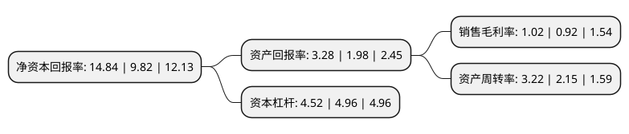

> 本页面由自动化程序生成于 2022年5月20日 01:04
> 内容可能存在错误，如有bug请提交issue至：https://github.com/Eroleice/doc-pi/issues
{.is-warning}

# 上市公司基本情况

## 基本资料

云南铜业股份有限公司（以下简称“云南铜业”）成立于1998年05月15日，昆明市。于1998年06月02日在深交所主板上市。

云南铜业注册资本169,967.856万元，主要产品:高纯阴极铜，工业硫酸，黄金，白银。主要业务:事生产和销售铜精矿及其他有色金属矿产品，高纯阴极铜，工业硫酸，黄金，白银以下是详细信息：

- 公司名称: 云南铜业股份有限公司
- 股票代码: 000878.SZ
- 所在地: 云南 - 昆明市
- 成立日期: 1998年05月15日
- 注册资本: 169,967.856万元
- 法定代表人: 田永忠
- 主营业务: 主要产品:高纯阴极铜，工业硫酸，黄金，白银事生产和销售铜精矿及其他有色金属矿产品，高纯阴极铜，工业硫酸，黄金，白银
- 公司官网: www.yunnan-copper.com
- 公司介绍: 公司是一家铜勘探、采选、冶炼、销售一体化的大型铜产业集团。公司主要从事生产和销售铜精矿及其他有色金属矿产品、高纯阴极铜、工业硫酸、黄金、白银，公司业务覆盖铜业务主要产业链，主要产品为高纯阴极铜、工业硫酸、黄金、白银。公司主产品均采用国际标准组织生产，依靠国际ISO9002质量保证体系的有效运行，保证产品受到严格的质量控制。主产品“铁峰牌”高纯阴极铜，在上海金属交易所和伦敦金属交易所注册，并荣获“中国名牌产品”称号。高纯阴极铜多次被评为省优、部优、国家优质产品，获国家名牌产品称号，在上海金属交易所挂牌交易和英国伦敦金属交易所注册，是云南省第一个生产资料“中国名牌”，在国际国内市场有很高的声誉。金锭多次被评为省优、部优产品和云南名牌产品，在上海黄金交易所注册交易，“滇金”在国内享有较高声誉。银锭被评为省优、部优产品和云南名牌产品，在英国伦敦金银市场协会注册交易。工业硫酸：被评为省优、部优产品和云南名牌产品。公司采用世界先进的铜冶炼技术及ISO9001—2000、GB/T28001—2001二合一标准体系组织生产，主要经济技术指标均为全国同行业领先水平，现已发展为中国三大铜工业有色金属企业之一。

## 股东及高管情况

上市公司第一大股东为云南铜业(集团)有限公司，持股637,469,718股，占比37.51%，为上市公司实际控制人。

截至2022年03月31日，上市公司的前十大股东中，共有2名自然人股东，5名机构股东，2个产品账户，1个海外主体，其中5%以上大股东共有1名。上市公司前十大股东明细如下：

> 截至2022年03月31日，上市公司前十大股东信息如下：

| 股东名称 | 持股数量（股） | 持股比例 |
| --- | --- | --- |
| 云南铜业(集团)有限公司 | 637,469,718 | 37.51% |
| 迪庆藏族自治州开发投资集团有限公司 | 57,714,511 | 3.4% |
| 香港中央结算有限公司(陆股通) | 35,317,274 | 2.08% |
| 中央企业乡村产业投资基金股份有限公司 | 20,502,507 | 1.21% |
| 华能国际电力开发公司 | 20,085,561 | 1.18% |
| 中国大唐集团有限公司 | 20,000,000 | 1.18% |
| 陈小毛 | 8,300,000 | 0.49% |
| 中国长城资产管理股份有限公司 | 7,000,000 | 0.41% |
| 国新央企运营投资基金管理(广州)有限公司-国新央企运营(广州)投资基金(有限合伙) | 6,608,800 | 0.39% |
| 耿晓奇 | 6,149,147 | 0.36% |

## 利润表分析

上市公司2021年总收入为1,270.57亿元，净利润为12.95亿元，实现盈利。

## 杜邦分析

> 数据列示周期：2021年 | 2020年 | 2019年
{.is-info}

上市公司的净资产收益率在近一年有所上升，上升幅度为51.12%，其变化情况分解如下：
- 上市公司的销售毛利率在近一年上升了10.87%，可能是生产效率的提升、商品原材料价格下跌或商品价格的上涨所致。
- 上市公司的资产周转率在近一年上升了49.77%，可能是源自于更快的销售回款或库存管理效果提升。
- 上市公司的财务杠杆比率在近一年下降了-8.87%，可能是减少负债降低财务费用。

