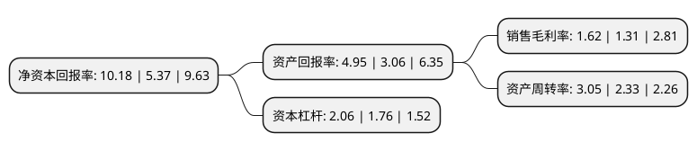

> 本页面由自动化程序生成于 2022年5月20日 01:06
> 内容可能存在错误，如有bug请提交issue至：https://github.com/Eroleice/doc-pi/issues
{.is-warning}

# 上市公司基本情况

## 基本资料

安徽楚江科技新材料股份有限公司（以下简称“楚江新材”）成立于2005年12月21日，芜湖市。于2007年09月21日在深交所中小板上市。

楚江新材注册资本133,453.004万元，主要产品:高精度铜合金板带材，精密铜合金线材和铜导体材料主营业务:高精度铜合金板带材，精密铜合金线材和铜导体材料的研发，制造和销售。以下是详细信息：

- 公司名称: 安徽楚江科技新材料股份有限公司
- 股票代码: 002171.SZ
- 所在地: 安徽 - 芜湖市
- 成立日期: 2005年12月21日
- 注册资本: 133,453.004万元
- 法定代表人: 姜纯
- 主营业务: 主要产品:高精度铜合金板带材，精密铜合金线材和铜导体材料主营业务:高精度铜合金板带材，精密铜合金线材和铜导体材料的研发，制造和销售
- 公司官网: www.ahcjxc.com
- 公司介绍: 公司致力于高精度铜合金板带材、精密铜合金线材和铜导体材料的研发、制造和销售，为消费电子、汽车电子、新能源电池、光伏能源、汽车线束、LED和轨道交通等行业提供优质的工业材料和服务。公司是国内重要先进铜基材料研发和制造基地、安徽省循环经济示范企业，公司先进铜基材料和高端热工装备及新材料二大主业业绩均取得显著增长，产品研发和技术创新成果丰硕，公司发展战略、定位、方向、目标明确，项目投资稳步推进公司。

## 股东及高管情况

上市公司第一大股东为安徽楚江投资集团有限公司，持股431,739,560股，占比32.35%，为上市公司实际控制人。

截至2022年05月10日，上市公司的前十大股东中，共有5名自然人股东，1名机构股东，3个产品账户，1个海外主体，其中5%以上大股东共有1名。上市公司前十大股东明细如下：

> 截至2022年05月10日，上市公司前十大股东信息如下：

| 股东名称 | 持股数量（股） | 持股比例 |
| --- | --- | --- |
| 安徽楚江投资集团有限公司 | 431,739,560 | 32.35% |
| 国家军民融合产业投资基金有限责任公司 | 66,501,475 | 4.98% |
| 缪云良 | 63,402,468 | 4.75% |
| 汤优钢 | 14,331,870 | 1.07% |
| 香港中央结算有限公司(陆股通) | 13,790,846 | 1.03% |
| 曹文玉 | 13,201,889 | 0.99% |
| 唐武盛 | 11,891,307 | 0.89% |
| 航发基金管理有限公司-北京国发航空发动机产业投资基金中心(有限合伙) | 11,507,593 | 0.86% |
| 曹全中 | 10,716,332 | 0.8% |
| 基本养老保险基金一五零一二组合 | 10,000,000 | 0.75% |

## 利润表分析

上市公司2021年总收入为373.49亿元，净利润为6.06亿元，实现盈利。

## 杜邦分析

> 数据列示周期：2021年 | 2020年 | 2019年
{.is-info}

上市公司的净资产收益率在近一年有所上升，上升幅度为89.57%，其变化情况分解如下：
- 上市公司的销售毛利率在近一年上升了23.66%，可能是生产效率的提升、商品原材料价格下跌或商品价格的上涨所致。
- 上市公司的资产周转率在近一年上升了30.9%，可能是源自于更快的销售回款或库存管理效果提升。
- 上市公司的财务杠杆比率在近一年上升了17.05%，可能是增加负债扩大生产规模。

