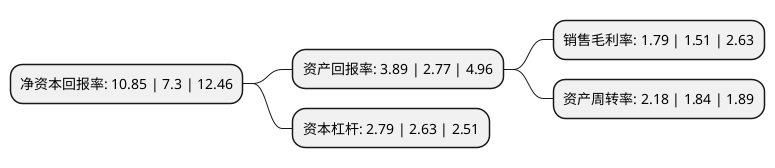

> 本页面由自动化程序生成于 2022年5月20日 01:07
> 内容可能存在错误，如有bug请提交issue至：https://github.com/Eroleice/doc-pi/issues
{.is-warning}

# 上市公司基本情况

## 基本资料

浙江海亮股份有限公司（以下简称“海亮股份”）成立于2001年10月29日，绍兴市。于2008年01月16日在深交所中小板上市。

海亮股份注册资本196,673.631万元，主要产品:铜管，铜棒，铜管接件，铜铝复合导体，铝型材等。主营业务:铜管，铜棒，铜管接件，铜铝复合导体，铝型材等产品的研发，生产制造和销售。以下是详细信息：

- 公司名称: 浙江海亮股份有限公司
- 股票代码: 002203.SZ
- 所在地: 浙江 - 绍兴市
- 成立日期: 2001年10月29日
- 注册资本: 196,673.631万元
- 法定代表人: 朱张泉
- 主营业务: 主要产品:铜管，铜棒，铜管接件，铜铝复合导体，铝型材等主营业务:铜管，铜棒，铜管接件，铜铝复合导体，铝型材等产品的研发，生产制造和销售
- 公司官网: www.hailiangstock.com
- 公司介绍: 公司主要从事铜管、铜棒、铜管接件、铜铝复合导体、铝型材等产品的研发、生产制造和销售。公司产品广泛用于空调和冰箱制冷、建筑水管、海水淡化、舰船制造、核电设施、装备制造、汽车工业、电子通讯、交通运输、五金机械、电力等行业。公司是全球最大、国际最具竞争力的铜加工企业之一，为中国最大的铜管、铜管接件出口企业之一，为铜加工行业精细化管理标杆企业。公司的生产经营采用“以销定产”的经营模式，产品销售采用“原材料价格＋加工费”的定价模式，从而赚取稳定的加工费的盈利模式。

## 股东及高管情况

上市公司第一大股东为海亮集团有限公司，持股588,351,239股，占比29.92%，**疑似为**上市公司实际控制人。

截至2022年04月15日，上市公司的前十大股东中，共有2名自然人股东，3名机构股东，3个产品账户，2个海外主体，其中5%以上大股东共有4名。上市公司前十大股东明细如下：

> 未能通过持股比例判定出上市公司实际控制人（持股30%以上）
> 可能存在通过间接持股、联合持股、协议控制等方式拥有实际控制权的主体，具体请参考上市公司定期公告！
{.is-warning}

> 截至2022年04月15日，上市公司前十大股东信息如下：

| 股东名称 | 持股数量（股） | 持股比例 |
| --- | --- | --- |
| 海亮集团有限公司 | 588,351,239 | 29.92% |
| 海亮集团有限公司 | 584,229,734 | 29.71% |
| Z&P ENTERPRISES LLC | 213,213,964 | 10.84% |
| Z&P ENTERPRISES LLC | 213,213,964 | 10.84% |
| 浙江嘉行慈善基金会 | 61,073,474 | 3.11% |
| 冯海良 | 59,840,466 | 3.04% |
| 浙江海亮股份有限公司-第二期员工持股计划 | 36,661,544 | 1.86% |
| 陈东 | 34,090,938 | 1.73% |
| 杭州久盈资产管理有限公司-久盈价值增强4号私募证券投资基金 | 30,628,600 | 1.56% |
| 中信建投证券股份有限公司 | 22,217,388 | 1.13% |

## 利润表分析

上市公司2021年总收入为634.38亿元，净利润为11.31亿元，实现盈利。

## 杜邦分析

> 数据列示周期：2021年 | 2020年 | 2019年
{.is-info}

上市公司的净资产收益率在近一年有所上升，上升幅度为48.63%，其变化情况分解如下：
- 上市公司的销售毛利率在近一年上升了18.54%，可能是生产效率的提升、商品原材料价格下跌或商品价格的上涨所致。
- 上市公司的资产周转率在近一年上升了18.48%，可能是源自于更快的销售回款或库存管理效果提升。
- 上市公司的财务杠杆比率在近一年上升了6.08%，可能是增加负债扩大生产规模。

