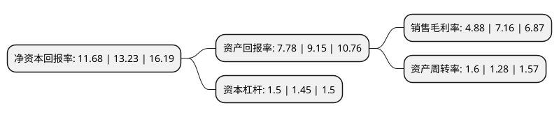

> 本页面由自动化程序生成于 2022年5月20日 01:19
> 内容可能存在错误，如有bug请提交issue至：https://github.com/Eroleice/doc-pi/issues
{.is-warning}

# 上市公司基本情况

## 基本资料

江阴电工合金股份有限公司（以下简称“电工合金”）成立于1985年06月12日，无锡市。于2017年09月07日在深交所创业板上市。

电工合金注册资本33,280万元，主营业务:铜及铜合金产品的研发，生产和销售。主要产品:电气化铁路接触网和铜母线两大系列产品。以下是详细信息：

- 公司名称: 江阴电工合金股份有限公司
- 股票代码: 300697.SZ
- 所在地: 江苏 - 无锡市
- 成立日期: 1985年06月12日
- 注册资本: 33,280万元
- 法定代表人: 冯岳军
- 主营业务: 主营业务:铜及铜合金产品的研发，生产和销售主要产品:电气化铁路接触网和铜母线两大系列产品
- 公司官网: www.cn-dghj.com
- 公司介绍: 公司主营业务为铜及铜合金产品的研发、生产和销售，主要产品按大类分为电气化铁路接触网系列产品以及铜母线系列产品，其中，电气化铁路接触网系列产品包括电气化铁路用接触线和承力索，铜母线系列产品包括铜母线及其深加工铜制零部件。公司依靠自主研发和技术创新，已建立起行业领先的技术优势。公司设有江苏省博士后创新实践基地和江苏省企业技术中心，拥有多项江苏省高新技术产品，并连续多次被评为“江苏省民营科技企业”，承担并实施了多项科技型中小企业技术创新基金项目及国家火炬计划项目。同时，公司多次参与我国铁路接触线和铜母线行业标准的制定工作，在业界具有较大的影响力。

## 股东及高管情况

上市公司第一大股东为陈力皎，持股104,000,000股，占比31.25%，为上市公司实际控制人。

截至2022年03月31日，上市公司的前十大股东中，共有7名自然人股东，3名机构股东，其中5%以上大股东共有3名。上市公司前十大股东明细如下：

> 截至2022年03月31日，上市公司前十大股东信息如下：

| 股东名称 | 持股数量（股） | 持股比例 |
| --- | --- | --- |
| 陈力皎 | 104,000,000 | 31.25% |
| 镇江市金康盛企业管理有限责任公司 | 99,806,720 | 29.99% |
| 天津秋炜管理咨询合伙企业(有限合伙) | 24,960,000 | 7.5% |
| 镇江秋炜商务服务有限公司 | 14,179,980 | 4.26% |
| 黎虹 | 1,577,500 | 0.47% |
| 曹万清 | 1,000,000 | 0.3% |
| 喻孝军 | 671,900 | 0.2% |
| 蒋根兴 | 640,000 | 0.19% |
| 陆耀娟 | 600,000 | 0.18% |
| 蒋卓 | 589,244 | 0.18% |

## 利润表分析

上市公司2021年总收入为21.73亿元，净利润为1.05亿元，实现盈利。

## 杜邦分析

> 数据列示周期：2021年 | 2020年 | 2019年
{.is-info}

上市公司的净资产收益率在近一年有所下降，下降幅度为-11.72%，其变化情况分解如下：
- 上市公司的销售毛利率在近一年下降了-31.84%，可能是生产效率的下降、商品原材料价格上涨或商品价格的下跌所致。
- 上市公司的资产周转率在近一年上升了25%，可能是源自于更快的销售回款或库存管理效果提升。
- 上市公司的财务杠杆比率在近一年上升了3.45%，可能是增加负债扩大生产规模。

