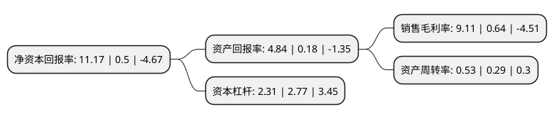

> 本页面由自动化程序生成于 2022年5月20日 01:24
> 内容可能存在错误，如有bug请提交issue至：https://github.com/Eroleice/doc-pi/issues
{.is-warning}

# 上市公司基本情况

## 基本资料

诺德投资股份有限公司（以下简称“诺德股份”）成立于1989年08月23日，长春市。于1997年10月07日在上交所主板上市。

诺德股份注册资本173,726.862万元，主要产品:高档电解铜箔产品，动力电池材料等。主营业务:新材料，新能源产品的研发，生产与销售;铜箔及铜箔工业设备及锂离子电池材料生产，销售;高新技术产业项目的投资与管理;创新金融投资与经营;国内及进出口贸易。以下是详细信息：

- 公司名称: 诺德投资股份有限公司
- 股票代码: 600110.SH
- 所在地: 吉林 - 长春市
- 成立日期: 1989年08月23日
- 注册资本: 173,726.862万元
- 法定代表人: 陈立志
- 主营业务: 主要产品:高档电解铜箔产品，动力电池材料等主营业务:新材料，新能源产品的研发，生产与销售;铜箔及铜箔工业设备及锂离子电池材料生产，销售;高新技术产业项目的投资与管理;创新金融投资与经营;国内及进出口贸易
- 公司官网: www.ndgf.net
- 公司介绍: 公司前身为中国科学院长春应用化学研究所于1987年创办的长春热缩材料厂，为国家级高新技术企业。1997年10月7日在上海交易所上市，成为中国科学院系统首家上市公司。经多年技术研发与市场积累，形成了公司的核心产业为锂离子电池基础材料电解铜箔的生产、销售，作为中国大陆第一家电解铜箔的生产商，公司自主研发生产的高档电解铜箔产品、动力电池材料等系列产品具备有较为明显的技术与成本优势，已经成为国内知名的新能源锂电池材料龙头供应商。诺德股份依托产业基础和实业优势，积极布局金融服务业，通过创新投融资模式和产品，推动产业链和供应链金融服务模式的转变。公司将积极把握产融结合的发展趋势及金融业的战略投资机会，努力打造并逐步形成金融投资控股平台。

## 股东及高管情况

上市公司第一大股东为深圳市邦民产业控股有限公司，持股218,194,731股，占比12.56%，**疑似为**上市公司实际控制人。

截至2022年05月05日，上市公司的前十大股东中，共有3名机构股东，7个产品账户，其中5%以上大股东共有3名。上市公司前十大股东明细如下：

> 未能通过持股比例判定出上市公司实际控制人（持股30%以上）
> 可能存在通过间接持股、联合持股、协议控制等方式拥有实际控制权的主体，具体请参考上市公司定期公告！
{.is-warning}

> 截至2022年05月05日，上市公司前十大股东信息如下：

| 股东名称 | 持股数量（股） | 持股比例 |
| --- | --- | --- |
| 深圳市邦民产业控股有限公司 | 218,194,731 | 12.56% |
| 深圳市弘源新材料有限公司 | 150,000,000 | 8.63% |
| 深圳邦民新材料有限公司 | 150,000,000 | 8.63% |
| 全国社保基金一一八组合 | 25,265,248 | 1.45% |
| 中国银行股份有限公司-华夏行业景气混合型证券投资基金 | 24,424,909 | 1.41% |
| 中国银行股份有限公司-兴全合丰三年持有期混合型证券投资基金 | 19,004,475 | 1.09% |
| 中信建投证券股份有限公司-建信新能源行业股票型证券投资基金 | 17,144,501 | 0.99% |
| 中国邮政储蓄银行有限责任公司-东方增长中小盘混合型开放式证券投资基金 | 16,287,271 | 0.94% |
| 交通银行股份有限公司-工银瑞信新能源汽车主题混合型证券投资基金 | 15,122,169 | 0.87% |
| 上海浦东发展银行股份有限公司-工银瑞信生态环境行业股票型证券投资基金 | 12,609,600 | 0.73% |

## 利润表分析

上市公司2021年总收入为44.45亿元，净利润为4.05亿元，实现盈利。

## 杜邦分析

> 数据列示周期：2021年 | 2020年 | 2019年
{.is-info}

上市公司的净资产收益率在近一年有所上升，上升幅度为2134%，其变化情况分解如下：
- 上市公司的销售毛利率在近一年上升了1323.44%，可能是生产效率的提升、商品原材料价格下跌或商品价格的上涨所致。
- 上市公司的资产周转率在近一年上升了82.76%，可能是源自于更快的销售回款或库存管理效果提升。
- 上市公司的财务杠杆比率在近一年下降了-16.61%，可能是减少负债降低财务费用。

