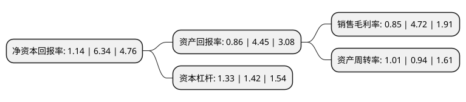

> 本页面由自动化程序生成于 2022年5月20日 01:26
> 内容可能存在错误，如有bug请提交issue至：https://github.com/Eroleice/doc-pi/issues
{.is-warning}

# 上市公司基本情况

## 基本资料

鹏欣环球资源股份有限公司（以下简称“鹏欣资源”）成立于2000年09月29日，上海市。于2003年06月26日在上交所主板上市。

鹏欣资源注册资本221,288.708万元，主营业务:有色金属及贵金属的采选业务，冶炼及销售，以及贸易，新能源及金融等。以下是详细信息：

- 公司名称: 鹏欣环球资源股份有限公司
- 股票代码: 600490.SH
- 所在地: 上海 - 上海市
- 成立日期: 2000年09月29日
- 注册资本: 221,288.708万元
- 法定代表人: 王晋定
- 主营业务: 主营业务:有色金属及贵金属的采选业务，冶炼及销售，以及贸易，新能源及金融等
- 公司官网: www.pengxinzy.com.cn
- 公司介绍: 公司是一家从事境外有色金属矿产资源(铜金属)的开采、冶炼和销售业务的上市公司。公司经过多年的发展与开拓，已拥有以金属铜采矿、选矿、冶炼为核心业务的产业链，同时上市公司业务范围还包括国际贸易和金融投资。在矿业领域，上市公司将利用现有矿产资源和并购经验通过战略投资、收购等方式积极控制全球大规模优质矿产资源，重点关注有色金属、贵金属及钴等新能源产业相关的新兴矿种。在贸易和金融投资领域，一方面上市公司以服务和支持实业生产领域的发展需求为出发点，协同对接优质项目机会，实现产融互动，挖掘产业链多个环节的价值；另一方面，通过各自业务发展规划增强核心竞争力。2018年公司通过重大资产重组,收购宁波天弘100%股权,公司新增金金属业务，有色金属储备规模进一步增大，长期来看将提高有色金属的产量,利于改变上市公司当前有色金属资源结构较为单一的局面，有效充实上市公司实业生产业务板块。

## 股东及高管情况

上市公司第一大股东为上海鹏欣(集团)有限公司，持股415,858,727股，占比18.79%，**疑似为**上市公司实际控制人。

截至2022年03月31日，上市公司的前十大股东中，共有4名自然人股东，5名机构股东，1个产品账户，其中5%以上大股东共有2名。上市公司前十大股东明细如下：

> 未能通过持股比例判定出上市公司实际控制人（持股30%以上）
> 可能存在通过间接持股、联合持股、协议控制等方式拥有实际控制权的主体，具体请参考上市公司定期公告！
{.is-warning}

> 截至2022年03月31日，上市公司前十大股东信息如下：

| 股东名称 | 持股数量（股） | 持股比例 |
| --- | --- | --- |
| 上海鹏欣(集团)有限公司 | 415,858,727 | 18.79% |
| 姜照柏 | 138,166,058 | 6.24% |
| 西藏智冠投资管理有限公司 | 91,183,431 | 4.12% |
| 姜雷 | 82,599,635 | 3.73% |
| 谈意道 | 78,700,000 | 3.56% |
| 上海逸合投资管理有限公司 | 61,900,000 | 2.8% |
| 上海鹏欣农业投资(集团)有限公司 | 45,000,000 | 2.03% |
| 西藏风格投资管理有限公司 | 30,000,000 | 1.36% |
| 蒋国祥 | 21,076,600 | 0.95% |
| 鹏欣环球资源股份有限公司-第二期员工持股计划 | 16,546,200 | 0.75% |

## 利润表分析

上市公司2021年总收入为85.87亿元，净利润为0.72亿元，实现盈利。

## 杜邦分析

> 数据列示周期：2021年 | 2020年 | 2019年
{.is-info}

上市公司的净资产收益率在近一年有所下降，下降幅度为-82.02%，其变化情况分解如下：
- 上市公司的销售毛利率在近一年下降了-81.99%，可能是生产效率的下降、商品原材料价格上涨或商品价格的下跌所致。
- 上市公司的资产周转率在近一年上升了7.45%，可能是源自于更快的销售回款或库存管理效果提升。
- 上市公司的财务杠杆比率在近一年下降了-6.34%，可能是减少负债降低财务费用。

