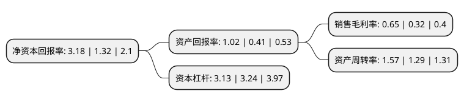

> 本页面由自动化程序生成于 2022年5月20日 01:30
> 内容可能存在错误，如有bug请提交issue至：https://github.com/Eroleice/doc-pi/issues
{.is-warning}

# 上市公司基本情况

## 基本资料

白银有色集团股份有限公司（以下简称“白银有色”）成立于2007年07月06日，白银市。于2017年02月15日在上交所主板上市。

白银有色注册资本740,477.451万元，主要产品:主要有阴极铜，铅锭，锌锭，铜材，铅材，锌材，贵金属制品等多个品种。主营业务:本公司的主要业务为铜，铅，锌，金，银等多种有色金属的采选，冶炼，加工及贸易，业务覆盖有色金属全产业链，是具有深厚行业积淀并初步形成国际布局的行业领先的大型有色金属企业。以下是详细信息：

- 公司名称: 白银有色集团股份有限公司
- 股票代码: 601212.SH
- 所在地: 甘肃 - 白银市
- 成立日期: 2007年07月06日
- 注册资本: 740,477.451万元
- 法定代表人: 王普公
- 主营业务: 主要产品:主要有阴极铜，铅锭，锌锭，铜材，铅材，锌材，贵金属制品等多个品种主营业务:本公司的主要业务为铜，铅，锌，金，银等多种有色金属的采选，冶炼，加工及贸易，业务覆盖有色金属全产业链，是具有深厚行业积淀并初步形成国际布局的行业领先的大型有色金属企业
- 公司官网: www.bynmc.com
- 公司介绍: 公司的前身白银有色金属公司是新中国最早建设的大型铜硫生产企业，也是国家“一五”时期156个重点建设项目之一，独创了我国具有自主知识产权的“白银炼铜法”。公司的主营业务为铜、铅、锌、金、银等多种有色金属的采选、冶炼、加工及贸易，业务覆盖有色金属勘探、采矿、选矿、冶炼、加工于一体的全产业链，涉及国内、南非、秘鲁、哈萨克斯坦、刚果(金)、菲律宾等多个地区，是具有深厚行业积淀并初步形成国际布局的行业领先的大型有色金属企业。公司拥有新型白银炉熔池富氧炼铜、新型焙烧炉、低污染湿法炼锌、复杂铅锌矿伴生金属综合回收、超长冷凝管、特种电磁线、核聚变超导电缆绞缆等一批处于国际国内先进水平的核心技术，申请授权了一大批专利技术，在产品结构、产品质量、综合能耗、综合利用等方面实现了提质增效和转型升级。

## 股东及高管情况

上市公司第一大股东为中信国安集团有限公司，持股2,250,000,000股，占比30.39%，为上市公司实际控制人。

截至2022年03月31日，上市公司的前十大股东中，共有4名机构股东，4个产品账户，2名其他股东，其中5%以上大股东共有3名。上市公司前十大股东明细如下：

> 截至2022年03月31日，上市公司前十大股东信息如下：

| 股东名称 | 持股数量（股） | 持股比例 |
| --- | --- | --- |
| 中信国安集团有限公司 | 2,250,000,000 | 30.39% |
| 甘肃省人民政府国有资产监督管理委员会 | 1,159,942,311 | 15.66% |
| 甘肃省新业资产经营有限责任公司 | 1,108,819,995 | 14.97% |
| 中国信达资产管理股份有限公司 | 342,874,300 | 4.63% |
| 中非发展基金有限公司 | 239,369,624 | 3.23% |
| 甘肃省财政厅 | 211,157,751 | 2.85% |
| 中国中信集团有限公司 | 195,671,272 | 2.64% |
| 甘肃长城兴陇丝路基金管理有限公司-甘肃长城兴陇丝路基金(有限合伙) | 47,816,742 | 0.65% |
| 珠海阿巴马资产管理有限公司-阿巴马元享红利97号私募证券投资基金 | 31,950,406 | 0.43% |
| 珠海阿巴马资产管理有限公司-阿巴马元享红利96号私募证券投资基金 | 30,785,982 | 0.42% |

## 利润表分析

上市公司2021年总收入为722.79亿元，净利润为4.68亿元，实现盈利。

## 杜邦分析

> 数据列示周期：2021年 | 2020年 | 2019年
{.is-info}

上市公司的净资产收益率在近一年有所上升，上升幅度为140.91%，其变化情况分解如下：
- 上市公司的销售毛利率在近一年上升了103.13%，可能是生产效率的提升、商品原材料价格下跌或商品价格的上涨所致。
- 上市公司的资产周转率在近一年上升了21.71%，可能是源自于更快的销售回款或库存管理效果提升。
- 上市公司的财务杠杆比率在近一年下降了-3.4%，可能是减少负债降低财务费用。

