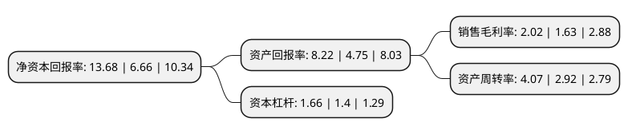

> 本页面由自动化程序生成于 2022年5月20日 01:34
> 内容可能存在错误，如有bug请提交issue至：https://github.com/Eroleice/doc-pi/issues
{.is-warning}

# 上市公司基本情况

## 基本资料

安徽众源新材料股份有限公司（以下简称“众源新材”）成立于2005年04月06日，芜湖市。于2017年09月07日在上交所主板上市。

众源新材注册资本24,382.4万元，主要产品:紫铜带箔材等。主营业务:紫铜带箔材的研发，生产和销售业务。以下是详细信息：

- 公司名称: 安徽众源新材料股份有限公司
- 股票代码: 603527.SH
- 所在地: 安徽 - 芜湖市
- 成立日期: 2005年04月06日
- 注册资本: 24,382.4万元
- 法定代表人: 封全虎
- 主营业务: 主要产品:紫铜带箔材等主营业务:紫铜带箔材的研发，生产和销售业务
- 公司官网: www.zyxcl.cn
- 公司介绍: 公司主要从事高精度紫铜系列带材的研发、生产、销售和服务。公司管理通过质量管理体系认证、环境管理体系认证、职业健康安全管理体系认证。各类高精度紫铜系列带材产品质量符合欧盟环保质量检测标准，广泛应用于通讯、电子、电力、电器等行业，是通讯电缆、电力电缆、变压器、铜包铝、散热器、热交换器、新能源电池等产品的重要材料。多年来，公司产品畅销全国，在珠三角、长三角、黄渤海及西南地区倍受青睐，享有较高的美誉。近年来，产品已出口远销至东南亚及欧美等海外市场。

## 股东及高管情况

上市公司第一大股东为封全虎，持股83,737,276股，占比34.34%，为上市公司实际控制人。

截至2022年03月31日，上市公司的前十大股东中，共有8名自然人股东，1名机构股东，1个产品账户，其中5%以上大股东共有3名。上市公司前十大股东明细如下：

> 截至2022年03月31日，上市公司前十大股东信息如下：

| 股东名称 | 持股数量（股） | 持股比例 |
| --- | --- | --- |
| 封全虎 | 83,737,276 | 34.34% |
| 阮纪友 | 30,670,016 | 12.58% |
| 上海科惠股权投资中心(有限合伙) | 14,230,772 | 5.84% |
| 王金雷 | 10,311,364 | 4.23% |
| 吴平 | 6,482,000 | 2.66% |
| 李明军 | 4,775,171 | 1.96% |
| 周丽 | 3,920,000 | 1.61% |
| 陶昌梅 | 2,500,000 | 1.03% |
| 黎文章 | 1,785,644 | 0.73% |
| 深圳资瑞兴投资有限公司-资瑞兴成长私募证券投资基金 | 1,689,480 | 0.69% |

## 利润表分析

上市公司2021年总收入为67.79亿元，净利润为1.37亿元，实现盈利。

## 杜邦分析

> 数据列示周期：2021年 | 2020年 | 2019年
{.is-info}

上市公司的净资产收益率在近一年有所上升，上升幅度为105.41%，其变化情况分解如下：
- 上市公司的销售毛利率在近一年上升了23.93%，可能是生产效率的提升、商品原材料价格下跌或商品价格的上涨所致。
- 上市公司的资产周转率在近一年上升了39.38%，可能是源自于更快的销售回款或库存管理效果提升。
- 上市公司的财务杠杆比率在近一年上升了18.57%，可能是增加负债扩大生产规模。

