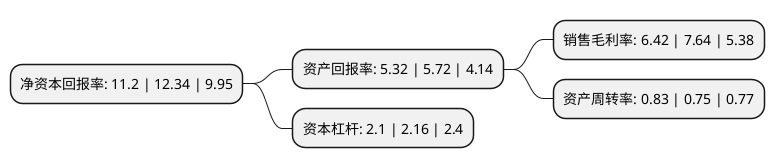

> 本页面由自动化程序生成于 2022年5月20日 01:38
> 内容可能存在错误，如有bug请提交issue至：https://github.com/Eroleice/doc-pi/issues
{.is-warning}

# 上市公司基本情况

## 基本资料

陕西斯瑞新材料股份有限公司（以下简称“斯瑞新材”）成立于1995年07月11日，西安市。于2022年03月16日在上交所科创板上市。

斯瑞新材注册资本40,001万元，以轨道交通，电力电子，航空航天，医疗影像等高端应用领域为目标市场，向客户提供高强高导铜合金材料及制品，中高压电接触材料及制品，高性能金属铬粉，医疗影像零组件等产品。以下是详细信息：

- 公司名称: 陕西斯瑞新材料股份有限公司
- 股票代码: 688102.SH
- 所在地: 陕西 - 西安市
- 成立日期: 1995年07月11日
- 注册资本: 40,001万元
- 法定代表人: 王文斌
- 主营业务: 以轨道交通，电力电子，航空航天，医疗影像等高端应用领域为目标市场，向客户提供高强高导铜合金材料及制品，中高压电接触材料及制品，高性能金属铬粉，医疗影像零组件等产品
- 公司官网: www.sxsr.com
- 公司介绍: 公司是一家以轨道交通、电力电子、航空航天、医疗影像等高端应用领域为目标市场，向客户提供高强高导铜合金材料及制品、中高压电接触材料及制品、高性能金属铬粉、医疗影像零组件等产品的关键基础材料和零组件制造商。第一代产品中高压电接触材料及制品发展至今已成为公司稳定增长的核心产品，根据中国电器工业协会统计，2019年公司的铜铬触头市场占有率在国内排名第一，客户覆盖了西门子、ABB、伊顿、施耐德等全球知名的电气设备制造商和西电集团、旭光电子等国内主要电气设备制造商。公司同时是行业内技术标准的主要起草单位、国家高技术研究发展计划(863计划)新材料领域课题的受托研发单位，拥有国家科技进步二等奖奖项和制造业单项冠军产品奖项。根据中国有色金属工业协会出具的《科学技术成果评价报告》(中色协科(评)字[2020]第271号)，公司的“真空自耗电弧熔炼铜铬触头”达到“国际领先水平”。

## 股东及高管情况

上市公司第一大股东为王文斌，持股161,366,788股，占比40.34%，为上市公司实际控制人。

截至2022年04月28日，上市公司的前十大股东中，共有8名自然人股东，2名机构股东，其中5%以上大股东共有5名。上市公司前十大股东明细如下：

> 截至2022年04月28日，上市公司前十大股东信息如下：

| 股东名称 | 持股数量（股） | 持股比例 |
| --- | --- | --- |
| 王文斌 | 161,366,788 | 40.34% |
| 王文斌 | 161,366,788 | 40.34% |
| 盛庆义 | 35,513,040 | 8.88% |
| 深圳市乐然科技开发有限公司 | 23,047,325 | 5.7617% |
| 深圳市乐然科技开发有限公司 | 22,861,560 | 5.72% |
| 李刚 | 14,940,000 | 3.73% |
| 武旭红 | 5,972,727 | 1.49% |
| 脱文梅 | 5,594,858 | 1.4% |
| 李高中 | 5,454,545 | 1.36% |
| 贾少驰 | 5,454,545 | 1.36% |

## 利润表分析

上市公司2021年总收入为9.67亿元，净利润为0.61亿元，实现盈利。

## 杜邦分析

> 数据列示周期：2021年 | 2020年 | 2019年
{.is-info}

上市公司的净资产收益率在近一年有所下降，下降幅度为-9.24%，其变化情况分解如下：
- 上市公司的销售毛利率在近一年下降了-15.97%，可能是生产效率的下降、商品原材料价格上涨或商品价格的下跌所致。
- 上市公司的资产周转率在近一年上升了10.67%，可能是源自于更快的销售回款或库存管理效果提升。
- 上市公司的财务杠杆比率在近一年下降了-2.78%，可能是减少负债降低财务费用。

