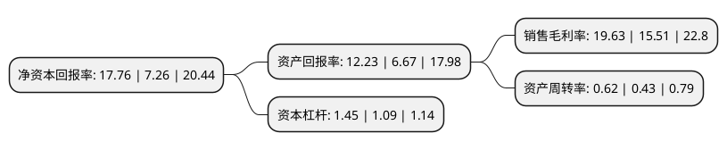

> 本页面由自动化程序生成于 2022年5月20日 01:39
> 内容可能存在错误，如有bug请提交issue至：https://github.com/Eroleice/doc-pi/issues
{.is-warning}

# 上市公司基本情况

## 基本资料

广东嘉元科技股份有限公司（以下简称“嘉元科技”）成立于2001年09月29日，梅州市。于2019年07月22日在上交所科创板上市。

嘉元科技注册资本23,419.198万元，主要从事各类高性能电解铜箔的研究，生产和销售，主要产品为超薄锂电铜箔和极薄锂电铜箔。以下是详细信息：

- 公司名称: 广东嘉元科技股份有限公司
- 股票代码: 688388.SH
- 所在地: 广东 - 梅州市
- 成立日期: 2001年09月29日
- 注册资本: 23,419.198万元
- 法定代表人: 廖平元
- 主营业务: 主要从事各类高性能电解铜箔的研究，生产和销售，主要产品为超薄锂电铜箔和极薄锂电铜箔
- 公司官网: www.gdjygf.com
- 公司介绍: 公司是一家从事各类高性能电解铜箔的研究生产和销售的高新技术企业，主要产品为超薄锂电铜箔和极薄锂电铜箔，主要用于锂离子电池的负极集流体，是锂离子电池行业重要基础材料。最终应用在新能源汽车、3C数码产品、储能系统、通讯设备、汽车电子等终端应用领域。同时，公司生产少量PCB用标准铜箔产品,公司是国内高性能锂电铜箔行业领先企业之一，已与宁德时代、宁德新能源、比亚迪等知名电池厂商建立了长期合作关系，并成为其锂电铜箔的核心供应商，并于2018年度荣获宁德时代锂电铜箔优秀供应商称号。先后获评为高新技术企业、国家知识产权优势企业、广东省创新型企业、广东省战略性新兴产业骨干企业，是GB/T31471-2015《印制电路用金属箔通用规范》国家标准主导起草单位,公司被中国电子信息材料行业协会电子铜箔分会认定为“国内锂离子动力电池用电子铜箔细分行业的骨干企业”、“高成长性电子铜箔制造企业”。公司荣获“创新驱动发展先进企业”、“最具投资价值企业”和“梅州市政府质量奖”等荣誉。

## 股东及高管情况

上市公司第一大股东为广东嘉沅投资实业发展有限公司，持股63,324,400股，占比27.04%，**疑似为**上市公司实际控制人。

截至2022年03月31日，上市公司的前十大股东中，共有1名自然人股东，1名机构股东，6个产品账户，2个海外主体，其中5%以上大股东共有1名。上市公司前十大股东明细如下：

> 未能通过持股比例判定出上市公司实际控制人（持股30%以上）
> 可能存在通过间接持股、联合持股、协议控制等方式拥有实际控制权的主体，具体请参考上市公司定期公告！
{.is-warning}

> 截至2022年03月31日，上市公司前十大股东信息如下：

| 股东名称 | 持股数量（股） | 持股比例 |
| --- | --- | --- |
| 广东嘉沅投资实业发展有限公司 | 63,324,400 | 27.04% |
| 赖仕昌 | 11,708,145 | 5% |
| 中国工商银行股份有限公司-农银汇理新能源主题灵活配置混合型证券投资基金 | 8,982,669 | 3.84% |
| JPMORGAN CHASE BANK,NATIONAL ASSOCIATION | 6,222,224 | 2.66% |
| 招商银行股份有限公司-华夏上证科创板50成份交易型开放式指数证券投资基金 | 4,632,090 | 1.98% |
| 中国邮政储蓄银行有限责任公司-东方增长中小盘混合型开放式证券投资基金 | 3,706,395 | 1.58% |
| 中国建设银行股份有限公司-创金合信新能源汽车主题股票型发起式证券投资基金 | 3,093,730 | 1.32% |
| 中国银行股份有限公司-嘉实新能源新材料股票型证券投资基金 | 2,904,107 | 1.24% |
| 中国工商银行股份有限公司-嘉实智能汽车股票型证券投资基金 | 2,777,157 | 1.19% |
| UBS   AG | 2,535,382 | 1.08% |

## 利润表分析

上市公司2021年总收入为28.04亿元，净利润为5.5亿元，实现盈利。

## 杜邦分析

> 数据列示周期：2021年 | 2020年 | 2019年
{.is-info}

上市公司的净资产收益率在近一年有所上升，上升幅度为144.63%，其变化情况分解如下：
- 上市公司的销售毛利率在近一年上升了26.56%，可能是生产效率的提升、商品原材料价格下跌或商品价格的上涨所致。
- 上市公司的资产周转率在近一年上升了44.19%，可能是源自于更快的销售回款或库存管理效果提升。
- 上市公司的财务杠杆比率在近一年上升了33.03%，可能是增加负债扩大生产规模。

