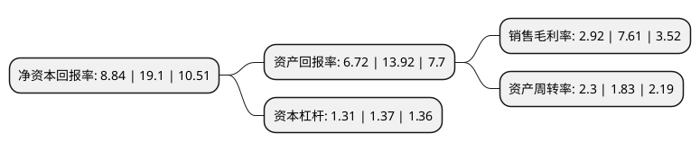

> 本页面由自动化程序生成于 2022年5月20日 01:39
> 内容可能存在错误，如有bug请提交issue至：https://github.com/Eroleice/doc-pi/issues
{.is-warning}

# 上市公司基本情况

## 基本资料

有研粉末新材料股份有限公司（以下简称“有研粉材”）成立于2004年03月04日，北京市。于2021年03月17日在上交所科创板上市。

有研粉材注册资本10,366万元，一直专注于先进有色金属粉体材料的设计，研发，生产和销售，主要产品包括先进铜基金属粉体材料，高端微电子锡基焊粉材料和3D打印粉体材料等。以下是详细信息：

- 公司名称: 有研粉末新材料股份有限公司
- 股票代码: 688456.SH
- 所在地: 北京 - 北京市
- 成立日期: 2004年03月04日
- 注册资本: 10,366万元
- 法定代表人: 汪礼敏
- 主营业务: 一直专注于先进有色金属粉体材料的设计，研发，生产和销售，主要产品包括先进铜基金属粉体材料，高端微电子锡基焊粉材料和3D打印粉体材料等
- 公司官网: www.gripm.com
- 公司介绍: 公司是国内铜基金属粉体材料和锡基焊粉材料领域的龙头企业，已成为国际领先的先进有色金属粉体材料生产企业之一，自设立以来一直专注于先进有色金属粉体材料的设计、研发、生产和销售，主要产品包括先进铜基金属粉体材料、高端微电子锡基焊粉材料和3D打印粉体材料等，公司已汇聚了一批国内顶尖的有色金属粉体材料专家，组建了国内有色金属粉体领域极具竞争力的研发团队，在有色金属粉体材料的制备和应用方面储备了多项达到国际领先或国际先进水平的技术成果；发行人逐步在北京、重庆、安徽、山东、英国和泰国等国内外地区布局了产业基地，在国内外有色金属粉体材料市场皆具有较强的市场竞争力。

## 股东及高管情况

上市公司第一大股东为有研科技集团有限公司，持股37,638,000股，占比36.31%，为上市公司实际控制人。

截至2022年03月31日，上市公司的前十大股东中，共有8名机构股东，2个产品账户，其中5%以上大股东共有1名。上市公司前十大股东明细如下：

> 截至2022年03月31日，上市公司前十大股东信息如下：

| 股东名称 | 持股数量（股） | 持股比例 |
| --- | --- | --- |
| 有研科技集团有限公司 | 37,638,000 | 36.31% |
| 重庆机电股份有限公司 | 4,900,500 | 4.73% |
| 北京华鼎新基石股权投资基金(有限合伙) | 4,839,750 | 4.67% |
| 博深股份有限公司 | 4,792,500 | 4.62% |
| 北京怀胜城市建设开发有限公司 | 3,827,250 | 3.69% |
| 北京满瑞佳德投资顾问有限公司 | 3,350,900 | 3.23% |
| 共青城恒瑞盛创投资合伙企业(有限合伙) | 2,570,000 | 2.48% |
| 成都航天工业互联网智能制造产业投资基金合伙企业(有限合伙) | 2,126,250 | 2.05% |
| 共青城恒瑞合创投资合伙企业(有限合伙) | 2,074,000 | 2% |
| 有研鼎盛投资发展有限公司 | 1,613,250 | 1.56% |

## 利润表分析

上市公司2021年总收入为27.8亿元，净利润为0.81亿元，实现盈利。

## 杜邦分析

> 数据列示周期：2021年 | 2020年 | 2019年
{.is-info}

上市公司的净资产收益率在近一年有所下降，下降幅度为-53.72%，其变化情况分解如下：
- 上市公司的销售毛利率在近一年下降了-61.63%，可能是生产效率的下降、商品原材料价格上涨或商品价格的下跌所致。
- 上市公司的资产周转率在近一年上升了25.68%，可能是源自于更快的销售回款或库存管理效果提升。
- 上市公司的财务杠杆比率在近一年下降了-4.38%，可能是减少负债降低财务费用。

