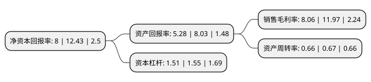

> 本页面由自动化程序生成于 2022年5月20日 01:02
> 内容可能存在错误，如有bug请提交issue至：https://github.com/Eroleice/doc-pi/issues
{.is-warning}

# 上市公司基本情况

## 基本资料

焦作万方铝业股份有限公司（以下简称“焦作万方”）成立于1996年11月27日，焦作市。于1996年09月26日在深交所主板上市。

焦作万方注册资本119,219.939万元，主要产品:是铝液，铝锭和铝合金产品等。主要业务:铝冶炼及加工。以下是详细信息：

- 公司名称: 焦作万方铝业股份有限公司
- 股票代码: 000612.SZ
- 所在地: 河南 - 焦作市
- 成立日期: 1996年11月27日
- 注册资本: 119,219.939万元
- 法定代表人: 霍斌
- 主营业务: 主要产品:是铝液，铝锭和铝合金产品等铝冶炼及加工
- 公司官网: www.jzwfal.com
- 公司介绍: 公司是一家在有色行业内有较强竞争力的公司，主营业务是铝冶炼、发电及合金制品的生产和销售，主要产品是铝液、铝锭和铝合金产品，广泛应用于建筑、电力、包装、交通运输和日用消费品等多个领域，已经形成了较为完善的煤电铝加工一体化的运营模式。主导产品“万方”牌铝锭，为伦敦金属交易所注册产品，远销美国、日本、韩国、中国香港、中国台湾等国家和地区，在国内外享有较高声誉。公司拥有外贸自营权，检验室为国家注册实验室，已通过质量管理、职业健康安全、环境三大体系认证。公司信用评级AA级。公司坚持科学发展观，以建设资源节约型、环境友好型企业为目标，依靠技术创新滚动发展，多项技术填补了国内铝电解技术空白。公司是国内首先产业化采用280KA大型预焙电解槽技术的电解铝厂，280KA电解槽产业化示范工程的成功，开启了我国大型预焙槽全面应用的时代。公司重视节能降耗工作，立足技术创新和精益管理，使公司吨铝综合能耗在国内外同行中持续处于领先行列。

## 股东及高管情况

上市公司第一大股东为樟树市和泰安成投资管理中心(有限合伙)，持股206,278,976股，占比17.3%，**疑似为**上市公司实际控制人。

截至2022年03月31日，上市公司的前十大股东中，共有3名自然人股东，4名机构股东，3个产品账户，其中5%以上大股东共有2名。上市公司前十大股东明细如下：

> 未能通过持股比例判定出上市公司实际控制人（持股30%以上）
> 可能存在通过间接持股、联合持股、协议控制等方式拥有实际控制权的主体，具体请参考上市公司定期公告！
{.is-warning}

> 截至2022年03月31日，上市公司前十大股东信息如下：

| 股东名称 | 持股数量（股） | 持股比例 |
| --- | --- | --- |
| 樟树市和泰安成投资管理中心(有限合伙) | 206,278,976 | 17.3% |
| 宁波中曼科技管理有限公司 | 141,529,491 | 11.87% |
| 焦作市万方集团有限责任公司 | 52,880,000 | 4.44% |
| 和泰人寿保险股份有限公司-传统保险产品 | 14,401,600 | 1.21% |
| 宁波梅山保税港区玉出昆冈投资管理合伙企业(有限合伙) | 13,000,000 | 1.09% |
| 国泰君安证券股份有限公司约定购回专用账户 | 9,300,000 | 0.78% |
| 胡博文 | 9,187,827 | 0.77% |
| 秦彦 | 6,645,629 | 0.56% |
| 魏巍 | 5,835,016 | 0.49% |
| 中国建设银行股份有限公司-嘉实中证稀土产业交易型开放式指数证券投资基金 | 5,640,518 | 0.47% |

## 杜邦分析

> 数据列示周期：2021年 | 2020年 | 2019年
{.is-info}

上市公司的净资产收益率在近一年有所下降，下降幅度为-35.64%，其变化情况分解如下：
- 上市公司的销售毛利率在近一年下降了-32.66%，可能是生产效率的下降、商品原材料价格上涨或商品价格的下跌所致。
- 上市公司的资产周转率在近一年下降了-1.49%，可能是源自于更慢的销售回款或库存管理效果下降。
- 上市公司的财务杠杆比率在近一年下降了-2.58%，可能是减少负债降低财务费用。

