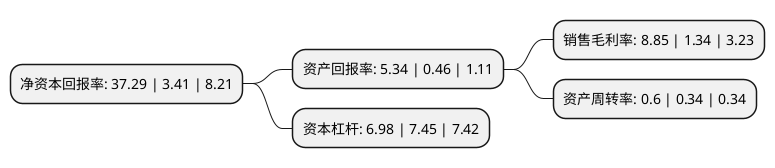

> 本页面由自动化程序生成于 2022年5月20日 01:04
> 内容可能存在错误，如有bug请提交issue至：https://github.com/Eroleice/doc-pi/issues
{.is-warning}

# 上市公司基本情况

## 基本资料

河南神火煤电股份有限公司（以下简称“神火股份”）成立于1998年08月31日，商丘市。于1999年08月31日在深交所主板上市。

神火股份注册资本225,098.661万元，主要业务:煤煤炭，发电(基本为自发自用)，氧化铝，铝产品的生产，加工和销售。主要产品:煤炭，型焦，铝锭，铝合金，铸轧卷，冷轧卷，电力等。。以下是详细信息：

- 公司名称: 河南神火煤电股份有限公司
- 股票代码: 000933.SZ
- 所在地: 河南 - 商丘市
- 成立日期: 1998年08月31日
- 注册资本: 225,098.661万元
- 法定代表人: 李宏伟
- 主营业务: 煤煤炭，发电(基本为自发自用)，氧化铝，铝产品的生产，加工和销售主要产品:煤炭，型焦，铝锭，铝合金，铸轧卷，冷轧卷，电力等
- 公司官网: www.shenhuo.com
- 公司介绍: 公司是河南神火集团的核心企业，公司系国家大型企业，国家重点扶植企业，河南省100家建立现代企业制度试点企业，银行“AAA”信誉企业，全国500家文明创建先进单位，河南省重点扶持的煤炭骨干企业及铝加工企业，河南省第一批循环经济试点企业。公司主营业务为煤炭、发电(基本为自发自用)、氧化铝、铝产品的生产、加工和销售，已形成比较完善的煤电铝材产业链。目前，神火集团主要产品的年生产能力为：煤炭1500万吨，电解铝90万吨，发电装机容量870MW，铸造型焦10万吨，铝箔2.5万吨。主要产业分别通过了国际质量管理体系、环境管理体系、职业安全健康管理体系、计量管理体系认证。产品在国内外市场上享有较高信誉，经济效益连续多年名列全国同行业前茅。公司已形成比较完善的煤电铝材产业链。优质的产品质量和品牌影响力为公司产品保持市场竞争奠定了基础。

## 股东及高管情况

上市公司第一大股东为河南神火集团有限公司，持股482,103,191股，占比21.42%，**疑似为**上市公司实际控制人。

截至2022年04月25日，上市公司的前十大股东中，共有3名机构股东，6个产品账户，1个海外主体，其中5%以上大股东共有3名。上市公司前十大股东明细如下：

> 未能通过持股比例判定出上市公司实际控制人（持股30%以上）
> 可能存在通过间接持股、联合持股、协议控制等方式拥有实际控制权的主体，具体请参考上市公司定期公告！
{.is-warning}

> 截至2022年04月25日，上市公司前十大股东信息如下：

| 股东名称 | 持股数量（股） | 持股比例 |
| --- | --- | --- |
| 河南神火集团有限公司 | 482,103,191 | 21.42% |
| 商丘市普天工贸有限公司 | 191,750,885 | 8.52% |
| 香港中央结算有限公司(陆股通) | 134,745,296 | 5.99% |
| 商丘新创投资股份有限公司 | 81,452,666 | 3.62% |
| 中国银行股份有限公司-易方达供给改革灵活配置混合型证券投资基金 | 25,081,994 | 1.11% |
| 上海浦东发展银行股份有限公司-易方达裕祥回报债券型证券投资基金 | 22,409,600 | 1% |
| 全国社保基金四零三组合 | 21,305,800 | 0.95% |
| 全国社保基金六零一组合 | 15,762,300 | 0.7% |
| 易方达基金-国新央企新发展格局私募证券投资基金-易方达基金-央企稳健收益-1单一资产管理计划 | 13,231,401 | 0.59% |
| 招商银行股份有限公司-易方达瑞恒灵活配置混合型证券投资基金 | 11,954,763 | 0.53% |

## 利润表分析

上市公司2021年总收入为344.51亿元，净利润为30.48亿元，实现盈利。

## 杜邦分析

> 数据列示周期：2021年 | 2020年 | 2019年
{.is-info}

上市公司的净资产收益率在近一年有所上升，上升幅度为993.55%，其变化情况分解如下：
- 上市公司的销售毛利率在近一年上升了560.45%，可能是生产效率的提升、商品原材料价格下跌或商品价格的上涨所致。
- 上市公司的资产周转率在近一年上升了76.47%，可能是源自于更快的销售回款或库存管理效果提升。
- 上市公司的财务杠杆比率在近一年下降了-6.31%，可能是减少负债降低财务费用。

