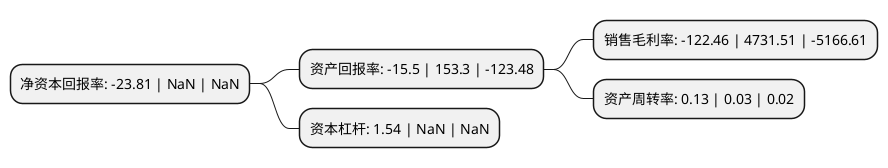

> 本页面由自动化程序生成于 2022年5月20日 01:09
> 内容可能存在错误，如有bug请提交issue至：https://github.com/Eroleice/doc-pi/issues
{.is-warning}

# 上市公司基本情况

## 基本资料

吉林利源精制股份有限公司（以下简称“*ST利源”）成立于2001年11月13日，辽源市。于2010年11月17日在深交所中小板上市。

*ST利源注册资本355,000万元，主营业务:铝型材及深加工产品，轨道交通装备的研发，生产与销售业务。主要产品:工业铝型材，建筑铝型材及多种铝型材深加工产品，轨道车辆装备等。以下是详细信息：

- 公司名称: 吉林利源精制股份有限公司
- 股票代码: 002501.SZ
- 所在地: 吉林 - 辽源市
- 成立日期: 2001年11月13日
- 注册资本: 355,000万元
- 法定代表人: 吴睿
- 主营业务: 主营业务:铝型材及深加工产品，轨道交通装备的研发，生产与销售业务主要产品:工业铝型材，建筑铝型材及多种铝型材深加工产品，轨道车辆装备等
- 公司官网: www.liyuanlvye.com
- 公司介绍: 公司是国内领先的铝合金型材生产厂商之一，主要从事各种铝合金型材产品的开发、生产和销售。主要产品有工业铝型材、建筑铝型材、特殊型材及各种铝型材深加工部件和产品、铝合金轨道车车头、车体。公司装备技术水平领先，具备大截面复杂型材加工能力，可为机械装备、电力设备、消费电子、交通装备等众多领域提供铝制产品，持续为国内外知名品牌提供产品服务，产品附加值保持较高水平。公司先后荣获吉林省百强民营企业、全国守合同重信用企业、吉林省民营科技企业、质量管理先进企业、吉林省最具成长性中型企业50强等殊荣。

## 股东及高管情况

上市公司第一大股东为倍有智能科技(深圳)有限公司，持股800,000,000股，占比22.54%，**疑似为**上市公司实际控制人。

截至2022年03月31日，上市公司的前十大股东中，共有3名自然人股东，6名机构股东，1个产品账户，其中5%以上大股东共有2名。上市公司前十大股东明细如下：

> 未能通过持股比例判定出上市公司实际控制人（持股30%以上）
> 可能存在通过间接持股、联合持股、协议控制等方式拥有实际控制权的主体，具体请参考上市公司定期公告！
{.is-warning}

> 截至2022年03月31日，上市公司前十大股东信息如下：

| 股东名称 | 持股数量（股） | 持股比例 |
| --- | --- | --- |
| 倍有智能科技(深圳)有限公司 | 800,000,000 | 22.54% |
| 吉林利源精制股份有限公司破产企业财产处置专用账户 | 332,435,720 | 9.36% |
| 王民 | 175,881,028 | 4.95% |
| 海南省恒馨贸易合伙企业(有限合伙) | 150,000,000 | 4.23% |
| 郑世财 | 100,000,000 | 2.82% |
| 张永侠 | 94,500,000 | 2.66% |
| 海南世泉贸易合伙企业(有限合伙) | 75,000,000 | 2.11% |
| 阿拉山口市弘通股权投资有限合伙企业 | 70,245,000 | 1.98% |
| 锦银金融租赁有限责任公司 | 62,981,157 | 1.77% |
| 东北证券股份有限公司 | 57,459,489 | 1.62% |

## 杜邦分析

> 数据列示周期：2021年 | 2020年 | 2019年
{.is-info}

上市公司的净资产收益率在近一年有所下降，下降幅度为NaN%，其变化情况分解如下：
- 上市公司的销售毛利率在近一年下降了-102.59%，可能是生产效率的下降、商品原材料价格上涨或商品价格的下跌所致。
- 上市公司的资产周转率在近一年上升了333.33%，可能是源自于更快的销售回款或库存管理效果提升。
- 上市公司的财务杠杆比率在近一年下降了NaN%，可能是减少负债降低财务费用。

