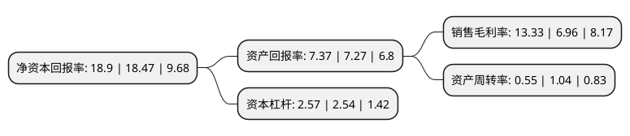

> 本页面由自动化程序生成于 2022年5月20日 01:10
> 内容可能存在错误，如有bug请提交issue至：https://github.com/Eroleice/doc-pi/issues
{.is-warning}

# 上市公司基本情况

## 基本资料

天山铝业集团股份有限公司（以下简称“天山铝业”）成立于1997年11月03日，台州市。于2010年12月31日在深交所中小板上市。

天山铝业注册资本465,188.542万元，主营业务为原铝，氧化铝，高纯铝，预焙阳极以及铝深加工产品及材料的生产和销售以下是详细信息：

- 公司名称: 天山铝业集团股份有限公司
- 股票代码: 002532.SZ
- 所在地: 浙江 - 台州市
- 成立日期: 1997年11月03日
- 注册资本: 465,188.542万元
- 法定代表人: 曾超林
- 主营业务: 主营业务为原铝，氧化铝，高纯铝，预焙阳极以及铝深加工产品及材料的生产和销售
- 公司官网: www.xjtsly.net
- 公司介绍: 公司已建成年产能120万吨原铝生产线，配套建有6台350MW发电机组和年产能30万吨预焙阳极生产线，在江苏江阴建有年产5万吨铝深加工基地。公司正在广西靖西新建年产250万吨氧化铝生产线、在新疆阿克苏地区阿拉尔市国家级经济开发区新建年产50万吨预焙阳极生产线、在新疆石河子新建6万吨高纯铝生产线。天山铝业在电力及氧化铝成本方面具有显著优势，在环保及高端产品技术领域处于领先，是一家覆盖铝产业链上下游的一体化大型综合铝业集团。根据阿拉丁研究报告，以截至2018年12月原铝生产能力排名，天山铝业原铝单厂产能排名全国第二，总产能位列全国前十、新疆第二。

## 股东及高管情况

上市公司第一大股东为石河子市锦隆能源产业链有限公司，持股913,175,412股，占比19.63%，**疑似为**上市公司实际控制人。

截至2022年03月31日，上市公司的前十大股东中，共有5名自然人股东，5名机构股东，其中5%以上大股东共有6名。上市公司前十大股东明细如下：

> 未能通过持股比例判定出上市公司实际控制人（持股30%以上）
> 可能存在通过间接持股、联合持股、协议控制等方式拥有实际控制权的主体，具体请参考上市公司定期公告！
{.is-warning}

> 截至2022年03月31日，上市公司前十大股东信息如下：

| 股东名称 | 持股数量（股） | 持股比例 |
| --- | --- | --- |
| 石河子市锦隆能源产业链有限公司 | 913,175,412 | 19.63% |
| 曾超懿 | 393,778,364 | 8.46% |
| 中信聚信(北京)资本管理有限公司-潍坊聚信锦濛投资管理合伙企业(有限合伙) | 370,370,370 | 7.96% |
| 石河子市锦汇能源投资有限公司 | 345,357,966 | 7.42% |
| 曾超林 | 302,061,587 | 6.49% |
| 华融致诚柒号(深圳)投资合伙企业(有限合伙) | 239,651,416 | 5.15% |
| 信风投资管理有限公司-芜湖信泽润投资管理合伙企业(有限合伙) | 174,291,938 | 3.75% |
| 曾明柳 | 170,331,155 | 3.66% |
| 曾益柳 | 157,228,758 | 3.38% |
| 曾鸿 | 157,228,758 | 3.38% |

## 利润表分析

上市公司2021年总收入为287.44亿元，净利润为38.32亿元，实现盈利。

## 杜邦分析

> 数据列示周期：2021年 | 2020年 | 2019年
{.is-info}

上市公司的净资产收益率在近一年有所上升，上升幅度为2.33%，其变化情况分解如下：
- 上市公司的销售毛利率在近一年上升了91.52%，可能是生产效率的提升、商品原材料价格下跌或商品价格的上涨所致。
- 上市公司的资产周转率在近一年下降了-47.12%，可能是源自于更慢的销售回款或库存管理效果下降。
- 上市公司的财务杠杆比率在近一年上升了1.18%，可能是增加负债扩大生产规模。

