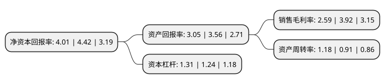

> 本页面由自动化程序生成于 2022年5月20日 01:10
> 内容可能存在错误，如有bug请提交issue至：https://github.com/Eroleice/doc-pi/issues
{.is-warning}

# 上市公司基本情况

## 基本资料

福建省闽发铝业股份有限公司（以下简称“闽发铝业”）成立于1997年09月15日，泉州市。于2011年04月28日在深交所中小板上市。

闽发铝业注册资本98,809.33万元，主营业务:从事各种铝型材产品的设计研发，生产和销售。公司产品按其应用领域分为建筑铝型材和工业铝型材。以下是详细信息：

- 公司名称: 福建省闽发铝业股份有限公司
- 股票代码: 002578.SZ
- 所在地: 福建 - 泉州市
- 成立日期: 1997年09月15日
- 注册资本: 98,809.33万元
- 法定代表人: 黄海
- 主营业务: 主营业务:从事各种铝型材产品的设计研发，生产和销售公司产品按其应用领域分为建筑铝型材和工业铝型材
- 公司官网: www.minfa.com
- 公司介绍: 公司是海西板块的铝型材龙头企业，公司主要从事各种铝型材产品的设计研发、生产和销售。公司产品按其应用领域分为建筑铝型材和工业铝型材。公司是福建省唯一获得“福建省铝型材星火行业技术创新中心”称号的企业，是我国铝型材国家标准的主编单位之一、是拟发布的《轨道列车车辆结构用铝合金挤压型材》国家标准起草单位之一、全国仅有的四家国标建筑铝型材试验研制基地之一，国家火炬计划重点高新技术企业。公司参加国际、国家、行业标准修订35项，拥有国家级中心实验室和省级企业技术中心，被全国有色金属标准化技术委员会授予“GB5237《铝合金建筑材料》试验研制基地”称号。公司“闽发牌”铝型材被评为“中国驰名商标”，获得中国有色金属工业协会颁发的“有色金属产品实物质量金杯奖”、国家质检总局颁发的“产品质量免检证书”等奖项或认证。

## 股东及高管情况

上市公司第一大股东为上饶市城市建设投资开发集团有限公司，持股296,329,179股，占比29.99%，**疑似为**上市公司实际控制人。

截至2022年03月31日，上市公司的前十大股东中，共有6名自然人股东，2名机构股东，2个产品账户，其中5%以上大股东共有2名。上市公司前十大股东明细如下：

> 未能通过持股比例判定出上市公司实际控制人（持股30%以上）
> 可能存在通过间接持股、联合持股、协议控制等方式拥有实际控制权的主体，具体请参考上市公司定期公告！
{.is-warning}

> 截至2022年03月31日，上市公司前十大股东信息如下：

| 股东名称 | 持股数量（股） | 持股比例 |
| --- | --- | --- |
| 上饶市城市建设投资开发集团有限公司 | 296,329,179 | 29.99% |
| 黄天火 | 53,566,804 | 5.42% |
| 黄文乐 | 39,901,163 | 4.04% |
| 黄印电 | 31,720,500 | 3.21% |
| 黄长远 | 31,662,500 | 3.2% |
| 上海玖鹏资产管理中心(有限合伙)-玖鹏大鹏精选18号私募证券投资基金 | 16,260,000 | 1.65% |
| 吴文选 | 7,202,300 | 0.73% |
| 王依青 | 3,668,000 | 0.37% |
| 上海通怡投资管理有限公司-通怡梧桐15号私募证券投资基金 | 3,490,000 | 0.35% |
| 大连经济技术开发区鞍山城建房地产开发有限公司 | 3,012,900 | 0.3% |

## 利润表分析

上市公司2021年总收入为22.43亿元，净利润为0.58亿元，实现盈利。

## 杜邦分析

> 数据列示周期：2021年 | 2020年 | 2019年
{.is-info}

上市公司的净资产收益率在近一年有所下降，下降幅度为-9.28%，其变化情况分解如下：
- 上市公司的销售毛利率在近一年下降了-33.93%，可能是生产效率的下降、商品原材料价格上涨或商品价格的下跌所致。
- 上市公司的资产周转率在近一年上升了29.67%，可能是源自于更快的销售回款或库存管理效果提升。
- 上市公司的财务杠杆比率在近一年上升了5.65%，可能是增加负债扩大生产规模。

