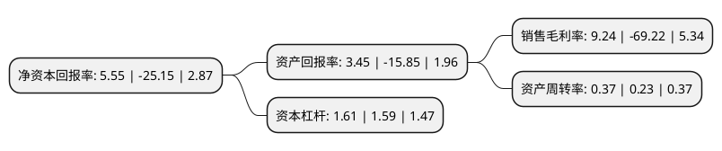

> 本页面由自动化程序生成于 2022年5月20日 01:12
> 内容可能存在错误，如有bug请提交issue至：https://github.com/Eroleice/doc-pi/issues
{.is-warning}

# 上市公司基本情况

## 基本资料

广东华锋新能源科技股份有限公司（以下简称“华锋股份”）成立于1995年08月30日，肇庆市。于2016年07月26日在深交所中小板上市。

华锋股份注册资本19,170.336万元，主要业务:从事铝电解电容器用电极箔的研发，生产及销售，新能源汽车动力系统平台业务。主要产品为铝电解电容器用低压化成箔。以下是详细信息：

- 公司名称: 广东华锋新能源科技股份有限公司
- 股票代码: 002806.SZ
- 所在地: 广东 - 肇庆市
- 成立日期: 1995年08月30日
- 注册资本: 19,170.336万元
- 法定代表人: 林程
- 主营业务: 从事铝电解电容器用电极箔的研发，生产及销售，新能源汽车动力系统平台业务主要产品为铝电解电容器用低压化成箔
- 公司官网: www.c-hfcc.com
- 公司介绍: 公司目前已经发展成为拥有肇庆低压腐蚀、高要中高压腐蚀、广西梧州低压化成三个腐蚀、化成生产基地和碧江环保分公司，是国内起步最早的低压化成铝箔生产厂家之一，是中国电子元件百强企业之一；产品包含低、中、高压全系列化成箔和新型高效水处理药剂系列产品；公司把“校企合作、自主创新”作为技术核心，拥有多项发明专利；公司低压化成铝箔处于国内领先水平和国际先进水平，在同行业有着一定的影响和地位；公司已通过ISO9001。2018年，公司收购理工华创，理工华创定位为新能源汽车动力系统平台技术、产品及服务提供商，主要为新能源商用车企业提供动力系统平台的定制化产品和技术咨询服务，公司的主营业务新增新能源汽车动力系统平台业务。

## 股东及高管情况

上市公司第一大股东为谭帼英，持股44,647,800股，占比23.2892%，**疑似为**上市公司实际控制人。

截至2022年04月14日，上市公司的前十大股东中，共有6名自然人股东，4名机构股东，其中5%以上大股东共有5名。上市公司前十大股东明细如下：

> 未能通过持股比例判定出上市公司实际控制人（持股30%以上）
> 可能存在通过间接持股、联合持股、协议控制等方式拥有实际控制权的主体，具体请参考上市公司定期公告！
{.is-warning}

> 截至2022年04月14日，上市公司前十大股东信息如下：

| 股东名称 | 持股数量（股） | 持股比例 |
| --- | --- | --- |
| 谭帼英 | 44,647,800 | 23.2892% |
| 谭帼英 | 44,647,800 | 23.29% |
| 广东省科技创业投资有限公司 | 17,355,320 | 9.0529% |
| 林程 | 15,068,153 | 7.8599% |
| 林程 | 15,068,153 | 7.86% |
| 肇庆市端州区城北经济建设开发公司 | 4,783,120 | 2.49% |
| 北京雷科卓硕科技中心(有限合伙) | 4,482,440 | 2.34% |
| 肇庆市汇海技术咨询有限公司 | 2,739,400 | 1.43% |
| 周辉 | 1,474,816 | 0.77% |
| 孙逢春 | 1,191,467 | 0.62% |

## 杜邦分析

> 数据列示周期：2021年 | 2020年 | 2019年
{.is-info}

上市公司的净资产收益率在近一年有所下降，下降幅度为-122.07%，其变化情况分解如下：
- 上市公司的销售毛利率在近一年下降了-113.35%，可能是生产效率的下降、商品原材料价格上涨或商品价格的下跌所致。
- 上市公司的资产周转率在近一年上升了60.87%，可能是源自于更快的销售回款或库存管理效果提升。
- 上市公司的财务杠杆比率在近一年上升了1.26%，可能是增加负债扩大生产规模。

