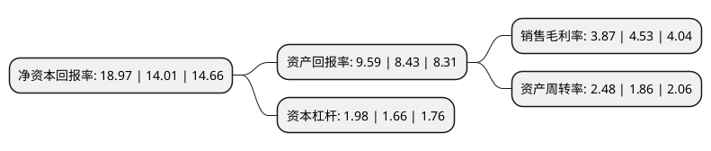

> 本页面由自动化程序生成于 2022年5月20日 01:13
> 内容可能存在错误，如有bug请提交issue至：https://github.com/Eroleice/doc-pi/issues
{.is-warning}

# 上市公司基本情况

## 基本资料

重庆顺博铝合金股份有限公司（以下简称“顺博合金”）成立于2003年03月21日，重庆市。于2020年08月28日在深交所中小板上市。

顺博合金注册资本43,900万元，公司主营业务为再生铝合金锭的生产和销售。公司的主要产品为各种牌号的铝合金锭。以下是详细信息：

- 公司名称: 重庆顺博铝合金股份有限公司
- 股票代码: 002996.SZ
- 所在地: 重庆 - 重庆市
- 成立日期: 2003年03月21日
- 注册资本: 43,900万元
- 法定代表人: 王真见
- 主营业务: 公司主营业务为再生铝合金锭的生产和销售公司的主要产品为各种牌号的铝合金锭
- 公司官网: www.soonbest.com
- 公司介绍: 公司主营业务为再生铝合金锭的生产和销售，公司主要利用各种废铝材料，通过分选、熔炼、浇铸等生产工序，生产各种牌号的铝合金锭，用于各类压铸铝合金产品和铸造铝合金产品的生产，从而实现铝资源的循环利用。报告期内，根据中国有色金属工业协会再生金属分会提供的资料，公司为国内再生铝行业中产量排名第4的生产企业。公司在重庆、广东清远、江苏溧阳拥有生产基地，产品主要销往西南、华南、华东等地区，主要应用于汽车、摩托车、机械设备、通讯设备、电子电器、五金灯具等行业的产品生产。公司是《重庆市环保产业集群发展规划(2015-2020年)》重点支持的资源综合利用企业之一，是中国有色金属工业协会再生金属分会理事单位、重庆再生资源行业协会副会长单位、重庆市冶金工业协会理事单位、重庆铸造行业协会理事单位，曾先后获得重庆市首批循环经济试点单位、重庆市再生资源优秀企业、中国有色金属工业协会再生金属分会“节能环保奖”等荣誉。公司是国家标准《再生铸造铝合金原料》(GB/T38472-2019)的起草单位。

## 股东及高管情况

上市公司第一大股东为王增潮，持股110,583,001股，占比25.19%，**疑似为**上市公司实际控制人。

截至2022年03月31日，上市公司的前十大股东中，共有9名自然人股东，1名机构股东，其中5%以上大股东共有4名。上市公司前十大股东明细如下：

> 未能通过持股比例判定出上市公司实际控制人（持股30%以上）
> 可能存在通过间接持股、联合持股、协议控制等方式拥有实际控制权的主体，具体请参考上市公司定期公告！
{.is-warning}

> 截至2022年03月31日，上市公司前十大股东信息如下：

| 股东名称 | 持股数量（股） | 持股比例 |
| --- | --- | --- |
| 王增潮 | 110,583,001 | 25.19% |
| 王真见 | 105,768,000 | 24.09% |
| 王启 | 27,669,001 | 6.3% |
| 杜福昌 | 27,668,999 | 6.3% |
| 陈飞 | 14,623,700 | 3.33% |
| 夏跃云 | 9,522,600 | 2.17% |
| 广东温氏投资有限公司-新兴温氏成长壹号股权投资合伙企业(有限合伙) | 9,400,000 | 2.14% |
| 包中生 | 9,000,000 | 2.05% |
| 朱昌补 | 6,822,000 | 1.55% |
| 朱胜德 | 6,693,525 | 1.52% |

## 利润表分析

上市公司2021年总收入为99.84亿元，净利润为3.85亿元，实现盈利。

## 杜邦分析

> 数据列示周期：2021年 | 2020年 | 2019年
{.is-info}

上市公司的净资产收益率在近一年有所上升，上升幅度为35.4%，其变化情况分解如下：
- 上市公司的销售毛利率在近一年下降了-14.57%，可能是生产效率的下降、商品原材料价格上涨或商品价格的下跌所致。
- 上市公司的资产周转率在近一年上升了33.33%，可能是源自于更快的销售回款或库存管理效果提升。
- 上市公司的财务杠杆比率在近一年上升了19.28%，可能是增加负债扩大生产规模。

