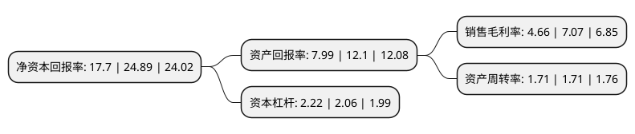

> 本页面由自动化程序生成于 2022年5月20日 01:14
> 内容可能存在错误，如有bug请提交issue至：https://github.com/Eroleice/doc-pi/issues
{.is-warning}

# 上市公司基本情况

## 基本资料

安徽鑫铂铝业股份有限公司（以下简称“鑫铂股份”）成立于2013年08月29日，滁州市。于2021年02月10日在深交所中小板上市。

鑫铂股份注册资本12,772.505万元，从事工业铝型材，工业铝部件和建筑铝型材的研发，生产与销售，公司的主要产品分为工业铝型材，工业铝部件及建筑铝型材三大类，其中工业铝部件是在工业铝型材的基础上采取进一步的精加工工艺进行加工形成部件级产品。以下是详细信息：

- 公司名称: 安徽鑫铂铝业股份有限公司
- 股票代码: 003038.SZ
- 所在地: 安徽 - 滁州市
- 成立日期: 2013年08月29日
- 注册资本: 12,772.505万元
- 法定代表人: 唐开健
- 主营业务: 从事工业铝型材，工业铝部件和建筑铝型材的研发，生产与销售，公司的主要产品分为工业铝型材，工业铝部件及建筑铝型材三大类，其中工业铝部件是在工业铝型材的基础上采取进一步的精加工工艺进行加工形成部件级产品
- 公司官网: xinbogf.com
- 公司介绍: 公司专业从事工业铝型材、工业铝部件和建筑铝型材的研发、生产与销售，公司的主要产品分为工业铝型材、工业铝部件及建筑铝型材三大类，其中工业铝部件是在工业铝型材的基础上采取进一步的精加工工艺进行加工形成部件级产品。公司建立了从原材料研发、模具设计与制造、生产加工、表面处理至精加工工艺的完整的工业生产体系，具备全流程生产制造能力。目前公司生产的铝型材及铝部件具备高强韧、质量轻、易加工、耐腐蚀等优良物理及化学性能，作为工业及建筑领域终端产品制造的材料或零部件，广泛应用于新能源光伏、轨道交通、汽车轻量化、医疗环保、电子家电、系统门窗、节能建筑等领域。公司作为市场上为数不多的自原材料研发至精加工一体化全流程铝型材及铝部件生产企业，生产的产品主要用于满足中高端铝型材及铝部件市场的需求。

## 股东及高管情况

上市公司第一大股东为唐开健，持股53,051,904股，占比41.54%，为上市公司实际控制人。

截至2022年03月31日，上市公司的前十大股东中，共有5名自然人股东，1名机构股东，4个产品账户，其中5%以上大股东共有3名。上市公司前十大股东明细如下：

> 截至2022年03月31日，上市公司前十大股东信息如下：

| 股东名称 | 持股数量（股） | 持股比例 |
| --- | --- | --- |
| 唐开健 | 53,051,904 | 41.54% |
| 芜湖高新毅达中小企业创业投资基金(有限合伙) | 8,156,329 | 6.39% |
| 李正培 | 6,489,504 | 5.08% |
| 天长市天鼎企业运营管理中心(有限合伙) | 6,345,120 | 4.97% |
| 滁州安元投资基金有限公司 | 5,786,032 | 4.53% |
| 黄山高新毅达新安江专精特新创业投资基金(有限合伙) | 4,764,819 | 3.73% |
| 李杰 | 3,893,424 | 3.05% |
| 陈未荣 | 3,731,256 | 2.92% |
| 华夏基金管理有限公司-社保基金四二二组合 | 2,776,481 | 2.17% |
| 张培华 | 2,433,912 | 1.91% |

## 利润表分析

上市公司2021年总收入为25.96亿元，净利润为1.21亿元，实现盈利。

## 杜邦分析

> 数据列示周期：2021年 | 2020年 | 2019年
{.is-info}

上市公司的净资产收益率在近一年有所下降，下降幅度为-28.89%，其变化情况分解如下：
- 上市公司的销售毛利率在近一年下降了-34.09%，可能是生产效率的下降、商品原材料价格上涨或商品价格的下跌所致。
- 上市公司的资产周转率在近一年下降了0%，可能是源自于更慢的销售回款或库存管理效果下降。
- 上市公司的财务杠杆比率在近一年上升了7.77%，可能是增加负债扩大生产规模。

