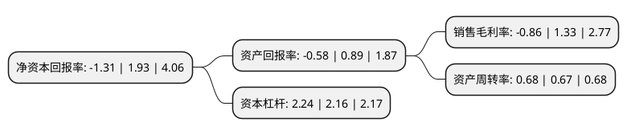

> 本页面由自动化程序生成于 2022年5月20日 01:14
> 内容可能存在错误，如有bug请提交issue至：https://github.com/Eroleice/doc-pi/issues
{.is-warning}

# 上市公司基本情况

## 基本资料

汕头万顺新材集团股份有限公司（以下简称“万顺新材”）成立于1998年03月06日，汕头市。于2010年02月26日在深交所创业板上市。

万顺新材注册资本68,367.781万元，主营业务:纸包装材料，铝加工和功能性薄膜业务，主要产品:复合纸和转移纸，高精度铝箔，导电膜，节能膜，高阻隔膜。以下是详细信息：

- 公司名称: 汕头万顺新材集团股份有限公司
- 股票代码: 300057.SZ
- 所在地: 广东 - 汕头市
- 成立日期: 1998年03月06日
- 注册资本: 68,367.781万元
- 法定代表人: 杜成城
- 主营业务: 主营业务:纸包装材料，铝加工和功能性薄膜业务，主要产品:复合纸和转移纸，高精度铝箔，导电膜，节能膜，高阻隔膜
- 公司官网: www.wanshun.cn
- 公司介绍: 公司是国内领先的大型环保包装材料的龙头企业，经过多年发展，公司确立以中高档包装材料、铝箔包装业务、ITO导电膜为“三驾马车”的多元化发展战略，对全国进行战略布局，实现经营结构的全面升级。公司不断加强技术团队建设，建立健全技术创新机制拥有多项发明专利和多项非专利技术。公司凭借技术创新优势，荣膺“国家级高新技术企业”、“广东省自主创新产品”和“汕头市十大创新企业”、“汕头市科学技术奖一等奖”、“广东省著名商标”等荣誉。

## 股东及高管情况

上市公司第一大股东为杜成城，持股223,201,523股，占比32.65%，为上市公司实际控制人。

截至2022年03月31日，上市公司的前十大股东中，共有8名自然人股东，2个产品账户，其中5%以上大股东共有1名。上市公司前十大股东明细如下：

> 截至2022年03月31日，上市公司前十大股东信息如下：

| 股东名称 | 持股数量（股） | 持股比例 |
| --- | --- | --- |
| 杜成城 | 223,201,523 | 32.65% |
| 杜端凤 | 23,808,156 | 3.48% |
| 汕头万顺新材集团股份有限公司-第二期员工持股计划 | 18,000,000 | 2.63% |
| 李伟明 | 13,298,295 | 1.95% |
| 孙海珍 | 9,005,820 | 1.32% |
| 陈均洲 | 8,811,617 | 1.29% |
| 中国建设银行股份有限公司-前海开源公用事业行业股票型证券投资基金 | 7,313,719 | 1.07% |
| 王建军 | 5,927,546 | 0.87% |
| 蔡懿然 | 5,875,778 | 0.86% |
| 周前文 | 5,875,778 | 0.86% |

## 利润表分析

上市公司2021年总收入为54.37亿元，净利润为-0.47亿元，**未实现盈利**。

## 杜邦分析

> 数据列示周期：2021年 | 2020年 | 2019年
{.is-info}

上市公司的净资产收益率在近一年有所下降，下降幅度为-167.88%，其变化情况分解如下：
- 上市公司的销售毛利率在近一年下降了-164.66%，可能是生产效率的下降、商品原材料价格上涨或商品价格的下跌所致。
- 上市公司的资产周转率在近一年上升了1.49%，可能是源自于更快的销售回款或库存管理效果提升。
- 上市公司的财务杠杆比率在近一年上升了3.7%，可能是增加负债扩大生产规模。

