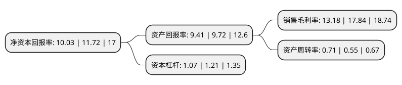

> 本页面由自动化程序生成于 2022年5月20日 01:20
> 内容可能存在错误，如有bug请提交issue至：https://github.com/Eroleice/doc-pi/issues
{.is-warning}

# 上市公司基本情况

## 基本资料

天津锐新昌科技股份有限公司（以下简称“锐新科技”）成立于2004年11月25日，天津市。于2020年04月21日在深交所创业板上市。

锐新科技注册资本11,028万元，主要从事工业精密铝合金部件的研发，生产和销售。主要产品包括:电力电子设备散热器，汽车轻量化部件，自动化设备与医疗设备精密部件。以下是详细信息：

- 公司名称: 天津锐新昌科技股份有限公司
- 股票代码: 300828.SZ
- 所在地: 天津 - 天津市
- 成立日期: 2004年11月25日
- 注册资本: 11,028万元
- 法定代表人: 国占昌
- 主营业务: 主要从事工业精密铝合金部件的研发，生产和销售主要产品包括:电力电子设备散热器，汽车轻量化部件，自动化设备与医疗设备精密部件
- 公司官网: www.ruixin-eht.com
- 公司介绍: 公司坐落于天津华苑产业园区，组建于2004年底，是天津市科委及园区认证的天津市高新技术企业及天津市市级技术中心，通过ISO9001:2000质量体系认证。企业性质为民营股份制，机加工企业。公司主要致力于开发、制造电力电子铝合金型材散热器、高附加值的铝合金工业型材以及深加工制品。公司现拥有4套挤压机，近百台数控加工中心，其中70%为国外进口机台。作为已有近20年经验的挤压模具设计、制造和挤压型材的供应商，公司最先在国内完成挤压铝合金电力电子散热器工艺技术的开发，并引领型材散热器国内最早的市场转型。

## 股东及高管情况

上市公司第一大股东为国占昌，持股36,626,000股，占比33.21%，为上市公司实际控制人。

截至2022年03月31日，上市公司的前十大股东中，共有4名自然人股东，3名机构股东，3个产品账户，其中5%以上大股东共有3名。上市公司前十大股东明细如下：

> 截至2022年03月31日，上市公司前十大股东信息如下：

| 股东名称 | 持股数量（股） | 持股比例 |
| --- | --- | --- |
| 国占昌 | 36,626,000 | 33.21% |
| 国佳 | 16,630,000 | 15.08% |
| 上海虢实投资合伙企业(有限合伙) | 11,358,400 | 10.3% |
| 上海虢盛资产管理中心(有限合伙) | 3,087,000 | 2.8% |
| 东方证券股份有限公司-中庚价值先锋股票型证券投资基金 | 1,995,900 | 1.81% |
| 光大永明资管-兴业银行-光大永明资产聚财121号定向资产管理产品 | 1,993,900 | 1.81% |
| 上海虢合投资合伙企业(有限合伙) | 1,485,700 | 1.35% |
| 王静 | 1,080,000 | 0.98% |
| 广发证券股份有限公司-中庚小盘价值股票型证券投资基金 | 1,053,900 | 0.96% |
| 吴键 | 558,577 | 0.51% |

## 利润表分析

上市公司2021年总收入为5.74亿元，净利润为0.75亿元，实现盈利。

## 杜邦分析

> 数据列示周期：2021年 | 2020年 | 2019年
{.is-info}

上市公司的净资产收益率在近一年有所下降，下降幅度为-14.42%，其变化情况分解如下：
- 上市公司的销售毛利率在近一年下降了-26.12%，可能是生产效率的下降、商品原材料价格上涨或商品价格的下跌所致。
- 上市公司的资产周转率在近一年上升了29.09%，可能是源自于更快的销售回款或库存管理效果提升。
- 上市公司的财务杠杆比率在近一年下降了-11.57%，可能是减少负债降低财务费用。

