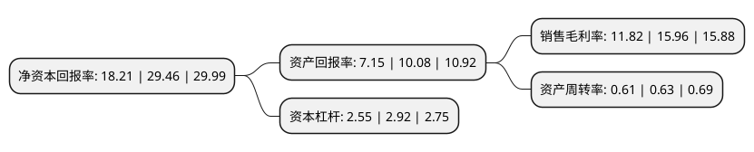

> 本页面由自动化程序生成于 2022年5月20日 01:22
> 内容可能存在错误，如有bug请提交issue至：https://github.com/Eroleice/doc-pi/issues
{.is-warning}

# 上市公司基本情况

## 基本资料

江西志特新材料股份有限公司（以下简称“志特新材”）成立于2011年12月08日，抚州市。于2021年04月30日在深交所创业板上市。

志特新材注册资本11,706.667万元，公司产品是一种应用于建筑施工中混凝土浇筑成形的临时支护结构系统，为客户提供建筑铝模系统的研发，设计，生产，销售，租赁和相应的技术指导等综合服务以下是详细信息：

- 公司名称: 江西志特新材料股份有限公司
- 股票代码: 300986.SZ
- 所在地: 江西 - 抚州市
- 成立日期: 2011年12月08日
- 注册资本: 11,706.667万元
- 法定代表人: 高渭泉
- 主营业务: 公司产品是一种应用于建筑施工中混凝土浇筑成形的临时支护结构系统，为客户提供建筑铝模系统的研发，设计，生产，销售，租赁和相应的技术指导等综合服务
- 公司官网: www.geto.com.cn
- 公司介绍: 公司专注于为客户提供建筑铝模系统的研发、设计、生产、销售、租赁和相应的技术指导等综合服务，系专业从事建筑铝模系统的综合服务提供商。公司产品是一种应用于建筑施工中混凝土浇筑成形的临时支护结构系统。公司致力于推动传统建筑向现代绿色建筑革新转型，产品相较于传统建筑模板，具有绿色、环保、高效、高精度和可循环使用等综合优势。公司产品被评为“江西省优秀产品”及“江西省名牌产品”，通过新加坡政府建筑施工局(BCA)的严格测评并取得了BAND2认证，是目前国内外取得该资质的少数企业之一。

## 股东及高管情况

上市公司第一大股东为珠海凯越高科技产业投资有限公司，持股52,932,000股，占比45.22%，为上市公司实际控制人。

截至2022年03月31日，上市公司的前十大股东中，共有2名自然人股东，7名机构股东，1个产品账户，其中5%以上大股东共有1名。上市公司前十大股东明细如下：

> 截至2022年03月31日，上市公司前十大股东信息如下：

| 股东名称 | 持股数量（股） | 持股比例 |
| --- | --- | --- |
| 珠海凯越高科技产业投资有限公司 | 52,932,000 | 45.22% |
| 珠海志壹股权投资企业(有限合伙) | 5,700,000 | 4.87% |
| 珠海志同股权投资企业(有限合伙) | 5,430,000 | 4.64% |
| 东方证券股份有限公司-中庚价值先锋股票型证券投资基金 | 4,302,178 | 3.67% |
| 广东粤科创业投资管理有限公司-广东粤科振粤一号股权投资合伙企业(有限合伙) | 4,000,000 | 3.42% |
| 何庆泉 | 3,400,000 | 2.9% |
| 周水江 | 3,100,000 | 2.65% |
| 珠海志成股权投资企业(有限合伙) | 3,000,000 | 2.56% |
| 珠海志特新材咨询企业(有限合伙) | 2,647,060 | 2.26% |
| 抚州市数字经济投资集团有限公司 | 2,000,000 | 1.71% |

## 利润表分析

上市公司2021年总收入为14.81亿元，净利润为1.75亿元，实现盈利。

## 杜邦分析

> 数据列示周期：2021年 | 2020年 | 2019年
{.is-info}

上市公司的净资产收益率在近一年有所下降，下降幅度为-38.19%，其变化情况分解如下：
- 上市公司的销售毛利率在近一年下降了-25.94%，可能是生产效率的下降、商品原材料价格上涨或商品价格的下跌所致。
- 上市公司的资产周转率在近一年下降了-3.17%，可能是源自于更慢的销售回款或库存管理效果下降。
- 上市公司的财务杠杆比率在近一年下降了-12.67%，可能是减少负债降低财务费用。

