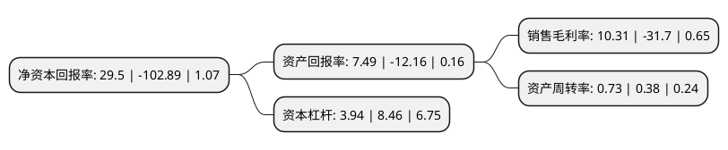

> 本页面由自动化程序生成于 2022年5月20日 01:27
> 内容可能存在错误，如有bug请提交issue至：https://github.com/Eroleice/doc-pi/issues
{.is-warning}

# 上市公司基本情况

## 基本资料

河南中孚实业股份有限公司（以下简称“ST中孚”）成立于1997年01月28日，郑州市。于2002年06月26日在上交所主板上市。

ST中孚注册资本392,244.811万元，主要产品:高性能铝合金板材，易拉罐罐体，罐盖，拉环料，高档双零铝箔毛料，高档印刷版基，阳极氧化料等，产品广泛使用于交通运输，食品和医药包装，印刷制版等。主营业务:煤炭，火电，阳极炭块，电解铝，铝棒材，铝线材及铝精深加工产品。以下是详细信息：

- 公司名称: 河南中孚实业股份有限公司
- 股票代码: 600595.SH
- 所在地: 河南 - 郑州市
- 成立日期: 1997年01月28日
- 注册资本: 392,244.811万元
- 法定代表人: 马文超
- 主营业务: 主要产品:高性能铝合金板材，易拉罐罐体，罐盖，拉环料，高档双零铝箔毛料，高档印刷版基，阳极氧化料等，产品广泛使用于交通运输，食品和医药包装，印刷制版等主营业务:煤炭，火电，阳极炭块，电解铝，铝棒材，铝线材及铝精深加工产品
- 公司官网: www.zfsy.com.cn
- 公司介绍: 公司以经营电解铝及铝型材系列产品的生产和销售、火力发电为主，依托本地丰富的煤炭资源优势和氧化铝供应优势，公司以煤带电、以电促铝，以电为中间产品，铝为最终产品，成功地将电力生产和电解铝生产结合起来，实现了真正意义上的铝电合一，大大降低了电解铝的生产成本(铝电联营是公司的主要优势)，极大地增强了公司的核心竞争力。公司拥有“煤-电-铝-铝加工”较为健全的产业链优势,公司核心转型升级项目——高性能铝合金特种铝材项目已基本建成投产，其整体装备和工艺技术立足于规模化、专业化生产，是当前河南省铝工业转型升级的标志性项目。公司自主研发了“一种铜铝复合排压接断电阻的测量方法”和“一种密封物料输送系统的自动除铁装置”获得国家知识产权局颁发的的“发明专利证书”，“大型整流系统纯水电阻率快速提升装置”等七项技术研发成果获得国家知识产权局颁发的“实用新型专利证书”。

## 股东及高管情况

上市公司第一大股东为河南中孚实业股份有限公司破产企业财产处置专用账户，持股1,088,533,796股，占比27.75%，**疑似为**上市公司实际控制人。

截至2022年03月31日，上市公司的前十大股东中，共有9名机构股东，1个产品账户，其中5%以上大股东共有3名。上市公司前十大股东明细如下：

> 未能通过持股比例判定出上市公司实际控制人（持股30%以上）
> 可能存在通过间接持股、联合持股、协议控制等方式拥有实际控制权的主体，具体请参考上市公司定期公告！
{.is-warning}

> 截至2022年03月31日，上市公司前十大股东信息如下：

| 股东名称 | 持股数量（股） | 持股比例 |
| --- | --- | --- |
| 河南中孚实业股份有限公司破产企业财产处置专用账户 | 1,088,533,796 | 27.75% |
| 河南豫联能源集团有限责任公司 | 811,248,821 | 20.68% |
| 河南豫联能源集团有限责任公司-河南豫联能源集团有限责任公司非公开发行2018年可交换公司债券(第一期)质押专户 | 216,000,000 | 5.51% |
| 中银金融资产投资有限公司 | 74,856,196 | 1.91% |
| 工银金融资产投资有限公司 | 62,610,320 | 1.6% |
| 中国长城资产管理股份有限公司 | 60,519,066 | 1.54% |
| 河南豫联能源集团有限责任公司-河南豫联能源集团有限责任公司非公开发行2018年可交换公司债券(第二期)质押专户 | 50,000,000 | 1.27% |
| 华融金融租赁股份有限公司 | 43,530,412 | 1.11% |
| 洛阳银行股份有限公司 | 43,439,750 | 1.11% |
| 建信金融资产投资有限公司 | 42,004,561 | 1.07% |

## 杜邦分析

> 数据列示周期：2021年 | 2020年 | 2019年
{.is-info}

上市公司的净资产收益率在近一年有所下降，下降幅度为-128.67%，其变化情况分解如下：
- 上市公司的销售毛利率在近一年下降了-132.52%，可能是生产效率的下降、商品原材料价格上涨或商品价格的下跌所致。
- 上市公司的资产周转率在近一年上升了92.11%，可能是源自于更快的销售回款或库存管理效果提升。
- 上市公司的财务杠杆比率在近一年下降了-53.43%，可能是减少负债降低财务费用。

