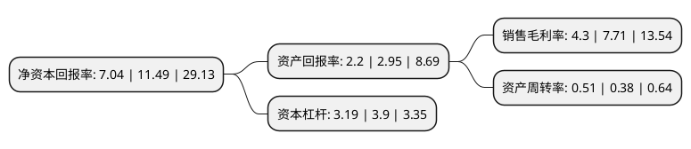

> 本页面由自动化程序生成于 2022年5月20日 01:28
> 内容可能存在错误，如有bug请提交issue至：https://github.com/Eroleice/doc-pi/issues
{.is-warning}

# 上市公司基本情况

## 基本资料

广东东阳光科技控股股份有限公司（以下简称“东阳光”）成立于1996年10月24日，韶关市。于1993年09月17日在上交所主板上市。

东阳光注册资本301,389.726万元，亲水箔的生产和销售。以下是详细信息：

- 公司名称: 广东东阳光科技控股股份有限公司
- 股票代码: 600673.SH
- 所在地: 广东 - 韶关市
- 成立日期: 1996年10月24日
- 注册资本: 301,389.726万元
- 法定代表人: 张红伟
- 主营业务: 亲水箔的生产和销售
- 公司官网: www.hec-al.com
- 公司介绍: 公司主营业务主要分为电子新材料、合金材料以及化工产品三大板块，产品主要为铝电解电容器用电极箔(包含腐蚀箔和化成箔)、铝电解电容器、软磁材料、电子光箔、亲水箔、钎焊箔、电化工产品、氟化工产品等。公司以研发创新为核心，在做大做强公司具有核心竞争力产品的同时，以公司基础产业为切入点，不断向下游高附加值的新兴产业延伸，淘汰低技术含量低附加值的落后产业，优化公司产业布局。公司研究院下辖电子材料所、新材料所、新能源所三大研究所，被评为国家技术中心(“广东省工程技术研发中心”)，围绕电子及储能产业进行创新研发。

## 股东及高管情况

上市公司第一大股东为深圳市东阳光实业发展有限公司，持股842,894,889股，占比27.97%，**疑似为**上市公司实际控制人。

截至2022年03月31日，上市公司的前十大股东中，共有2名自然人股东，5名机构股东，2个产品账户，1个海外主体，其中5%以上大股东共有2名。上市公司前十大股东明细如下：

> 未能通过持股比例判定出上市公司实际控制人（持股30%以上）
> 可能存在通过间接持股、联合持股、协议控制等方式拥有实际控制权的主体，具体请参考上市公司定期公告！
{.is-warning}

> 截至2022年03月31日，上市公司前十大股东信息如下：

| 股东名称 | 持股数量（股） | 持股比例 |
| --- | --- | --- |
| 深圳市东阳光实业发展有限公司 | 842,894,889 | 27.97% |
| 宜昌东阳光药业股份有限公司 | 545,023,350 | 18.08% |
| 乳源阳之光铝业发展有限公司 | 128,058,819 | 4.25% |
| 乳源瑶族自治县东阳光企业管理有限公司 | 91,049,160 | 3.02% |
| 香港中央结算有限公司(陆股通) | 36,309,302 | 1.2% |
| 深圳市事必安投资有限公司 | 34,847,371 | 1.16% |
| 中国建设银行股份有限公司-信达澳银新能源产业股票型证券投资基金 | 29,531,236 | 0.98% |
| 袁灵斌 | 28,710,780 | 0.95% |
| 兴业银行股份有限公司-博时汇兴回报一年持有期灵活配置混合型证券投资基金 | 28,039,780 | 0.93% |
| 石增凡 | 22,827,505 | 0.76% |

## 利润表分析

上市公司2021年总收入为127.97亿元，净利润为5.5亿元，实现盈利。

## 杜邦分析

> 数据列示周期：2021年 | 2020年 | 2019年
{.is-info}

上市公司的净资产收益率在近一年有所下降，下降幅度为-38.73%，其变化情况分解如下：
- 上市公司的销售毛利率在近一年下降了-44.23%，可能是生产效率的下降、商品原材料价格上涨或商品价格的下跌所致。
- 上市公司的资产周转率在近一年上升了34.21%，可能是源自于更快的销售回款或库存管理效果提升。
- 上市公司的财务杠杆比率在近一年下降了-18.21%，可能是减少负债降低财务费用。

