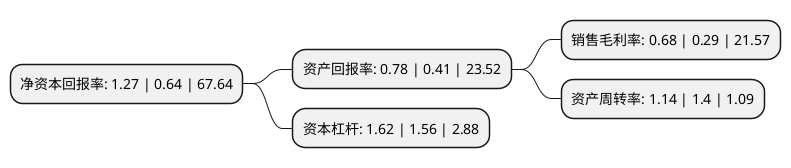

> 本页面由自动化程序生成于 2022年5月20日 01:28
> 内容可能存在错误，如有bug请提交issue至：https://github.com/Eroleice/doc-pi/issues
{.is-warning}

# 上市公司基本情况

## 基本资料

宁波富邦精业集团股份有限公司（以下简称“宁波富邦”）成立于1981年12月20日，宁波市。于1996年11月11日在上交所主板上市。

宁波富邦注册资本13,374.72万元，主营业务:工业铝板带材和铝型材生产，加工和销售以及铝铸棒的仓储，贸易服务。主要产品:铝板带材，铝型材。以下是详细信息：

- 公司名称: 宁波富邦精业集团股份有限公司
- 股票代码: 600768.SH
- 所在地: 浙江 - 宁波市
- 成立日期: 1981年12月20日
- 注册资本: 13,374.72万元
- 法定代表人: 陈炜
- 主营业务: 主营业务:工业铝板带材和铝型材生产，加工和销售以及铝铸棒的仓储，贸易服务主要产品:铝板带材，铝型材
- 公司官网: www.600768.com.cn
- 公司介绍: 公司主要从事工业铝板带材和铝型材生产、加工和销售以及铝铸棒的仓储、贸易服务，属于有色金属压延加工行业，是华东地区规模较大的铝加工压延企业之一。下属企业包括铝材厂、铝型材有限公司、贸易有限公司以及仓储公司等。公司是宁波市制造业百强企业，其中宁圆牌纯铝板材、带材是浙江省名牌产品。

## 股东及高管情况

上市公司第一大股东为宁波富邦控股集团有限公司，持股49,820,082股，占比37.25%，为上市公司实际控制人。

截至2022年03月31日，上市公司的前十大股东中，共有9名自然人股东，1名机构股东，其中5%以上大股东共有1名。上市公司前十大股东明细如下：

> 截至2022年03月31日，上市公司前十大股东信息如下：

| 股东名称 | 持股数量（股） | 持股比例 |
| --- | --- | --- |
| 宁波富邦控股集团有限公司 | 49,820,082 | 37.25% |
| 陶婷婷 | 1,953,961 | 1.46% |
| 戚家伟 | 1,908,568 | 1.43% |
| 孙景云 | 1,194,600 | 0.89% |
| 周宇光 | 1,084,702 | 0.81% |
| 沈君杰 | 1,079,500 | 0.81% |
| 谢锦和 | 1,012,620 | 0.76% |
| 陈荣 | 1,008,479 | 0.75% |
| 孙福忠 | 906,900 | 0.68% |
| 章安 | 766,637 | 0.57% |

## 利润表分析

上市公司2021年总收入为4.16亿元，净利润为0.02亿元，实现盈利。

## 杜邦分析

> 数据列示周期：2021年 | 2020年 | 2019年
{.is-info}

上市公司的净资产收益率在近一年有所上升，上升幅度为98.44%，其变化情况分解如下：
- 上市公司的销售毛利率在近一年上升了134.48%，可能是生产效率的提升、商品原材料价格下跌或商品价格的上涨所致。
- 上市公司的资产周转率在近一年下降了-18.57%，可能是源自于更慢的销售回款或库存管理效果下降。
- 上市公司的财务杠杆比率在近一年上升了3.85%，可能是增加负债扩大生产规模。

