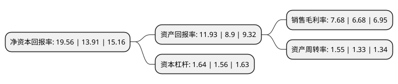

> 本页面由自动化程序生成于 2022年5月20日 01:31
> 内容可能存在错误，如有bug请提交issue至：https://github.com/Eroleice/doc-pi/issues
{.is-warning}

# 上市公司基本情况

## 基本资料

河南明泰铝业股份有限公司（以下简称“明泰铝业”）成立于1997年04月18日，郑州市。于2011年09月19日在上交所主板上市。

明泰铝业注册资本68,258.232万元，主要产品:铝板带箔及铝型材两大门类，广泛应用于新能源电池，轨道车体，汽车制造，印刷制版，电子家电，电力设施，建筑装饰，交通运输，食品和医药包装等领域。主营业务:1-8系铝板带箔的生产和销售。以下是详细信息：

- 公司名称: 河南明泰铝业股份有限公司
- 股票代码: 601677.SH
- 所在地: 河南 - 郑州市
- 成立日期: 1997年04月18日
- 注册资本: 68,258.232万元
- 法定代表人: 马廷义
- 主营业务: 主要产品:铝板带箔及铝型材两大门类，广泛应用于新能源电池，轨道车体，汽车制造，印刷制版，电子家电，电力设施，建筑装饰，交通运输，食品和医药包装等领域主营业务:1-8系铝板带箔的生产和销售
- 公司官网: www.hngymt.com
- 公司介绍: 公司是一家集科研、加工、制造为一体的大型现代化铝加工企业，主要从事铝板带箔的生产和销售，是中国知名的民营铝板带箔加工生产企业。目前，公司产品涵盖1系、2系、3系、4系、5系、6系、7系、8系铝合金等8个规格系列，主要产品有CTP/PS版基、电解电容器用铝箔、单零箔、双零箔坯料、电子箔、合金料、深冲料、钎焊板、中厚板。产品广泛应用于航空航天、印刷制版、交通运输、汽车制造、包装容器、建筑装饰、机械电器、电子通讯、石油化工、能源动力等各个行业。多年来，公司在研发、生产等领域获得多项殊荣。先后获得“国家大型企业”、“中国有色金属50强”、“中华人民共和国AA类企业”、“河南省铝板带箔工程技术研究中心”、“河南省百强企业”、“河南省优秀民营企业”、“河南省质量信用AA级工业企业”、“中国十大铝加工公司”。

## 股东及高管情况

上市公司第一大股东为马廷义，持股105,916,800股，占比15.37%，**疑似为**上市公司实际控制人。

截至2022年03月31日，上市公司的前十大股东中，共有6名自然人股东，4个产品账户，其中5%以上大股东共有1名。上市公司前十大股东明细如下：

> 未能通过持股比例判定出上市公司实际控制人（持股30%以上）
> 可能存在通过间接持股、联合持股、协议控制等方式拥有实际控制权的主体，具体请参考上市公司定期公告！
{.is-warning}

> 截至2022年03月31日，上市公司前十大股东信息如下：

| 股东名称 | 持股数量（股） | 持股比例 |
| --- | --- | --- |
| 马廷义 | 105,916,800 | 15.37% |
| 中国农业银行股份有限公司-大成新锐产业混合型证券投资基金 | 17,326,717 | 2.51% |
| 马廷耀 | 16,188,034 | 2.35% |
| 雷敬国 | 16,159,051 | 2.35% |
| 化新民 | 12,956,000 | 1.88% |
| 王占标 | 12,201,270 | 1.77% |
| 广发证券股份有限公司-大成睿景灵活配置混合型证券投资基金 | 11,400,379 | 1.65% |
| 马跃平 | 10,141,430 | 1.47% |
| 交通银行股份有限公司-浦银安盛新经济结构灵活配置混合型证券投资基金 | 8,845,474 | 1.28% |
| 中国工商银行股份有限公司-交银施罗德趋势优先混合型证券投资基金 | 8,161,127 | 1.18% |

## 利润表分析

上市公司2021年总收入为246.12亿元，净利润为18.9亿元，实现盈利。

## 杜邦分析

> 数据列示周期：2021年 | 2020年 | 2019年
{.is-info}

上市公司的净资产收益率在近一年有所上升，上升幅度为40.62%，其变化情况分解如下：
- 上市公司的销售毛利率在近一年上升了14.97%，可能是生产效率的提升、商品原材料价格下跌或商品价格的上涨所致。
- 上市公司的资产周转率在近一年上升了16.54%，可能是源自于更快的销售回款或库存管理效果提升。
- 上市公司的财务杠杆比率在近一年上升了5.13%，可能是增加负债扩大生产规模。

