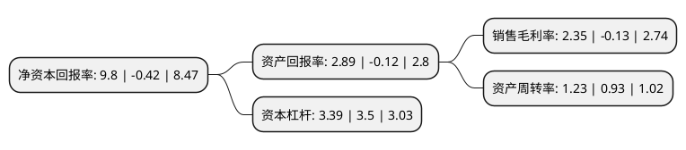

> 本页面由自动化程序生成于 2022年5月20日 01:35
> 内容可能存在错误，如有bug请提交issue至：https://github.com/Eroleice/doc-pi/issues
{.is-warning}

# 上市公司基本情况

## 基本资料

江苏鼎胜新能源材料股份有限公司（以下简称“鼎胜新材”）成立于2003年08月12日，镇江市。于2018年04月18日在上交所主板上市。

鼎胜新材注册资本48,597.978万元，主要产品为空调箔，单零箔，双零箔，铝板带，新能源电池箔等，产品广泛应用于绿色包装，家用，家电，锂电池，交通运输，建筑装饰等多个领域。主营业务:铝板带箔的研发，生产与销售业务。以下是详细信息：

- 公司名称: 江苏鼎胜新能源材料股份有限公司
- 股票代码: 603876.SH
- 所在地: 江苏 - 镇江市
- 成立日期: 2003年08月12日
- 注册资本: 48,597.978万元
- 法定代表人: 周贤海
- 主营业务: 主要产品为空调箔，单零箔，双零箔，铝板带，新能源电池箔等，产品广泛应用于绿色包装，家用，家电，锂电池，交通运输，建筑装饰等多个领域主营业务:铝板带箔的研发，生产与销售业务
- 公司官网: www.dingshengxincai.com
- 公司介绍: 公司主导产品为铝板、带、箔及涂层材，以及深加工产品氧化铝板、电缆箔、空调箔、装饰建材用铝箔、空调冰箱用蒸发器、冷凝器等多种系列铝产品。广泛用于绿色包装、家用、家电、电子通讯、交通运输、印刷、化工、建材、装饰等行业。公司主要生产、检测设备从意大利、日本、德国等国引进，采用国内外先进的技术、工艺组织生产，通过严格的检测保证质量，能满足客户对产品厚度、精度及性能的需求。公司已于2001年通过了ISO9002认证，目前正在实施ERP管理。

## 股东及高管情况

上市公司第一大股东为杭州鼎胜实业集团有限公司，持股138,704,300股，占比28.36%，**疑似为**上市公司实际控制人。

截至2022年03月31日，上市公司的前十大股东中，共有2名自然人股东，4名机构股东，3个产品账户，1个海外主体，其中5%以上大股东共有3名。上市公司前十大股东明细如下：

> 未能通过持股比例判定出上市公司实际控制人（持股30%以上）
> 可能存在通过间接持股、联合持股、协议控制等方式拥有实际控制权的主体，具体请参考上市公司定期公告！
{.is-warning}

> 截至2022年03月31日，上市公司前十大股东信息如下：

| 股东名称 | 持股数量（股） | 持股比例 |
| --- | --- | --- |
| 杭州鼎胜实业集团有限公司 | 138,704,300 | 28.36% |
| 北京普润平方股权投资中心(有限合伙) | 51,707,710 | 10.57% |
| 周贤海 | 48,424,000 | 9.9% |
| 北京普润平方壹号股权投资中心(有限合伙) | 19,584,986 | 4% |
| 江苏沿海产业投资基金(有限合伙) | 14,625,497 | 2.99% |
| 中国建设银行股份有限公司-东方红启东三年持有期混合型证券投资基金 | 9,398,872 | 1.92% |
| 王小丽 | 6,600,000 | 1.35% |
| UBS   AG | 6,037,891 | 1.23% |
| 上海睿扬投资管理有限公司-睿扬新兴成长私募证券投资基金 | 6,000,000 | 1.23% |
| 杭州陆金澈投资合伙企业(有限合伙) | 5,664,999 | 1.16% |

## 利润表分析

上市公司2021年总收入为181.67亿元，净利润为4.27亿元，实现盈利。

## 杜邦分析

> 数据列示周期：2021年 | 2020年 | 2019年
{.is-info}

上市公司的净资产收益率在近一年有所下降，下降幅度为-2433.33%，其变化情况分解如下：
- 上市公司的销售毛利率在近一年下降了-1907.69%，可能是生产效率的下降、商品原材料价格上涨或商品价格的下跌所致。
- 上市公司的资产周转率在近一年上升了32.26%，可能是源自于更快的销售回款或库存管理效果提升。
- 上市公司的财务杠杆比率在近一年下降了-3.14%，可能是减少负债降低财务费用。

