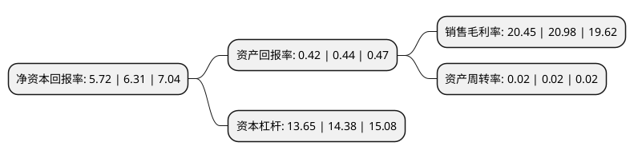

> 本页面由自动化程序生成于 2022年5月20日 01:05
> 内容可能存在错误，如有bug请提交issue至：https://github.com/Eroleice/doc-pi/issues
{.is-warning}

# 上市公司基本情况

## 基本资料

兰州银行股份有限公司（以下简称“兰州银行”）成立于1998年08月10日，兰州市。于2022年01月17日在深交所主板上市。

兰州银行注册资本569,569.717万元，主要业务包括公司银行业务，个人银行业务，资金业务，其他业务等。以下是详细信息：

- 公司名称: 兰州银行股份有限公司
- 股票代码: 001227.SZ
- 所在地: 甘肃 - 兰州市
- 成立日期: 1998年08月10日
- 注册资本: 569,569.717万元
- 法定代表人: 许建平
- 主营业务: 主要业务包括公司银行业务，个人银行业务，资金业务，其他业务等
- 公司官网: www.lzbank.com
- 公司介绍: 1997年6月29日，在五十五家城市信用社的基础上组建成立的兰州银行，成为甘肃省第一家具有法人资格的股份制商业银行。经过全行的不懈努力，兰州银行已经成为一家具有一定规模、经营稳健、治理规范的区域性城市商业银行。根据英国《银行家》杂志2012年“全球银行1000强”排行榜，按一级资本排名，兰州银行位列第717名，按总资产排名，位列第597名。兰州银行一直秉承“服务地方、服务中小、服务民营、服务市民”的市场定位，坚持走差异化、特色化发展之路，为地方经济建设，扶持中小企业发展壮大，满足市民金融需求等方面做出了重要贡献，创造了良好的经济效益和社会效益。兰州银行长期致力于中小企业金融业务，80%以上的信贷客户属于中小企业，80%以上的信贷资金投向了中小企业，认真践行着“专注中小，相伴成长”的经营理念，依靠多样、个性的产品和优质、高效的服务，树立起了良好的品牌形象，先后荣获“省长金融奖·银行业二等奖”、“全国银行业金融机构小企业贷款工作先进单位”、“中国中小企业金融服务十佳机构”、“中国中小企业金融服务十佳机构”、“连续六年进入甘肃省纳税百强”、“连续两届获得兰州市经济推动力总评榜榜首企业”等多项荣誉称号。

## 股东及高管情况

上市公司第一大股东为兰州市财政局，持股498,058,901股，占比8.74%，**疑似为**上市公司实际控制人。

截至2022年03月31日，上市公司的前十大股东中，共有9名机构股东，1名其他股东，其中5%以上大股东共有3名。上市公司前十大股东明细如下：

> 未能通过持股比例判定出上市公司实际控制人（持股30%以上）
> 可能存在通过间接持股、联合持股、协议控制等方式拥有实际控制权的主体，具体请参考上市公司定期公告！
{.is-warning}

> 上市公司第一大股东持股不超过10%，请检查是否存在公司控制权风险！
{.is-danger}

> 截至2022年03月31日，上市公司前十大股东信息如下：

| 股东名称 | 持股数量（股） | 持股比例 |
| --- | --- | --- |
| 兰州市财政局 | 498,058,901 | 8.74% |
| 兰州国资投资(控股)建设集团有限公司 | 403,381,000 | 7.08% |
| 华邦控股集团有限公司 | 297,451,000 | 5.22% |
| 兰州天庆房地产开发有限公司 | 277,600,000 | 4.87% |
| 甘肃盛达集团有限公司 | 275,000,000 | 4.83% |
| 深圳正威(集团)有限公司 | 245,805,000 | 4.32% |
| 甘肃天源温泉大酒店集团有限责任公司 | 176,000,000 | 3.09% |
| 甘肃省国有资产投资集团有限公司 | 174,680,000 | 3.07% |
| 盛达金属资源股份有限公司 | 155,000,000 | 2.72% |
| 甘肃省电力投资集团有限责任公司 | 105,600,000 | 1.85% |

## 利润表分析

上市公司2021年总收入为78.36亿元，净利润为16.02亿元，实现盈利。

## 杜邦分析

> 数据列示周期：2021年 | 2020年 | 2019年
{.is-info}

上市公司的净资产收益率在近一年有所下降，下降幅度为-9.35%，其变化情况分解如下：
- 上市公司的销售毛利率在近一年下降了-2.53%，可能是生产效率的下降、商品原材料价格上涨或商品价格的下跌所致。
- 上市公司的资产周转率在近一年下降了0%，可能是源自于更慢的销售回款或库存管理效果下降。
- 上市公司的财务杠杆比率在近一年下降了-5.08%，可能是减少负债降低财务费用。

