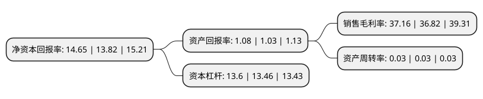

> 本页面由自动化程序生成于 2022年5月20日 01:06
> 内容可能存在错误，如有bug请提交issue至：https://github.com/Eroleice/doc-pi/issues
{.is-warning}

# 上市公司基本情况

## 基本资料

宁波银行股份有限公司（以下简称“宁波银行”）成立于1997年04月10日，宁波市。于2007年07月19日在深交所中小板上市。

宁波银行注册资本660,359.079万元，主要产品:公司贷款，个人贷款，房屋贷款是本行个人贷款。以下是详细信息：

- 公司名称: 宁波银行股份有限公司
- 股票代码: 002142.SZ
- 所在地: 浙江 - 宁波市
- 成立日期: 1997年04月10日
- 注册资本: 660,359.079万元
- 法定代表人: 陆华裕
- 主营业务: 主要产品:公司贷款，个人贷款，房屋贷款是本行个人贷款
- 公司官网: www.nbcb.com.cn
- 公司介绍: 公司成立于1997年4月10日，2007年7月19日成为国内首家在深圳证券交易所挂牌上市的城市商业银行。公司前两大股东分别是宁波市政府和新加坡华侨银行，新加坡华侨银行是东南亚第二大金融服务集团，是国际上具有最高评级的银行之一，拥有穆迪Aa1级评级。公司以“了解的市场，熟悉的客户”为准入原则，坚持“门当户对”的经营策略，以为客户提供多元化金融服务为目标，打造“公司银行、零售公司、个人银行、金融市场、信用卡、票据业务、投资银行、资产托管、资产管理”九大利润中心，初步形成多元化的业务增长模式和良好的品牌形象。

## 股东及高管情况

上市公司第一大股东为宁波开发投资集团有限公司，持股1,237,489,845股，占比18.74%，**疑似为**上市公司实际控制人。

截至2022年03月31日，上市公司的前十大股东中，共有9名机构股东，1个海外主体，其中5%以上大股东共有4名。上市公司前十大股东明细如下：

> 未能通过持股比例判定出上市公司实际控制人（持股30%以上）
> 可能存在通过间接持股、联合持股、协议控制等方式拥有实际控制权的主体，具体请参考上市公司定期公告！
{.is-warning}

> 截至2022年03月31日，上市公司前十大股东信息如下：

| 股东名称 | 持股数量（股） | 持股比例 |
| --- | --- | --- |
| 宁波开发投资集团有限公司 | 1,237,489,845 | 18.74% |
| 新加坡华侨银行有限公司 | 1,233,993,375 | 18.69% |
| 雅戈尔集团股份有限公司 | 549,902,524 | 8.33% |
| 香港中央结算有限公司(陆股通) | 397,164,762 | 6.01% |
| 华茂集团股份有限公司 | 169,766,294 | 2.57% |
| 宁波富邦控股集团有限公司 | 120,493,850 | 1.82% |
| 新加坡华侨银行有限公司(QFII) | 87,770,208 | 1.33% |
| 宁兴(宁波)资产管理有限公司 | 85,348,203 | 1.29% |
| 宁波市轨道交通集团有限公司 | 78,310,394 | 1.19% |
| 中央汇金资产管理有限责任公司 | 75,496,366 | 1.14% |

## 利润表分析

上市公司2021年总收入为527.74亿元，净利润为196.09亿元，实现盈利。

## 杜邦分析

> 数据列示周期：2021年 | 2020年 | 2019年
{.is-info}

上市公司的净资产收益率在近一年有所上升，上升幅度为6.01%，其变化情况分解如下：
- 上市公司的销售毛利率在近一年上升了0.92%，可能是生产效率的提升、商品原材料价格下跌或商品价格的上涨所致。
- 上市公司的资产周转率在近一年下降了0%，可能是源自于更慢的销售回款或库存管理效果下降。
- 上市公司的财务杠杆比率在近一年上升了1.04%，可能是增加负债扩大生产规模。

