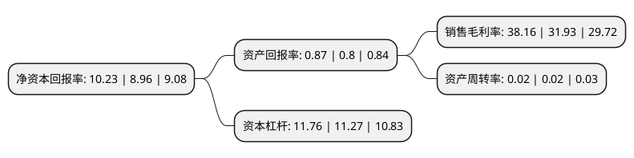

> 本页面由自动化程序生成于 2022年5月20日 01:12
> 内容可能存在错误，如有bug请提交issue至：https://github.com/Eroleice/doc-pi/issues
{.is-warning}

# 上市公司基本情况

## 基本资料

江苏江阴农村商业银行股份有限公司（以下简称“江阴银行”）成立于2001年12月03日，无锡市。于2016年09月02日在深交所中小板上市。

江阴银行注册资本217,200.985万元，核心业务主要包括公司业务，个人业务和资金业务。以下是详细信息：

- 公司名称: 江苏江阴农村商业银行股份有限公司
- 股票代码: 002807.SZ
- 所在地: 江苏 - 无锡市
- 成立日期: 2001年12月03日
- 注册资本: 217,200.985万元
- 法定代表人: 孙伟
- 主营业务: 核心业务主要包括公司业务，个人业务和资金业务
- 公司官网: www.jybank.com.cn
- 公司介绍: 公司前身江阴市信用合作社联合社，是在原江阴市35家法人信用合作社和3家城市信用社的基础上，经国务院、中国人民银行总行批准，由江阴企业、自然人入股组建的地方性股份制商业银行，是全国首批三家股份制农村商业银行之一。公司在大力支持经济社会中，各项业务取得了快速、稳健发展，其综合经济效益在全省信用社系统位居前列；存贷款总规模在全市各金融机构中名列前茅，为地方经济发展作出了巨大贡献。

## 股东及高管情况

上市公司第一大股东为江阴市长达钢铁有限公司，持股93,587,941股，占比4.31%，**疑似为**上市公司实际控制人。

截至2022年03月31日，上市公司的前十大股东中，共有9名机构股东，1个海外主体。上市公司前十大股东明细如下：

> 未能通过持股比例判定出上市公司实际控制人（持股30%以上）
> 可能存在通过间接持股、联合持股、协议控制等方式拥有实际控制权的主体，具体请参考上市公司定期公告！
{.is-warning}

> 上市公司第一大股东持股不超过10%，请检查是否存在公司控制权风险！
{.is-danger}

> 截至2022年03月31日，上市公司前十大股东信息如下：

| 股东名称 | 持股数量（股） | 持股比例 |
| --- | --- | --- |
| 江阴市长达钢铁有限公司 | 93,587,941 | 4.31% |
| 江阴新锦南投资发展有限公司 | 90,892,500 | 4.18% |
| 江阴长江投资集团有限公司 | 90,892,500 | 4.18% |
| 江阴市华发实业有限公司 | 83,255,100 | 3.83% |
| 江阴市振宏印染有限公司 | 72,267,732 | 3.33% |
| 江阴市爱衣思团绒毛纺有限公司 | 62,577,792 | 2.88% |
| 香港中央结算有限公司(陆股通) | 58,541,246 | 2.7% |
| 江阴法尔胜钢铁制品有限公司 | 54,821,226 | 2.52% |
| 江阴美纶纱业有限公司 | 43,018,500 | 1.98% |
| 江苏双良科技有限公司 | 38,772,778 | 1.79% |

## 利润表分析

上市公司2021年总收入为33.66亿元，净利润为12.84亿元，实现盈利。

## 杜邦分析

> 数据列示周期：2021年 | 2020年 | 2019年
{.is-info}

上市公司的净资产收益率在近一年有所上升，上升幅度为14.17%，其变化情况分解如下：
- 上市公司的销售毛利率在近一年上升了19.51%，可能是生产效率的提升、商品原材料价格下跌或商品价格的上涨所致。
- 上市公司的资产周转率在近一年下降了0%，可能是源自于更慢的销售回款或库存管理效果下降。
- 上市公司的财务杠杆比率在近一年上升了4.35%，可能是增加负债扩大生产规模。

