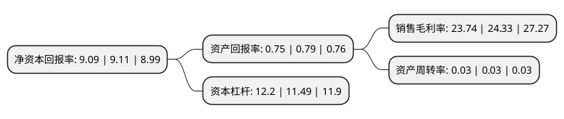

> 本页面由自动化程序生成于 2022年5月20日 01:12
> 内容可能存在错误，如有bug请提交issue至：https://github.com/Eroleice/doc-pi/issues
{.is-warning}

# 上市公司基本情况

## 基本资料

江苏张家港农村商业银行股份有限公司（以下简称“张家港行”）成立于2001年11月27日，苏州市。于2017年01月24日在深交所中小板上市。

张家港行注册资本180,795.926万元，主营业务:公司业务，个人业务和金融市场业务等。以下是详细信息：

- 公司名称: 江苏张家港农村商业银行股份有限公司
- 股票代码: 002839.SZ
- 所在地: 江苏 - 苏州市
- 成立日期: 2001年11月27日
- 注册资本: 180,795.926万元
- 法定代表人: 季颖
- 主营业务: 主营业务:公司业务，个人业务和金融市场业务等
- 公司官网: www.zrcbank.com
- 公司介绍: 公司是全国首家由农村信用社改制组建的股份制商业银行。成立近年来，张家港农商银行坚持“伴随你，成就你”的办行理念，专注服务中小微企业，积极发挥全国农村金融改革“试验田”的典型示范作用，率先在全国农村金融机构中提出上市、跨区域发展的改革新思路。公司坚持“伴随你，成就你”的服务理念，致力于向客户提供全面、优质、高效的金融服务，主要经营业务分为公司银行、个人银行、资金业务三大板块。公司积极推进金融创新，实施“互联网+”战略，将在张家港分布最广、数量最多的网点与电子银行、移动金融有机结合，构建了“线上+线下”的营销网络和服务平台。

## 股东及高管情况

上市公司第一大股东为江苏沙钢集团有限公司，持股147,828,660股，占比8.18%，**疑似为**上市公司实际控制人。

截至2022年03月31日，上市公司的前十大股东中，共有9名机构股东，1个海外主体，其中5%以上大股东共有4名。上市公司前十大股东明细如下：

> 未能通过持股比例判定出上市公司实际控制人（持股30%以上）
> 可能存在通过间接持股、联合持股、协议控制等方式拥有实际控制权的主体，具体请参考上市公司定期公告！
{.is-warning}

> 上市公司第一大股东持股不超过10%，请检查是否存在公司控制权风险！
{.is-danger}

> 截至2022年03月31日，上市公司前十大股东信息如下：

| 股东名称 | 持股数量（股） | 持股比例 |
| --- | --- | --- |
| 江苏沙钢集团有限公司 | 147,828,660 | 8.18% |
| 张家港市直属公有资产经营有限公司 | 140,086,406 | 7.75% |
| 江苏国泰南园宾馆有限公司 | 136,962,673 | 7.58% |
| 香港中央结算有限公司(陆股通) | 101,866,426 | 5.63% |
| 华芳集团有限公司 | 62,708,950 | 3.47% |
| 张家港市锦丰镇资产经营公司 | 48,121,020 | 2.66% |
| 江苏联峰实业有限公司 | 43,462,186 | 2.4% |
| 张家港市杨舍镇资产经营公司 | 30,000,000 | 1.66% |
| 张家港市金港镇资产经营公司 | 14,568,660 | 0.81% |
| 张家港市塘桥镇资产经营公司 | 14,568,660 | 0.81% |

## 利润表分析

上市公司2021年总收入为46.16亿元，净利润为13.36亿元，实现盈利。

## 杜邦分析

> 数据列示周期：2020年 | 2019年 | 2018年
{.is-info}

上市公司的净资产收益率在近一年有所下降，下降幅度为-0.22%，其变化情况分解如下：
- 上市公司的销售毛利率在近一年下降了-2.42%，可能是生产效率的下降、商品原材料价格上涨或商品价格的下跌所致。
- 上市公司的资产周转率在近一年下降了0%，可能是源自于更慢的销售回款或库存管理效果下降。
- 上市公司的财务杠杆比率在近一年上升了6.18%，可能是增加负债扩大生产规模。

