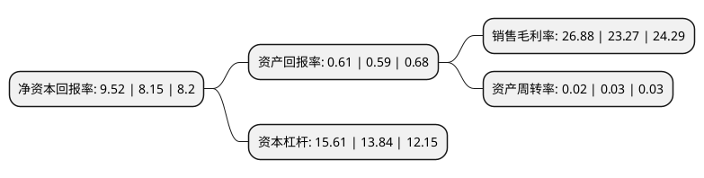

> 本页面由自动化程序生成于 2022年5月20日 01:13
> 内容可能存在错误，如有bug请提交issue至：https://github.com/Eroleice/doc-pi/issues
{.is-warning}

# 上市公司基本情况

## 基本资料

青岛银行股份有限公司（以下简称“青岛银行”）成立于1996年11月15日，青岛市。于2019年01月16日在深交所中小板上市。

青岛银行注册资本582,035.472万元，本行的业务主要包括公司银行业务，零售银行业务和金融市场业务等。公司银行业务向公司类客户，政府机关和金融机构提供多种金融产品和服务，具体包括公司贷款，公司存款，贸易融资及国际结算服务等。零售银行业务向个人客户提供多种金融产品和服务。这些产品和服务包括个人类贷款，存款服务等。金融市场业务的交易包括于银行间市场进行同业拆借交易，回购交易和债务工具投资以及非标准化债权投资。以下是详细信息：

- 公司名称: 青岛银行股份有限公司
- 股票代码: 002948.SZ
- 所在地: 山东 - 青岛市
- 成立日期: 1996年11月15日
- 注册资本: 582,035.472万元
- 法定代表人: 郭少泉
- 主营业务: 本行的业务主要包括公司银行业务，零售银行业务和金融市场业务等公司银行业务向公司类客户，政府机关和金融机构提供多种金融产品和服务，具体包括公司贷款，公司存款，贸易融资及国际结算服务等零售银行业务向个人客户提供多种金融产品和服务这些产品和服务包括个人类贷款，存款服务等金融市场业务的交易包括于银行间市场进行同业拆借交易，回购交易和债务工具投资以及非标准化债权投资
- 公司官网: www.qdccb.com
- 公司介绍: 公司成立于1996年11月，是我国首批设立的城市商业银行之一，主要业务为公司银行业务、零售银行业务及金融市场业务。青岛银行是中国山东省以总资产、总贷款、客户存款、总权益计最大的城市商业银行。青岛银行建立了高度契合区域经济的业务模式，在能够发挥自身优势的领域开展专业化、特色化经营，以需求为导向深耕目标客户群体，致力于为客户提供优质便捷的金融产品和服务，并以此实现稳健发展，为股东持续创造价值。青岛银行的营业网点布局以青岛为核心、辐射山东省。2018年11月30日，证监会按法定程序核准了青岛银行股份有限公司的首发申请。

## 股东及高管情况

上市公司第一大股东为香港中央结算(代理人)有限公司，持股1,272,947,424股，占比21.87%，**疑似为**上市公司实际控制人。

截至2022年03月31日，上市公司的前十大股东中，共有8名机构股东，1个海外主体，1名其他股东，其中5%以上大股东共有4名。上市公司前十大股东明细如下：

> 未能通过持股比例判定出上市公司实际控制人（持股30%以上）
> 可能存在通过间接持股、联合持股、协议控制等方式拥有实际控制权的主体，具体请参考上市公司定期公告！
{.is-warning}

> 截至2022年03月31日，上市公司前十大股东信息如下：

| 股东名称 | 持股数量（股） | 持股比例 |
| --- | --- | --- |
| 香港中央结算(代理人)有限公司 | 1,272,947,424 | 21.87% |
| 意大利联合圣保罗银行 | 1,018,562,076 | 17.5% |
| 青岛国信实业有限公司 | 654,623,243 | 11.25% |
| 青岛海尔产业发展有限公司 | 532,601,341 | 9.15% |
| 青岛海尔空调电子有限公司 | 284,299,613 | 4.88% |
| 海尔智家股份有限公司 | 188,886,626 | 3.25% |
| 青岛海仁投资有限责任公司 | 174,083,000 | 2.99% |
| 山东三利源经贸有限公司 | 152,170,000 | 2.61% |
| 青岛华通国有资本投资运营集团有限公司 | 123,457,855 | 2.12% |
| 青岛即发集团股份有限公司 | 118,217,013 | 2.03% |

## 利润表分析

上市公司2021年总收入为111.36亿元，净利润为29.93亿元，实现盈利。

## 杜邦分析

> 数据列示周期：2021年 | 2020年 | 2019年
{.is-info}

上市公司的净资产收益率在近一年有所上升，上升幅度为16.81%，其变化情况分解如下：
- 上市公司的销售毛利率在近一年上升了15.51%，可能是生产效率的提升、商品原材料价格下跌或商品价格的上涨所致。
- 上市公司的资产周转率在近一年下降了-33.33%，可能是源自于更慢的销售回款或库存管理效果下降。
- 上市公司的财务杠杆比率在近一年上升了12.79%，可能是增加负债扩大生产规模。

