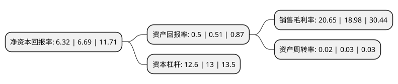

> 本页面由自动化程序生成于 2022年5月20日 01:23
> 内容可能存在错误，如有bug请提交issue至：https://github.com/Eroleice/doc-pi/issues
{.is-warning}

# 上市公司基本情况

## 基本资料

中国民生银行股份有限公司（以下简称“民生银行”）成立于1996年02月07日，北京市。于2000年12月19日在上交所主板上市。

民生银行注册资本4,378,241.85万元，主要业务:贷款(含贴现)，拆出，存放同业，转贴现，存放央行，逆回购，债券投资，存款，可转换债券，拆入，同业存放，再贴现，转贴现，央行借款，正回购。以下是详细信息：

- 公司名称: 中国民生银行股份有限公司
- 股票代码: 600016.SH
- 所在地: 北京 - 北京市
- 成立日期: 1996年02月07日
- 注册资本: 4,378,241.85万元
- 法定代表人: 高迎欣
- 主营业务: 贷款(含贴现)，拆出，存放同业，转贴现，存放央行，逆回购，债券投资，存款，可转换债券，拆入，同业存放，再贴现，转贴现，央行借款，正回购
- 公司官网: www.cmbc.com.cn
- 公司介绍: 公司是中国第一家主要由民营企业发起设立的全国性股份制商业银行，也是严格按照中国《公司法》和《商业银行法》设立的一家现代化金融企业。公司以实施“凤凰计划”为主线，按照“做强公司业务、做大零售业务、做优金融市场业务、做亮网络金融、做好综合化经营、做通海外业务”的经营思路，致力于成为民营企业和小微金融的首选银行、互联网金融和财富管理的领先银行，打造客户体验好、经营效益好、资产质量好、人才素质好、品牌形象好的“五好”银行。

## 股东及高管情况

上市公司第一大股东为香港中央结算(代理人)有限公司，持股8,284,807,550股，占比18.92%，**疑似为**上市公司实际控制人。

截至2022年03月31日，上市公司的前十大股东中，共有5名机构股东，3个产品账户，1个海外主体，1名其他股东，其中5%以上大股东共有3名。上市公司前十大股东明细如下：

> 未能通过持股比例判定出上市公司实际控制人（持股30%以上）
> 可能存在通过间接持股、联合持股、协议控制等方式拥有实际控制权的主体，具体请参考上市公司定期公告！
{.is-warning}

> 截至2022年03月31日，上市公司前十大股东信息如下：

| 股东名称 | 持股数量（股） | 持股比例 |
| --- | --- | --- |
| 香港中央结算(代理人)有限公司 | 8,284,807,550 | 18.92% |
| 大家人寿保险股份有限公司-万能产品 | 4,508,984,567 | 10.3% |
| 大家人寿保险股份有限公司-传统产品 | 2,843,300,122 | 6.49% |
| 同方国信投资控股有限公司 | 1,888,530,701 | 4.31% |
| 新希望六和投资有限公司 | 1,828,327,362 | 4.18% |
| 中国泛海控股集团有限公司 | 1,803,182,618 | 4.12% |
| 上海健特生命科技有限公司 | 1,379,679,587 | 3.15% |
| 华夏人寿保险股份有限公司-万能保险产品 | 1,375,763,341 | 3.14% |
| 中国船东互保协会 | 1,324,284,453 | 3.02% |
| 东方集团股份有限公司 | 1,280,117,123 | 2.92% |

## 利润表分析

上市公司2021年总收入为1,688.04亿元，净利润为348.53亿元，实现盈利。

## 杜邦分析

> 数据列示周期：2021年 | 2020年 | 2019年
{.is-info}

上市公司的净资产收益率在近一年有所下降，下降幅度为-5.53%，其变化情况分解如下：
- 上市公司的销售毛利率在近一年上升了8.8%，可能是生产效率的提升、商品原材料价格下跌或商品价格的上涨所致。
- 上市公司的资产周转率在近一年下降了-33.33%，可能是源自于更慢的销售回款或库存管理效果下降。
- 上市公司的财务杠杆比率在近一年下降了-3.08%，可能是减少负债降低财务费用。

