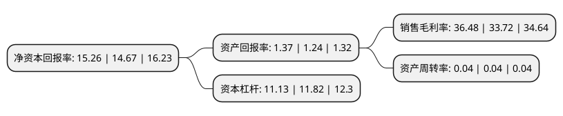

> 本页面由自动化程序生成于 2022年5月20日 01:23
> 内容可能存在错误，如有bug请提交issue至：https://github.com/Eroleice/doc-pi/issues
{.is-warning}

# 上市公司基本情况

## 基本资料

招商银行股份有限公司（以下简称“招商银行”）成立于1987年03月31日，深圳市。于2002年04月09日在上交所主板上市。

招商银行注册资本2,521,984.56万元，主要业务:贷款拆借，存放同业业务债券投资。以下是详细信息：

- 公司名称: 招商银行股份有限公司
- 股票代码: 600036.SH
- 所在地: 广东 - 深圳市
- 成立日期: 1987年03月31日
- 注册资本: 2,521,984.56万元
- 法定代表人: 缪建民
- 主营业务: 贷款拆借，存放同业业务债券投资
- 公司官网: www.cmbchina.com
- 公司介绍: 公司是中国境内第一家完全由企业法人持股的股份制商业银行、国家从体制外推动银行业改革的第一家试点银行，也是一家拥有商业银行、金融租赁、基金管理、人寿保险、境外投行等金融牌照的银行集团。近年来，公司聚焦移动优先策略，拥抱金融科技(Fintech)，率先推出闪电贷、刷脸取款、“一闪通”支付等创新服务，招商银行手机银行、掌上生活两大App已成行业翘楚，月活量均稳居金融行业前十。经过多年创新发展，招商银行部分业务领域已成为国内商业银行的标杆，连续多年获得境内外权威媒体评选的“中国最佳零售银行”“中国最佳私人银行”“中国最佳交易银行”等殊荣。

## 股东及高管情况

上市公司第一大股东为香港中央结算(代理人)有限公司，持股4,552,885,976股，占比18.05%，**疑似为**上市公司实际控制人。

截至2022年03月31日，上市公司的前十大股东中，共有6名机构股东，2个产品账户，2个海外主体，其中5%以上大股东共有4名。上市公司前十大股东明细如下：

> 未能通过持股比例判定出上市公司实际控制人（持股30%以上）
> 可能存在通过间接持股、联合持股、协议控制等方式拥有实际控制权的主体，具体请参考上市公司定期公告！
{.is-warning}

> 截至2022年03月31日，上市公司前十大股东信息如下：

| 股东名称 | 持股数量（股） | 持股比例 |
| --- | --- | --- |
| 香港中央结算(代理人)有限公司 | 4,552,885,976 | 18.05% |
| 招商局轮船有限公司 | 3,289,470,337 | 13.04% |
| 香港中央结算有限公司(陆股通) | 1,704,361,213 | 6.76% |
| 中国远洋运输有限公司 | 1,574,729,111 | 6.24% |
| 深圳市晏清投资发展有限公司 | 1,258,542,349 | 4.99% |
| 深圳市招融投资控股有限公司 | 1,147,377,415 | 4.55% |
| 和谐健康保险股份有限公司-传统-普通保险产品 | 1,130,991,537 | 4.48% |
| 深圳市楚源投资发展有限公司 | 944,013,171 | 3.74% |
| 大家人寿保险股份有限公司-万能产品 | 815,030,635 | 3.23% |
| 中远海运(广州)有限公司 | 696,450,214 | 2.76% |

## 利润表分析

上市公司2021年总收入为3,312.53亿元，净利润为1,208.34亿元，实现盈利。

## 杜邦分析

> 数据列示周期：2021年 | 2020年 | 2019年
{.is-info}

上市公司的净资产收益率在近一年有所上升，上升幅度为4.02%，其变化情况分解如下：
- 上市公司的销售毛利率在近一年上升了8.19%，可能是生产效率的提升、商品原材料价格下跌或商品价格的上涨所致。
- 上市公司的资产周转率在近一年下降了0%，可能是源自于更慢的销售回款或库存管理效果下降。
- 上市公司的财务杠杆比率在近一年下降了-5.84%，可能是减少负债降低财务费用。

