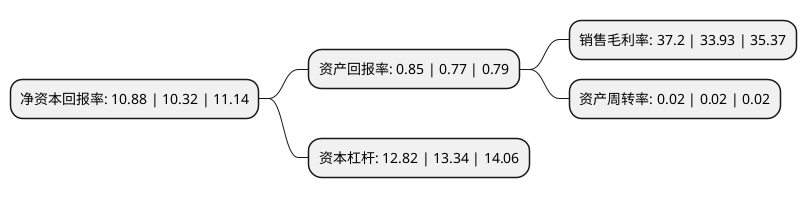

> 本页面由自动化程序生成于 2022年5月20日 01:29
> 内容可能存在错误，如有bug请提交issue至：https://github.com/Eroleice/doc-pi/issues
{.is-warning}

# 上市公司基本情况

## 基本资料

无锡农村商业银行股份有限公司（以下简称“无锡银行”）成立于2005年06月21日，无锡市。于2016年09月23日在上交所主板上市。

无锡银行注册资本186,167.552万元，主营业务:本行的主要业务包括公司金融业务，个人金融业务，资金业务及其他以下是详细信息：

- 公司名称: 无锡农村商业银行股份有限公司
- 股票代码: 600908.SH
- 所在地: 江苏 - 无锡市
- 成立日期: 2005年06月21日
- 注册资本: 186,167.552万元
- 法定代表人: 邵辉
- 主营业务: 主营业务:本行的主要业务包括公司金融业务，个人金融业务，资金业务及其他
- 公司官网: www.wrcb.com.cn
- 公司介绍: 公司是无锡市区唯一的地方性法人银行，现下辖1家营业部，99家本地支行(分理处)，8家异地支行(江阴、宜兴、楚州、靖江、如皋、如皋港、丰县、仪征)，另外控股2家村镇银行(铜山、姜堰)，入股1家农村商业银行(淮安)，入股1家农村信用联社(东海)。公司不断与时俱进，开拓创新，全面推进并优化了流程银行建设，独立开发了计算机综合业务网络系统，并在国内金融界率先开通了手机全功能支付业务，先后获得过“江苏省银行业文明规范服务示范单位”、“江苏省和谐劳动关系先进单位”、“全国金融机构服务‘三农’最佳诚信企业奖”、“银企合作‘十佳银行’最佳爱心公益奖”、“中国最具成长性银行”、“全球千强银行”等荣誉称号。无锡农商行将继续坚持“诚信、务实、稳健、高效”的核心价值观，加快转型步伐，探索经营亮点，全力打造现代化社区银行。

## 股东及高管情况

上市公司第一大股东为国联信托股份有限公司，持股166,330,635股，占比8.93%，**疑似为**上市公司实际控制人。

截至2022年03月31日，上市公司的前十大股东中，共有8名机构股东，1个产品账户，1个海外主体，其中5%以上大股东共有2名。上市公司前十大股东明细如下：

> 未能通过持股比例判定出上市公司实际控制人（持股30%以上）
> 可能存在通过间接持股、联合持股、协议控制等方式拥有实际控制权的主体，具体请参考上市公司定期公告！
{.is-warning}

> 上市公司第一大股东持股不超过10%，请检查是否存在公司控制权风险！
{.is-danger}

> 截至2022年03月31日，上市公司前十大股东信息如下：

| 股东名称 | 持股数量（股） | 持股比例 |
| --- | --- | --- |
| 国联信托股份有限公司 | 166,330,635 | 8.93% |
| 无锡市兴达尼龙有限公司 | 110,984,508 | 5.96% |
| 无锡万新机械有限公司 | 89,898,573 | 4.83% |
| 无锡市建设发展投资有限公司 | 77,004,934 | 4.14% |
| 无锡神伟化工有限公司 | 39,581,224 | 2.13% |
| 华林证券股份有限公司 | 38,645,121 | 2.08% |
| 全国社保基金四一三组合 | 24,386,874 | 1.31% |
| 无锡市银宝印铁有限公司 | 21,127,094 | 1.13% |
| 无锡市太平洋化肥有限公司 | 16,880,462 | 0.91% |
| UBS   AG | 15,795,623 | 0.85% |

## 利润表分析

上市公司2021年总收入为43.49亿元，净利润为16.17亿元，实现盈利。

## 杜邦分析

> 数据列示周期：2021年 | 2020年 | 2019年
{.is-info}

上市公司的净资产收益率在近一年有所上升，上升幅度为5.43%，其变化情况分解如下：
- 上市公司的销售毛利率在近一年上升了9.64%，可能是生产效率的提升、商品原材料价格下跌或商品价格的上涨所致。
- 上市公司的资产周转率在近一年下降了0%，可能是源自于更慢的销售回款或库存管理效果下降。
- 上市公司的财务杠杆比率在近一年下降了-3.9%，可能是减少负债降低财务费用。

