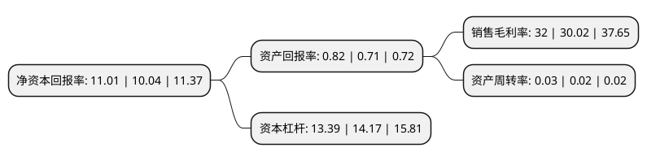

> 本页面由自动化程序生成于 2022年5月20日 01:29
> 内容可能存在错误，如有bug请提交issue至：https://github.com/Eroleice/doc-pi/issues
{.is-warning}

# 上市公司基本情况

## 基本资料

江苏银行股份有限公司（以下简称“江苏银行”）成立于2007年01月22日，南京市。于2016年08月02日在上交所主板上市。

江苏银行注册资本1,476,962.878万元，本行业务主要包括公司银行业务，个人银行业务及资金业务。主要产品包括:公司贷款，对公客户存款，中间业务产品与服务，客户，市场营销，个人贷款，银行卡，个人存款，中间业务产品与服务，客户，市场营销，存放同业，同业拆借，债券买卖，债券回购等。以下是详细信息：

- 公司名称: 江苏银行股份有限公司
- 股票代码: 600919.SH
- 所在地: 江苏 - 南京市
- 成立日期: 2007年01月22日
- 注册资本: 1,476,962.878万元
- 法定代表人: 夏平
- 主营业务: 本行业务主要包括公司银行业务，个人银行业务及资金业务主要产品包括:公司贷款，对公客户存款，中间业务产品与服务，客户，市场营销，个人贷款，银行卡，个人存款，中间业务产品与服务，客户，市场营销，存放同业，同业拆借，债券买卖，债券回购等
- 公司官网: www.jsbchina.cn
- 公司介绍: 公司是在江苏省内无锡、苏州、南通等10家城市商业银行基础上，合并重组而成的现代股份制商业银行，开创了地方法人银行改革的新模式。公司于2007年1月24日正式挂牌开业，是江苏省唯一一家省属地方法人银行。公司秉承“融创美好生活”的使命，以“融合创新、务实担当、精益成长”企业文化为引领，致力于建设“特色化、智慧化、综合化、国际化”的一流商业银行，已成长为一家综合实力和市场竞争力较强的现代股份制银行。公司获得江苏省委省政府“江苏省优秀企业”、银监会“全国银行业金融机构小微企业金融服务先进单位”、《金融时报》“最具竞争力中小银行”等多项荣誉称号。

## 股东及高管情况

上市公司第一大股东为江苏省国际信托有限责任公司，持股1,206,607,072股，占比8.17%，**疑似为**上市公司实际控制人。

截至2022年03月31日，上市公司的前十大股东中，共有9名机构股东，1个海外主体，其中5%以上大股东共有3名。上市公司前十大股东明细如下：

> 未能通过持股比例判定出上市公司实际控制人（持股30%以上）
> 可能存在通过间接持股、联合持股、协议控制等方式拥有实际控制权的主体，具体请参考上市公司定期公告！
{.is-warning}

> 上市公司第一大股东持股不超过10%，请检查是否存在公司控制权风险！
{.is-danger}

> 截至2022年03月31日，上市公司前十大股东信息如下：

| 股东名称 | 持股数量（股） | 持股比例 |
| --- | --- | --- |
| 江苏省国际信托有限责任公司 | 1,206,607,072 | 8.17% |
| 江苏凤凰出版传媒集团有限公司 | 1,197,149,625 | 8.11% |
| 华泰证券股份有限公司 | 832,050,000 | 5.63% |
| 无锡市建设发展投资有限公司 | 710,435,942 | 4.81% |
| 江苏宁沪高速公路股份有限公司 | 567,484,800 | 3.84% |
| 香港中央结算有限公司(陆股通) | 557,627,167 | 3.78% |
| 江苏省广播电视集团有限公司 | 450,703,013 | 3.05% |
| 苏州国际发展集团有限公司 | 351,459,272 | 2.38% |
| 江苏省国信集团有限公司 | 292,201,391 | 1.98% |
| 江苏凤凰资产管理有限责任公司 | 264,509,656 | 1.79% |

## 利润表分析

上市公司2021年总收入为637.71亿元，净利润为204.09亿元，实现盈利。

## 杜邦分析

> 数据列示周期：2021年 | 2020年 | 2018年
{.is-info}

上市公司的净资产收益率在近一年有所上升，上升幅度为9.66%，其变化情况分解如下：
- 上市公司的销售毛利率在近一年上升了6.6%，可能是生产效率的提升、商品原材料价格下跌或商品价格的上涨所致。
- 上市公司的资产周转率在近一年上升了50%，可能是源自于更快的销售回款或库存管理效果提升。
- 上市公司的财务杠杆比率在近一年下降了-5.5%，可能是减少负债降低财务费用。

