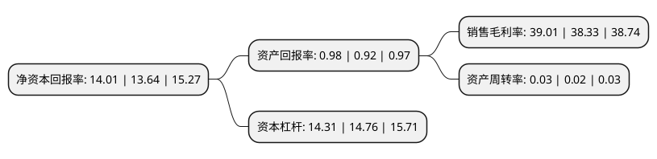

> 本页面由自动化程序生成于 2022年5月20日 01:30
> 内容可能存在错误，如有bug请提交issue至：https://github.com/Eroleice/doc-pi/issues
{.is-warning}

# 上市公司基本情况

## 基本资料

南京银行股份有限公司（以下简称“南京银行”）成立于1996年02月06日，南京市。于2007年07月19日在上交所主板上市。

南京银行注册资本1,001,541.736万元，主营业务:商业银行业务是本行的核心业务，主要包括公司银行业务，个人银行业务及资金运营业务。以下是详细信息：

- 公司名称: 南京银行股份有限公司
- 股票代码: 601009.SH
- 所在地: 江苏 - 南京市
- 成立日期: 1996年02月06日
- 注册资本: 1,001,541.736万元
- 法定代表人: 胡升荣
- 主营业务: 主营业务:商业银行业务是本行的核心业务，主要包括公司银行业务，个人银行业务及资金运营业务
- 公司官网: www.njcb.com.cn
- 公司介绍: 南京银行诞生于中国金融体制改革和资本市场蓬勃发展的浪潮之中，乘着中国改革开放、经济腾飞的东风，一路乘风破浪砥砺前行。1996年公司完成了股份制改造，2001年引入境外战略投资者国际金融公司(IFC)，2005年引入境外战略投资者法国巴黎银行(BNP)，成为一家由国有法人股份、中资法人股份、外资股份和众多自然人股份共同组成的混合所有制商业银行；2007年初首家异地分行泰州分行开业，成为国内首批跨区域发展的城商行；2007年7月在上交所挂牌交易，是国内首家在上交所主板上市的城商行。公司秉承“为社会铸诚信品质、为客户创卓越服务、为股东谋持久回报”的核心价值观，立足服务实体经济，坚持解放思想、锐意进取、开拓创新、稳健发展的经营理念，实现业务规模稳步增长、基础管理扎实有效、风险管控不断强化、资产质量保持稳定、经营效益持续优良、综合实力日益提升。截至2018年末，公司资产规模12,432.69亿元，员工人数10,721人，经营网点实现京沪杭及江苏省内地区全覆盖，设有17家分行和191家支行。

## 股东及高管情况

上市公司第一大股东为中国烟草总公司江苏省公司(江苏省烟草公司)，持股393,700,787,000股，占比3.93%，**疑似为**上市公司实际控制人。

截至2022年03月31日，上市公司的前十大股东中，共有7名机构股东，1个海外主体，2名其他股东，其中5%以上大股东共有6名。上市公司前十大股东明细如下：

> 未能通过持股比例判定出上市公司实际控制人（持股30%以上）
> 可能存在通过间接持股、联合持股、协议控制等方式拥有实际控制权的主体，具体请参考上市公司定期公告！
{.is-warning}

> 上市公司第一大股东持股不超过10%，请检查是否存在公司控制权风险！
{.is-danger}

> 截至2022年03月31日，上市公司前十大股东信息如下：

| 股东名称 | 持股数量（股） | 持股比例 |
| --- | --- | --- |
| 中国烟草总公司江苏省公司(江苏省烟草公司) | 393,700,787,000 | 3.93% |
| 紫金信托有限责任公司 | 112,465,858,000 | 1.12% |
| 南京市国有资产投资管理控股(集团)有限责任公司 | 107,438,552,000 | 1.07% |
| 法国巴黎银行 | 1,576,214,136 | 15.34% |
| 法国巴黎银行 | 1,392,721,067 | 13.91% |
| 南京紫金投资集团有限责任公司 | 1,262,531,949 | 12.29% |
| 南京高科股份有限公司 | 1,001,702,465 | 9.75% |
| 南京高科股份有限公司 | 1,001,702,465 | 10% |
| 江苏交通控股有限公司 | 999,874,667 | 9.73% |
| 香港中央结算有限公司(陆股通) | 239,223,681 | 2.39% |

## 利润表分析

上市公司2021年总收入为409.25亿元，净利润为159.65亿元，实现盈利。

## 杜邦分析

> 数据列示周期：2021年 | 2020年 | 2019年
{.is-info}

上市公司的净资产收益率在近一年有所上升，上升幅度为2.71%，其变化情况分解如下：
- 上市公司的销售毛利率在近一年上升了1.77%，可能是生产效率的提升、商品原材料价格下跌或商品价格的上涨所致。
- 上市公司的资产周转率在近一年上升了50%，可能是源自于更快的销售回款或库存管理效果提升。
- 上市公司的财务杠杆比率在近一年下降了-3.05%，可能是减少负债降低财务费用。

